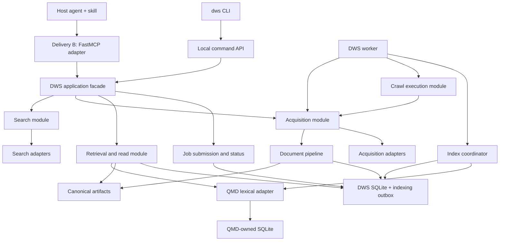
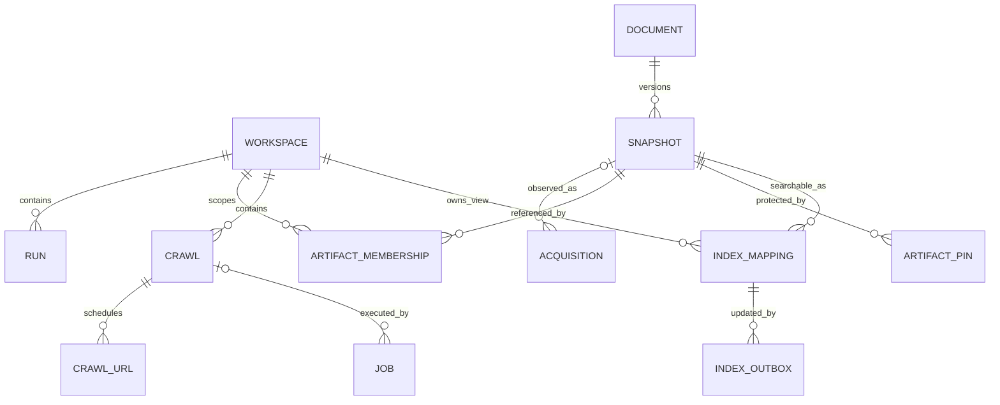
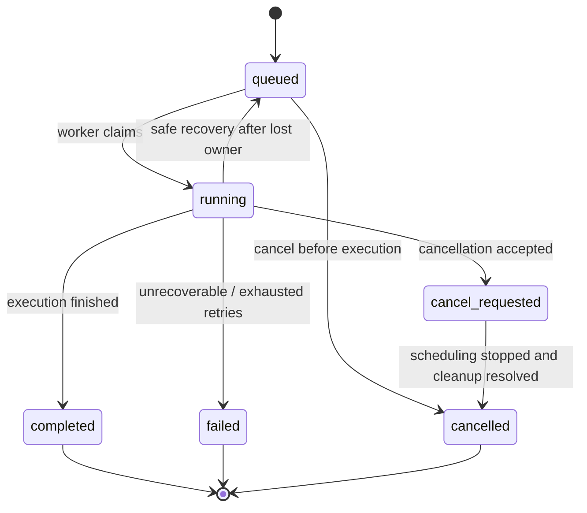
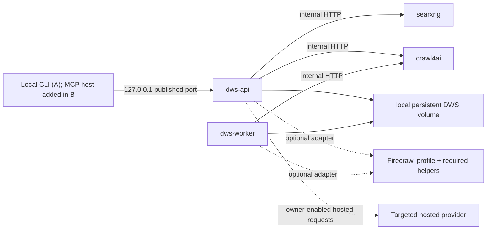

# Deep Web Search (DWS)
## Technical Design Document

**Canonical filename:** `DWS_Design.md`  
**Version:** 1.1 — proposed implementation design\
**Prepared:** 10 September 2026  
**Updated:** 22 September 2026 — CLI-first delivery order\
**Requirements baseline:** [DWS_PRD.md](DWS_PRD.md), version 1.1\
**Audience:** The project owner, implementers, reviewers, and host-integration authors  
**Implementation status:** Design only. No deployed system, completed prototype, passing test suite, or measured capacity is implied.

> **One-sentence design:** DWS is a local Python evidence-acquisition and retrieval application, delivered first through a daemon-backed CLI and local command API, then through a thin FastMCP adapter, with replaceable web providers, immutable retained snapshots, DWS-owned SQLite metadata, and a separately owned QMD lexical index. Research reasoning stays in the host.

---

## 0. Authority, scope, and reading guide

The PRD explains **what we require and why we selected the architecture**. This document explains **how the application is divided, how data moves, who owns state, and what happens when operations overlap or fail**. Read the PRD's ADRs for the full history of choices and rejected alternatives; do not maintain a competing decision history here.

**Precedence:** an explicit owner decision and its updated PRD/ADR take precedence over this design. Implementation refinements below are proposals until reviewed. A change to product scope, accepted technology, durability, or evidence guarantees requires a PRD/ADR update as well as a design update. The PRD is not modified by this document.

The terms **inherited** and **proposed** distinguish established direction from details specified here. `FR-*`, `NFR-*`, `AT-*`, `ADR-*`, and `G-*` refer to the existing PRD. `DD-*` identifies design refinements in Section 20; it does not replace the PRD's ADR numbering.

There is no DWS source repository supplied for inspection. Module paths, tables, endpoints, and state transitions below are intended implementation contracts, not descriptions of code that already exists. Examples are illustrative DWS payloads, not complete MCP wire envelopes. Third-party APIs, dependencies, images, and protocol support must be verified against pinned builds: engine dependencies during M0 for A, MCP compatibility before B.

### Accepted delivery order — 22 September 2026

Follow [PRD Section 0.4](DWS_PRD.md#04-accepted-delivery-order--22-september-2026), the owner's [implementation goal](../../plans/dws/implementation-goal.md), and the [CLI-engine implementation plan](../../plans/dws/cli-engine-implementation-plan.md). **Delivery A** is the complete Python engine, daemon-backed `dws` CLI and local command API: providers, immutable evidence, lexical QMD retrieval, durable crawl/jobs, shared concurrency controls, retention, diagnostics, and backup/restore. It must install, start and pass its acceptance without FastMCP, MCP SDK dependencies, model inference or hosted-provider credentials.

**Delivery B** subsequently adds the accepted FastMCP adapter over those same contracts, resources, jobs, policies and state. It owns MCP schemas/wire types, transports and actual client compatibility; it must not add a second execution system or make the CLI depend on MCP. Native Tasks remain optional. Combined-target diagrams and MCP interfaces below retain that architecture, but all MCP elements belong to B. Historical PRD ADRs remain intact.

The [PRD release boundary](DWS_PRD.md#193-v1-release-boundary) applies here: A requires a fresh default Compose demonstration of search, static/PDF/rendered fetch, exact read/retrieve, bounded crawl/status/cancel, pin/export/GC, diagnostics and backup/restore through the CLI, with restart/failure, scope and resource-limit evidence, operational instructions, measured limitations, and all applicable acceptance gates and independent reviews passed. Full original V1 interface parity is claimed only after B; deferring protocol work never defers engine safety or evidence guarantees.

**Suggested reading paths**

| Reader | Start here |
|---|---|
| Someone new to DWS | Sections 1–3, then the walkthrough in Section 19 |
| Backend implementer | Sections 4–12 and the design refinements in Section 20 |
| Deployment/operator | Sections 10–16 |
| Host-agent/skill author | Sections 3, 5, 9, and 17 |
| Reviewer | Invariants in Section 2, failures in Section 12, traceability in Section 21 |

### Contents

- [1. Design in five minutes](#1-design-in-five-minutes)
- [2. Goals, non-goals, and invariants](#2-goals-non-goals-and-invariants)
- [3. User stories and system boundary](#3-user-stories-and-system-boundary)
- [4. Runtime and module architecture](#4-runtime-and-module-architecture)
- [5. Public interface and contract design](#5-public-interface-and-contract-design)
- [6. Request flows and provider routing](#6-request-flows-and-provider-routing)
- [7. Evidence model and storage design](#7-evidence-model-and-storage-design)
- [8. QMD indexing design](#8-qmd-indexing-design)
- [9. Retrieval and passage construction](#9-retrieval-and-passage-construction)
- [10. Concurrency and admission design](#10-concurrency-and-admission-design)
- [11. Durable jobs and crawl state](#11-durable-jobs-and-crawl-state)
- [12. Failure and recovery matrix](#12-failure-and-recovery-matrix)
- [13. Deployment topology and startup lifecycle](#13-deployment-topology-and-startup-lifecycle)
- [14. Local security design](#14-local-security-design)
- [15. Configuration, operations, and recovery](#15-configuration-operations-and-recovery)
- [16. Observability and resource budgets](#16-observability-and-resource-budgets)
- [17. Host integration and extension design](#17-host-integration-and-extension-design)
- [18. Test design and implementation sequence](#18-test-design-and-implementation-sequence)
- [19. End-to-end example: researching AI memory systems](#19-end-to-end-example-researching-ai-memory-systems)
- [20. Design refinements and reconsideration triggers](#20-design-refinements-and-reconsideration-triggers)
- [21. Requirements-to-design traceability](#21-requirements-to-design-traceability)
- [22. References and document lineage](#22-references-and-document-lineage)

---

## 1. Design in five minutes

### 1.1 The product boundary

```text
HOST / PROJECT                                      DWS
──────────────────────────────────────────────────────────────────────
Research agent + skill
  decide the question
  formulate queries          ── search ──────────► discover URLs
  select sources             ── fetch / crawl ───► acquire snapshots
  examine evidence           ── retrieve / read ─► return exact passages
  assess contradictions
  write a report             ── pin / export ───► preserve cited evidence
```

DWS does not decide whether a research question has been answered. It does not generate summaries on every fetch, produce investment recommendations, or run a generic autonomous research loop. It returns evidence with explicit provenance and limits.

Its default execution is **model-free**, not a promise of identical internet results. Remote pages, provider rankings, rendering, timestamps, and extraction can change. DWS preserves the captured representation and the processing version so that evidence is inspectable later.

### 1.2 The physical shape

Combined target: the command API and admission ship in A; FastMCP is added in B.

```text
                    Local agents / projects / dws CLI
                                    |
                       Host loopback, one DWS port
                                    |
                          +---------v----------+
                          | dws-api            |
                          | FastMCP + command  |
                          | API + admission    |
                          +---+------------+---+
                              |            |
                   immediate work          | durable work
                              |            v
                              |       dws.sqlite <---- dws-worker
                              |            |            |
                              +------------+------------+
                                           |
                   +-----------------------+-------------------+
                   |                       |                   |
                Providers              Artifacts          QMD adapter
                   |                       |                   |
             SearXNG, DDGS          normalized snapshots    lexical only
             HTTP, Crawl4AI         selected originals         |
             optional backups                              QMD SQLite
```

**One Compose deployment is not one container or one database file.** API and worker are two processes built from the same DWS application image. QMD is a dependency in that image. SearXNG and Crawl4AI are supporting services. Optional Firecrawl services start only with their profile.

### 1.3 Who owns what

| Owner | Owns | Does not own |
|---|---|---|
| Host agent and skill | Research scope, queries, semantic judgment, synthesis, report | Provider retries, crawler frontier, DWS storage |
| DWS application | Public contracts, policies, provenance, snapshots, jobs, indexing readiness | QMD private schema, provider internal implementation |
| FastMCP adapter | MCP schemas, resource links, transport mapping | Acquisition policy or research execution |
| QMD | Its database, lexical ranking and supported indexing operations | DWS jobs, retention decisions, public snapshot identity |
| Crawl/search provider | A particular acquisition/discovery implementation | DWS's canonical evidence identity |

### 1.4 Stack at a glance

| Role | Baseline | Status |
|---|---|---|
| MCP adapter | Delivery B: standalone Python FastMCP; exact compatible build pinned before B | Inherited selection; PRD retains a 4.x target, not an unconditional version guarantee |
| CLI/control transport | Python CLI → local DWS command API | Inherited; concrete routes proposed here |
| Primary discovery | SearXNG | Inherited |
| Lightweight search backup | DDGS adapter | PRD proposed baseline |
| Static acquisition/extraction | HTTPX + local extraction, including Trafilatura for suitable HTML | PRD proposed baseline |
| Rendered acquisition | Crawl4AI service | Inherited |
| Text-bearing PDFs | Local PDF extraction adapter; pypdf baseline | PRD proposed baseline |
| Retained-document search | Original `tobi/qmd`, lexical path only | Inherited |
| Application state | Ordinary SQLite, separate from QMD | Inherited |
| Durable execution | DWS worker + persisted jobs/frontier/outbox | Inherited |
| Extra acquisition | Firecrawl profile; explicit TinyFish adapters | Optional, not baseline prerequisites |
| Further crawler | Spider Rust adapter | Deferred pending benefit tests |
| Vectors, Turso migration, internal research agent | Not in V1 | Inherited non-selection |

This document does not repeat historical patch-version claims, universal crawler rankings, or unmeasured capacity estimates as implementation facts.

## 2. Goals, non-goals, and invariants

### 2.1 What the design must optimize

The order of priorities is: correct source-linked evidence, safe bounded work, recovery of acknowledged state, usable local deployment, and then throughput. Lower token usage comes from selective acquisition and bounded retrieval, not from silently discarding important context.

The default installation must work without hosted-provider or model credentials. Useful local retrieval must remain possible when the internet is unavailable. A provider outage must not make stored evidence unreadable.

### 2.2 Explicit non-goals

V1 excludes an internal research planner/report generator, eager embeddings, a general agent framework, public multi-tenant hosting, distributed database access, enterprise authorization, an unrestricted browser automation tool, authenticated scraping by default, automatic OCR for every PDF, and mandatory Firecrawl/Spider deployments.

It also excludes universal extraction accuracy, exhaustive crawl coverage, exactly-once remote requests, zero-loss recovery from destruction of the host disk, and guaranteed semantic recall from lexical search. None of those promises follows from using MCP, Docker, or SQLite.

### 2.3 Invariants

| ID | Invariant | Enforcement point |
|---|---|---|
| INV-01 | No default reasoning-model dependency | Provider allowlist, retrieval adapter, no-inference tests |
| INV-02 | Public tools describe capabilities, not vendors | MCP/CLI contract review |
| INV-03 | A retained snapshot ID never changes its content | Artifact publication and snapshot repository |
| INV-04 | Source location, acquisition event, and snapshot identity remain distinct | Canonical metadata model |
| INV-05 | Every returned passage maps to its retained snapshot | Passage builder and read validation |
| INV-06 | Acknowledged durable jobs exist before their ID is returned | Job submission transaction |
| INV-07 | Successful acquisition does not require immediate indexing | Artifact publication + indexing outbox |
| INV-08 | QMD rebuild cannot delete DWS jobs or canonical evidence | Separate files and ownership |
| INV-09 | Workspace scope is enforced before a result leaves DWS | Retrieval/read response assembly |
| INV-10 | No transaction spans network, browser, parser, or QMD work | Repository unit-of-work boundary |
| INV-11 | Actual concurrent work and queued work are bounded | Shared admission/permit rules |
| INV-12 | Policy denials never trigger bypass through another provider | Routing policy |
| INV-13 | Partial, stale, pending, expired, and unsupported outcomes are explicit | Response schemas |
| INV-14 | Normal CLI callers cannot bypass shared-state coordination | Daemon-aware command path |
| INV-15 | Pins and active references protect evidence during cleanup | Retention transaction and GC recheck |

## 3. User stories and system boundary

These stories summarize design coverage; the PRD remains the full requirement catalog.

1. As a researcher, I want ranked source links without full page bodies, so that I can select evidence without flooding the model context.
2. As a researcher, I want a selected page captured with its source and time, so that I can verify what was actually retrieved.
3. As a researcher, I want a page requiring rendering acquired through an appropriate backend, so that the calling project need not understand browser tooling.
4. As a researcher, I want extraction limitations reported, so that missing tables or scanned content are not mistaken for complete evidence.
5. As a researcher, I want a site explored within explicit limits, so that a useful crawl cannot expand without control.
6. As a researcher, I want to disconnect and later inspect a crawl, so that the work does not depend on one chat connection.
7. As a researcher, I want to cancel work while keeping useful results, so that I can stop spending resources without losing acquired evidence.
8. As a researcher, I want relevant passages from the selected project or run, so that unrelated documents do not contaminate my analysis.
9. As a researcher, I want to read a just-captured snapshot immediately, so that index delay does not block verification.
10. As a researcher, I want old evidence to remain identifiable after a source changes, so that citations do not silently drift.
11. As a researcher, I want to pin and export important evidence, so that reports can be checked after normal cleanup.
12. As a researcher, I want explicit expiry and incomplete-search messages, so that absence is not confused with a negative finding.
13. As a project developer, I want MCP and CLI to use the same contracts, so that integrations do not require separate business logic.
14. As a project developer, I want provider replacement hidden behind DWS, so that a crawler change does not change my agent's tools.
15. As the owner, I want several agents to share one deployment safely, so that parallel work does not corrupt or duplicate the store.
16. As the owner, I want hosted fallbacks disabled until configured, so that data transfer and spending remain intentional.
17. As the owner, I want one startup entry point and a tested restore path, so that operating DWS stays manageable.
18. As a maintainer, I want to diagnose queues, indexing, and provider failures separately, so that I optimize the real bottleneck.

A workspace is an organizational scope, not a claim of enterprise tenant isolation. Nevertheless, accidental cross-workspace retrieval is a correctness defect. A `run_id` groups the host's activity; it does not create a DWS research agent.

## 4. Runtime and module architecture

### 4.1 Logical dependencies



The facade is a composition boundary for operations, not a second orchestration engine. Do not create layers that merely forward identical calls without owning policy, normalization, scheduling, or persistence.

### 4.2 Process responsibilities

| Process | Performs | Must not do |
|---|---|---|
| `dws-api` — initially one web process | Local command API in A; FastMCP added in B; interactive search/fetch/retrieve/read; durable submission; QMD query admission | Start private long-lived crawl loops on request event handlers |
| `dws-worker` — initially one worker process | Crawl jobs, indexing batches, recovery, coordinated maintenance | Expose a second public API or bypass global resource limits |
| QMD child processes | Allowlisted lexical queries and indexing/administration | Choose their own unconstrained working directory, configuration, or command |
| `searxng` | Configured search aggregation | Access DWS files |
| `crawl4ai` | Controlled acquisition/rendering requests | Access DWS SQLite, host home, Docker socket, or research-agent secrets |

The same DWS image supplies API and worker entry points. Process separation is for ownership and failure handling, not an invitation to build a microservice platform.

### 4.3 Cohesive modules

| Module | Narrow public interface | Complexity kept inside |
|---|---|---|
| Search | Execute a normalized search request | Cache, adapters, fallbacks, result validation and merging |
| Acquisition | Acquire a URL under a policy | Reuse, coalescing, safe redirects, rendering escalation, extraction |
| Crawl | Submit/execute a bounded traversal | Frontier, budgets, per-URL outcomes, continuation |
| Evidence | Publish/read/export a snapshot | Identity, hashes, files, mappings, retention checks |
| Retrieval | Retrieve passages for an explicit scope | QMD invocation, eligibility filtering, location mapping, partiality |
| Jobs | Submit, inspect, cancel, claim work | Idempotency, leases, checkpoints, outcomes |
| Index coordinator | Apply pending index changes/rebuild | Batch boundary, QMD lifecycle, indexing readiness |

Use ordinary Python models and explicit dependencies. Keep FastMCP types in the adapter. Do not introduce a repository factory, generic workflow DSL, plugin marketplace, or separate class for every helper simply to make the diagram look layered.

### 4.4 Provider-facing interfaces

| Interface | Input | Output and obligations |
|---|---|---|
| Search adapter | Query, explicit filters, limit, deadline | Candidate records, supported-filter declaration, typed outcome, attempt diagnostics |
| Acquisition adapter | Safe target, representation options, limits, rendering mode | Bytes or declared provider-normalized content; redirects, MIME type, links, warnings, origin metadata |
| Extractor | Bounded acquired content + format | Normalized body, source-location map, diagnostics; no automatic LLM summary |
| Optional native crawl adapter | Scope, budgets, provider continuation | Page outcomes and recoverable continuation; never an untracked second frontier |
| Retrieval index adapter | Workspace collection, lexical query, bounded candidates | Index hits keyed to known paths; supported update/status operations |

Capabilities are declared in configuration and verified in adapter tests. Unsupported filters are not silently ignored. Providers cannot bypass the document pipeline by returning their own document IDs.

## 5. Public interface and contract design

### 5.1 Seven model-visible capabilities

| Tool | Meaning | Response shape |
|---|---|---|
| `search` | Discover public-web candidates | Search ID + compact URL/title/snippet records |
| `fetch` | Acquire one selected source | Snapshot ID + metadata + deterministic excerpt + resource link |
| `crawl` | Submit bounded traversal | Durable job/crawl IDs and poll hint |
| `retrieve` | Find passages in retained artifacts | Bounded evidence passages + scope/index coverage |
| `read` | Read a bounded snapshot range | Exact normalized lines/section + continuation when needed |
| `job_status` | Inspect execution | State, disjoint counts, outcome, result handles |
| `job_cancel` | Request cooperative stop | Cancellation acceptance and current state |

Pin/export/GC/index rebuild and configuration are local administrative commands, not additional default model-visible tools. A host producing a durable report must use an authorized pin/export integration or explicitly tell the owner that its unpinned evidence may expire.

### 5.2 HTTP and CLI mapping

**Proposed command API**, separate from MCP wire methods:

| Local HTTP route | Core operation | CLI example |
|---|---|---|
| `POST /v1/search` | Search | `dws search "durable agent memory" --workspace ws_memory --json` |
| `POST /v1/fetch` | Acquire | `dws fetch https://example.org/notes --workspace ws_memory --json` |
| `POST /v1/crawls` | Submit crawl; respond with accepted job | `dws crawl https://example.org/docs/ --max-pages 100 --json` |
| `POST /v1/retrieve` | Retrieve | `dws retrieve "restart recovery" --workspace ws_memory --json` |
| `POST /v1/read` | Bounded read | `dws read snap_37_a --from-line 12 --max-lines 30` |
| `GET /v1/jobs/{job_id}` | Job status | `dws jobs status job_104` |
| `POST /v1/jobs/{job_id}/cancel` | Request cancel | `dws jobs cancel job_104` |
| `/v1/admin/...` | Explicit maintenance operations | `dws index status`, `dws artifacts pin ...`, `dws gc --dry-run` |

Delivery A uses a lightweight FastAPI command application without importing or installing FastMCP. Delivery B adds the public MCP endpoint `/mcp`, translating to the same application methods rather than calling the local HTTP routes back into itself. The FastMCP ASGI app is composed with the existing command application only in B. FastMCP documents FastAPI mounting and composed application lifespans; the exact mount path and lifecycle integration require an integration test in B. [R01] [R02]

Normal CLI use calls the daemon. An exclusive offline mode may call the same core only after taking maintenance ownership. JSON output goes to stdout and diagnostics to stderr. No CLI invocation independently starts QMD indexing against a live shared store.

### 5.3 Common request context

Every operation resolves a DWS request ID, workspace, optional run ID, configured policy version, deadline, and output budget. Caller-provided agent labels are correlation metadata, not authorization. Workspace and resource lookup checks apply equally to MCP, HTTP, CLI, and resource reads.

Caller limits may reduce owner limits, never silently raise them. The effective limit is the stricter applicable limit. Credentials, private provider endpoints, raw SQL, shell options, arbitrary paths, and upstream browser scripts are not public request parameters.

### 5.4 Result contracts

Use the PRD's `schema_version: "1.0"` payload baseline. Fields added here must be additive or explicitly approved before freezing schemas. Unknown dates stay `null`. Relevance ranks are not truth probabilities.

A proposed common error envelope is:

```json
{
  "schema_version": "1.0",
  "request_id": "req_example_05",
  "error": {
    "code": "INDEX_BUSY",
    "message": "The lexical index is being updated; stored snapshots remain readable.",
    "retryable": true,
    "retry_after_ms": 2000
  }
}
```

A fetch result returns copied normalized text, not an inferred summary. A retrieval result carries source URL, document/snapshot IDs, exact selector, capture time, extraction warnings, and index coverage. Full provider traces stay in local diagnostics.

Generate input/output validation from the shared DWS contract models. The MCP adapter converts resource references into the pinned framework's actual supported result types. An arbitrary JSON property called `resource_links` is not by itself an MCP resource-link block.

### 5.5 Resources and bounded reads

```text
dws://snapshot/{snapshot_id}/content
dws://snapshot/{snapshot_id}/metadata
dws://snapshot/{snapshot_id}/section/{section_id}
dws://crawl/{crawl_id}/manifest
```

Resources identify retained evidence; they do not contain the job state or replace a database. Do not enumerate the whole corpus through `resources/list`.

The content URI identifies the entire snapshot. If a full resource would exceed the ordinary response limit, return an explicit size-limit outcome and point the caller to `read` or export. Do not silently redefine a full-content URI as its first few lines. `read` uses 1-based inclusive normalized line selectors and reports truncation/continuation. Manifests use bounded, cursor-based views.

### 5.6 Pagination and consistency

Cursors bind query/filter digest, workspace, relevant generation or stable result-set ID, position, and expiry. Clients treat them as opaque. A changed index generation invalidates or explicitly restarts a retrieval cursor; never stitch two generations together while claiming one consistent result set.

Live search pagination uses retained search-result records or declared provider continuation. It is not a promise that the web index remains unchanged between pages. Structured payloads are trimmed at field/item boundaries; serialized JSON is never cut in the middle of a byte stream.

## 6. Request flows and provider routing

### 6.1 Search flow

```text
Request → validate scope/filters → search-cache lookup
    ├── fresh hit → return cached result records with age
    └── miss → SearXNG → validate output
                           ├── usable → normalize/dedupe/rank
                           └── eligible failure → DDGS
                                                    └── optional hosted search
                    → persist compact search history → bounded result
```

SearXNG's API output format must be enabled in its settings. Its date and query-operator support can depend on the underlying search engine; DWS must not represent unsupported filters as enforced. [R03]

Preserve the original query. Stable URL deduplication is allowed; research query generation is not. A legitimate zero-result search is different from a timeout or malformed payload. Domain diversity is not a universal quality requirement, especially for an intentional single-domain query.

Record effective dependencies where known. Two adapters using the same upstream engine are not necessarily independent backups. Hosted search is invoked only when enabled by owner policy.

### 6.2 Fetch and publication flow

```mermaid
sequenceDiagram
    participant H as Host / CLI
    participant A as DWS API
    participant P as Acquisition adapter
    participant F as Artifact store
    participant D as DWS SQLite
    participant W as Index worker
    participant Q as QMD
    H->>A: fetch URL, workspace, freshness
    A->>D: inspect reusable capture / coalescing record
    A->>P: bounded acquisition when needed
    P-->>A: bytes or declared normalized content
    A->>A: extract, validate, map locations, hash
    A->>F: stage and publish immutable artifact
    A->>D: commit snapshot + membership + index outbox
    D-->>A: committed
    A-->>H: snapshot + excerpt + index_state=pending
    W->>D: claim a bounded outbox batch
    W->>Q: update lexical index under ownership
    Q-->>W: result
    W->>D: verify mapping; record index readiness
```

A sufficiently fresh compatible capture can satisfy fetch without contacting the source. A current-information request overrides ordinary freshness reuse. The returned snapshot's capture time remains the capture time; a new cache hit does not make old text newly published.

Routing is conditional, not an obligation to try every vendor:

```text
HTTP/text/PDF path when suitable
             ↓ rendering genuinely needed
Crawl4AI
             ↓ eligible acquisition failure
Firecrawl, only if profile enabled and capability verified
             ↓ eligible failure + hosted permission
Targeted TinyFish adapter, if configured
```

Stop on unsafe targets, explicit access-policy denial, unsupported authentication, exhausted budgets, or known unsupported input. A challenge page with HTTP 200 is not a successful source extraction. Do not route an ordinary fetch into a vendor's autonomous Agent product by implication.

Crawl4AI supplies a self-hosted acquisition surface, but its upstream documentation includes release-dependent authentication and deployment changes. DWS pins and audits that service; it does not expose its entire upstream tool surface. [R04]

### 6.3 Quality evaluation without a research agent

The pipeline records observable signals: content type, extracted length, missing body, script-shell indicators, login/challenge markers, parser warnings, byte truncation, and available page/section mapping. Short useful pages are allowed. Heuristics are versioned and testable, not hidden confidence percentages.

HTML/text, text-bearing PDFs, and provider-normalized Markdown use separate format handling inside the same evidence pipeline. A text parser is not OCR; image-only or difficult-layout PDFs receive explicit limitations. [R05]

### 6.4 Crawl frontier ownership

**Proposed V1 refinement: DWS owns the frontier.** Crawl4AI performs page acquisition/rendering underneath it. This selects one of the alternatives left open in PRD Section 9.4 and is recorded as DD-002.

The reason is not that Crawl4AI cannot crawl. DWS already needs per-URL recovery, scope, cancellation, manifests, and limits. A DWS frontier makes those rules independent of a provider's native continuation format. Native crawl adapters remain possible later, but each crawl selects exactly one frontier owner.

```text
Persist seed at depth 0
    → worker claims crawl
    → dequeue allowed URL
    → acquire under shared limits
    → publish snapshot + URL outcome
    → evaluate extracted links
    → deduplicate and enqueue within budget
    → repeat until no work, a stop condition, or cancellation
```

Use stable bounded traversal: depth and discovery order determine eligibility; do not require bit-identical completion order across concurrent acquisitions. Off-scope links are recorded only as bounded diagnostics, not scheduled work.

The page ceiling counts **distinct scheduled URLs**, including eventual failures. Separate ceilings cover attempts, bytes, elapsed time, and hosted usage. A retry must not evade the page/attempt budget.

Scope defaults to the same explicitly allowed host or path. `same_domain` is not implicit permission to traverse every subdomain. Any subdomain expansion must be explicit. Canonicalization preserves meaningful query parameters and does not trust HTML canonical tags unconditionally.

### 6.5 Fallback outcomes

| Condition | Decision | Visible effect |
|---|---|---|
| Retryable provider timeout | Bounded retry/backoff or next eligible provider | Attempt history; final warning if degraded |
| Empty but valid discovery | Return empty or apply configured verification fallback | Not mislabeled a protocol error |
| JS shell with no useful text | Escalate rendering when allowed | Acquisition mode retained |
| Policy denial or unsafe URL | Stop, no alternate-provider bypass | `POLICY_DENIED` / `UNSAFE_URL` |
| All eligible providers unavailable | Fail the operation or URL unit | Typed error; crawl may continue elsewhere |
| Native crawl cannot resume on another backend | End partial; explicit continuation run | No hidden reset of frontier or budgets |

## 7. Evidence model and storage design

### 7.1 Identity and time

| Object | Meaning | Lifetime |
|---|---|---|
| Workspace | Project/topic scope and policy defaults | Owner-managed |
| Run | Optional host-session correlation | May close while evidence remains |
| Search | A particular query/filter result set | Short cache plus bounded history |
| Document | Logical source identity | May have several captures |
| Snapshot | Immutable normalized representation plus provenance | Retained, pinned, or explicitly expired |
| Acquisition | Observation/retrieval event; may reuse an existing snapshot | Audit/retention policy |
| Crawl | Scope, URL membership, manifest | Independent of job completion |
| Job | Execution state, attempts, lease, outcome | Execution/audit policy |
| QMD mapping | Workspace collection/path → snapshot | Derived and rebuildable |

A document may have several snapshots. Several acquisition events may refer to the same retained snapshot when the representation is unchanged. Two URLs serving equal text do not automatically become one source. Physical byte deduplication must not erase provenance.

Store separate notions of `captured_at`, `observed_at`/revalidation time, nullable source publication/update dates, and request time. For example, a fresh revalidation of old bytes can update the acquisition history without changing a snapshot's original capture time or source publication date.

A normalization change may create a new derived snapshot even when source bytes are unchanged. Record the transformation version and parent/raw-artifact relationship; do not call it a publisher update.

### 7.2 Canonical snapshot representation

A snapshot consists of an immutable normalized UTF-8 Markdown/text body, stable normalized line numbering, a structure/location sidecar, and DWS metadata. Preserve original bytes when the retention profile requires them.

The sidecar records heading/section boundaries, optional reliable PDF page associations, format warnings, and extractor/normalizer versions. Unreliable page or table mappings remain absent or explicitly qualified. Keep acquisition metadata out of the quoted body so that changing a timestamp cannot shift every passage line.

Selectors resolve against the normalized body. “Exact passage” means exact text from that body, not byte-identical HTML or a guarantee of original PDF reading order. Reports needing layout verification require the original artifact as well.

### 7.3 Conceptual entity relationships



This is a logical model, not generated DDL. Memberships carry optional run/crawl references; association constraints ensure those references belong to the same workspace. A workspace-scoped snapshot read must check membership even when the underlying bytes are shared.

### 7.4 DWS-owned SQLite tables

| Entity/table group | Key data | Important constraints/access paths |
|---|---|---|
| `workspaces`, `runs` | IDs, configured defaults, lifecycle, correlation | Run belongs to a workspace; closed runs are not deleted implicitly |
| `searches`, `search_hits` | Query/filter digest, result records, attempts, cache expiry | Cache key includes policy/filter identity; bounded hit records |
| `documents`, `snapshots` | Logical source, immutable artifact refs, hashes, versions, capture time | Snapshot IDs immutable; source and representation identity explicit |
| `acquisitions`, `provider_attempts` | Observed time, mode, safe redirects, result snapshot, failure category | Preserve fallback history without secrets |
| `artifact_memberships`, `artifact_pins` | Workspace/run/crawl references, retention reasons | Membership and pin checks required before eviction |
| `crawls`, `crawl_urls` | Scope, policy, URL key, depth, state, attempts, snapshot outcome | Unique URL key within crawl; indexed by crawl/state/order |
| `jobs` | Kind, input digest, state, result ID, lease owner/epoch, retry time | Indexed by runnable state/time; updates fence stale owners |
| `idempotency_records` | Workspace, operation, caller key, input digest, result handle | Unique operation/key within scope; conflicting payload rejected |
| `acquisition_claims` | Policy-sensitive coalescing key, owner, expiry, outcome | One active logical claim; followers do not create duplicate work |
| `index_mappings`, `index_outbox`, `index_state` | Workspace/path/snapshot, operation, revision, applied generation, retries | Outbox rows commit with source metadata; no QMD SQL joins |
| `artifact_tombstones`, maintenance records | Expiry/deletion reason, process ownership, recovery state | Old identifiers never silently redirect to new content |
| `schema_migrations` | DWS schema version and migration identity | Startup compatibility gate |

Some groups may share tables after implementation review. The important requirement is ownership and access patterns, not maximum table count. Do not put full normalized document bodies or another FTS index into `dws.sqlite`.

### 7.5 Filesystem layout

```text
/data/
├── dws.sqlite                       # authoritative DWS state
├── dws.sqlite-wal / -shm             # runtime-managed when applicable
├── artifacts/
│   ├── normalized/{owner_workspace}/{snapshot_id}.md
│   ├── structure/{snapshot_id}.json
│   ├── originals/{content_hash}/...
│   └── staging/{operation_id}/...
├── qmd/
│   ├── index.sqlite                 # QMD-owned derived state
│   ├── config/                      # DWS-managed configuration via public interfaces
│   └── collections/{workspace_id}/{snapshot_id}.md
├── locks/                           # process/maintenance/resource coordination
└── exports/{export_id}/...
```

**Proposed refinement:** QMD scans an indexer-owned collection view rather than the live canonical publication directory. The view contains exact immutable snapshot bodies, materialized only after metadata commit. Use same-filesystem hard links where safe and supported; otherwise copy and verify hashes. Never use mutable linked files. This controls batch visibility without making QMD the archive. See DD-004.

The `owner_workspace` path is a physical publication location, not the authority for access decisions. Memberships define which workspace may retrieve the snapshot. Cross-workspace cache sharing is disabled by default; enabling it must preserve memberships and source history. Physical hash-based deduplication is a separate optimization.

### 7.6 Publication transaction boundary

There is no assumed transaction spanning SQLite, the filesystem, and QMD. Use this recoverable sequence:

1. Stage bounded acquired content; complete extraction and hash verification outside a DB transaction.
2. Publish body and sidecar into immutable final paths on the same filesystem. Flush files and relevant directory entries according to the supported durability profile.
3. In one short DWS transaction, register/reuse the snapshot, record acquisition and membership, and add the required outbox operation.
4. Only after commit return a successful fetch acknowledgement.
5. Let the indexer update QMD separately. The snapshot is readable while indexing is pending.

The final-path publication must be collision-safe: a pre-existing ID must have matching expected content or produce an integrity error, never an overwrite. Orphan files are reclaimable only after a grace period and a reference recheck. Artifact publication does not itself authorize QMD indexing until DWS metadata exists.

### 7.7 Retention and cleanup

Retained, fresh, pinned, and indexed are different attributes. Preserve the PRD's proposed starting TTLs as configuration pending G-10: short discovery cache, ordinary fetch freshness, time-limited normalized captures, shorter raw HTML retention, and explicit pin protection. Do not hard-code those values into the file layout.

Deletion is coordinated:

```text
Dry-run candidate plan
   → transaction rechecks pins, active memberships, and job references
   → mark deletion-pending/tombstone; exclude from new retrieval
   → remove QMD collection reference under maintenance ownership
   → update/reconcile index
   → remove unreferenced files under artifact-maintenance ownership
   → record completion
```

A new pin against deletion-pending evidence either cancels deletion before its destructive phase or returns an explicit conflict. A pin must not succeed after required bytes have already disappeared. Cleanup never substitutes a current fetch for an expired snapshot.

Workspace expiry first removes that workspace's eligible membership/index reference. It does not delete shared canonical bytes while another workspace, pin, or active job still needs them. Canonical deletion is permitted only after the final protection/reference check.

QMD's lifecycle can deactivate missing files and clean inactive/unreferenced data. That is why its database is not our sole archive and file removal is coordinated rather than arbitrary. [R06] [R07]

## 8. QMD indexing design

### 8.1 The restricted integration surface

DWS uses original `tobi/qmd` through a pinned, allowlisted CLI adapter initially. QMD documents separate keyword, vector, and hybrid command paths. The corresponding SDK provides `searchLex`; its generic `search` can perform expansion and hybrid/model processing. [R08] [R09]

**Allowed concepts:** collection registration, lexical search, bounded lookup, update, status, controlled cleanup/rebuild. **Disallowed default paths:** embeddings, vector/hybrid search, query expansion, reranking, arbitrary commands, and direct exposure of QMD's own MCP server.

All invocations use argument arrays, a controlled working directory/configuration, minimal environment, subprocess deadlines, bounded output, and explicit cleanup. Flags and file paths are not constructed from an untrusted query. Empty input, invalid syntax, huge output, startup failure, busy timeout, and nonzero exit each become typed adapter outcomes.

### 8.2 Ownership and index readiness

One indexer owns collection mutations and updates. API and worker do not independently decide to run update after every fetch. A newly created workspace remains `index_state=pending` until its collection is registered; direct snapshot read does not wait for that registration.

Keep state per **workspace/snapshot index mapping**, not just per snapshot: a retained snapshot might be indexed in one workspace view and not another. Public `index_state` is resolved for the request scope.

Use these mapping states:

```text
pending → applying → ready
              └──→ failed → retry
ready → removal_pending → removed
```

An index epoch identifies a build/rebuild. A generation identifies a verified committed update within that epoch. The epoch is internal; public pagination must bind enough identity to distinguish a rebuilt index from the old one.

### 8.3 Outbox and update algorithm

The outbox is a DWS table, not a separate message broker. Writes to it occur in the same transaction as the relevant evidence/membership change.

For each bounded batch:

1. Select pending operations up to a recorded outbox watermark; coalesce repeated changes for a workspace/snapshot mapping.
2. Acquire exclusive index lifecycle ownership; mark the generation `applying` durably before invoking QMD.
3. Materialize/remove the batch's collection-view files. Later arrivals remain in the outbox and do not enter this batch's view.
4. Run supported QMD update operations. Do not trigger embeddings just because QMD reports that some documents lack them.
5. Verify affected paths through supported lookup/status behavior; check source-view hashes and per-file outcomes. A successful process exit alone is not proof every intended file was indexed.
6. Commit applied mapping revisions and a new ready generation in DWS; retain failed rows with bounded retry information.
7. Release ownership and admit waiting searches.

If QMD partially commits and the process fails, keep the generation `dirty`/unready until reconciliation. Do not claim the old generation accurately describes the partially modified physical index. Canonical `read` remains available.

**Index readiness is deliberately conservative.** A file QMD happens to ingest before DWS has verified its mapping is not yet eligible for a DWS search response.

### 8.4 Rebuild

Rebuild requires no website refetch. Pause index-dependent queries, enumerate retained active memberships, recreate collection views from canonical snapshots, construct/refresh the QMD index through its public interface, verify known fixtures and mappings, then advance the epoch/generation and resume queries.

Preserve the old index until the new one is verified when disk permits. In-place rebuild is acceptable only with explicit maintenance downtime and recoverable canonical evidence. Never replace a live SQLite file while processes still hold it open. Source artifacts and DWS metadata remain the rebuild authority.

### 8.5 Why two databases remain simpler

`dws.sqlite` is operational truth. QMD SQLite is derived retrieval state with its own schema and lifecycle. Separate files allow independent recovery and dependency changes. No DWS migrations, triggers, arbitrary queries, or metadata tables are added to QMD's file.

This design does not adopt Turso for either file. Any future change to DWS's metadata engine is separate from QMD compatibility and must be justified by attributed measurements, as required by ADR-023.

## 9. Retrieval and passage construction

### 9.1 Retrieval pipeline

```text
query + explicit scope
    → resolve eligible snapshot membership from DWS metadata
    → inspect index readiness and pending count
    → obtain bounded QMD lexical candidates in the workspace collection
    → apply requested run/crawl/document constraints
    → map only verified candidates to retained snapshots
    → select bounded matching passages from canonical bodies
    → verify exact text and selectors
    → return evidence envelope + honest coverage
```

The index selects candidates. DWS selects the response shape and supplies provenance. Source credibility, sufficiency, and contradiction judgment remain host responsibilities.

### 9.2 Workspace and subset filtering

The baseline is one collection per workspace. That is a coarse retrieval boundary; run/crawl/document subsets are enforced using DWS memberships as well as supported index filters where available.

Do not take a small global top-K, remove out-of-scope items, and claim the remaining results are the subset's true top-K. Instead:

- Use a verified native filter path when the pinned QMD build supports the required semantics.
- Otherwise increase the workspace candidate window within a configured candidate/byte/time ceiling and filter each batch.
- For an explicitly selected small snapshot set, a bounded direct lexical scan is permitted. Label its retrieval mode and ranking method; it is not a second persistent index.
- When the search window ends before the subset is adequately covered, set `filter_complete=false` and explain the limit. Do not silently widen the workspace.

`filter_complete` concerns filter/candidate coverage, not factual completeness or perfect relevance recall. `pending_snapshots` and extraction warnings remain separate. A completed crawl does not make its corpus index immediately complete.

### 9.3 Selecting passages

Use exact matches and local lexical context to select normalized lines or sections. Merge overlapping windows, diversify across snapshots where appropriate, and stop at the shared response budget. Avoid fabricated summaries and unverified offsets.

When a match only occurs in a title, state that fact instead of inventing a supporting body passage. When a requested table or original-layout feature was not recovered, return the relevant extraction warning and the retained-original reference if available.

A proposed evidence item contains:

```json
{
  "document_id": "doc_37",
  "snapshot_id": "snap_37_a",
  "source_url": "https://example.org/notes/memory-persistence",
  "captured_at": "2026-09-10T09:00:00Z",
  "title": "Memory persistence: design notes",
  "text": "Durable records remain available after the process that created them stops.",
  "selector": {"line_start": 12, "line_end": 12},
  "rank": 1,
  "resource_uri": "dws://snapshot/snap_37_a/content",
  "warnings": []
}
```

This is an example, not a real source quotation. `text` must equal the selected normalized lines in the actual implementation.

### 9.4 Direct read does not depend on QMD

`read(snapshot_id, selector, budget)` checks membership, retention state, integrity, and selector bounds, then reads the canonical artifact. It can work while the index is pending, rebuilding, or unavailable.

A missing file without an intentional tombstone is an integrity problem, not `ARTIFACT_EXPIRED`. An intentional expiry is not silently treated as `NOT_FOUND` or repaired by fetching a different live version. Reading a retained snapshot does not imply that it is current web information.

### 9.5 Read-after-fetch expectations

| Operation immediately after fetch succeeds | Guarantee |
|---|---|
| `read(snapshot_id)` | Available from committed retained evidence |
| `retrieve(...)` | May not contain the new snapshot yet; report lag |
| `job_status` for a crawl | Execution progress, not a guarantee that every snapshot is indexed |
| QMD rebuild | Preserves source evidence, but may temporarily disable corpus search |

This is explicit eventual consistency for search, not eventual durability for acknowledged snapshots.

## 10. Concurrency and admission design

### 10.1 Database baseline

Use SQLite WAL for DWS metadata and short transactions with bounded busy handling. WAL permits concurrent readers and a writer but still serializes writers per file; it depends on same-machine coordination. Keep both database files on supported local storage, not a NAS shared directly among machines. [R10]

Use `aiosqlite` or an equivalent bounded execution arrangement so synchronous database calls do not block the API event loop. Its per-connection queue does not define logical transaction ownership or make writes multi-writer. [R11]

Proposed DWS connection policy: foreign keys enabled, WAL provisioned during bootstrap, a configured busy timeout, and explicit transaction ownership. Start with durable commit settings rather than weakening them for benchmark speed; freeze exact PRAGMAs and test the power/process-failure assumptions in M0/G-11. Do not copy DWS PRAGMAs into QMD internals.

### 10.2 Limits inherited from the PRD's proposed defaults

| Resource | Initial ceiling to test | Coordination |
|---|---:|---|
| Lightweight HTTP acquisition | 8 active | Shared API/worker permits |
| Rendered acquisition | 2 active | Shared API/worker permits; browser service limits aligned |
| QMD lexical calls | 2 active | API query admission plus index lifecycle gate |
| QMD updates | 1 | Indexer ownership |
| Crawl jobs executing | 1 | Worker claim; page acquisition may be parallel |
| Pending admitted operations | 64 | Bounded backlog, not unlimited waiters |

These are not performance guarantees. Measure at 1, 5, 10, 20, and 50 callers with the fixture corpus before raising limits. Job status and cancellation should not queue behind long browser work; they need a small responsive control path.

### 10.3 Cross-process resource ownership

API and worker are separate processes. An `asyncio.Semaphore` in each would multiply the intended global limit.

**Proposed V1 mechanism:** local filesystem-backed slot locks for shared acquisition capacity, with a configured number of slots per resource class. Both processes acquire from the same lock directory. API-only work can use an in-process limiter. Cross-process primitives are tested on the selected Linux container/volume arrangement; unsupported filesystem semantics block release, not silently fall back to independent locks. See DD-006.

The permit covers the actual work, not merely HTTP submission to a provider. If a remote browser job can outlive a request timeout, preserve its handle and reconcile/cancel it before reusing all assumed capacity. A lost permit owner is not proof an external provider has stopped. When a provider cannot prove that, report residual work and use conservative cooldown/reconciliation.

### 10.4 QMD scheduling

The inspected QMD database adapter uses synchronous SQLite drivers and configurable busy handling, including WAL initialization behavior. This reinforces the need to test actual command execution, not assume an async caller removes contention. [R12]

**Conservative V1 proposal:** lexical searches share a read gate; index updates, registration, cleanup, and rebuild take the exclusive gate. At most two query child processes run concurrently. The indexer stops new query admission briefly, drains current queries, applies a bounded batch, and releases the gate.

```text
Two searches may overlap         Index update / maintenance
    shared gate                     exclusive gate
    query slot 1                    queries wait or receive INDEX_BUSY
    query slot 2                    acquisition/read may continue
```

This deliberately gives up query/update overlap for simpler verified generations and lifecycle safety. SQLite itself can support more overlap; a later design may permit it after G-03 demonstrates safe QMD behavior and generation semantics. If even two search startups contend on the pinned build, reduce to one or adopt a verified persistent wrapper before promotion.

Locks must live for the entire child-process lifetime. Killing a Python caller while a QMD child still runs must not release ownership and admit conflicting maintenance. Use explicit child/process-group supervision and lock-handle lifetime rules, tested through parent/child crash injection.

Do not leave searches blocked for an unbounded QMD internal busy timeout. Query deadlines include queue wait, startup, internal lock waiting, execution, output decoding, and cleanup.

### 10.5 Transaction ownership and lock order

Within one process, an application unit of work owns a connection/transaction until commit or rollback. Unrelated coroutines cannot interleave transaction statements merely because a library serializes individual SQL calls. Across processes, SQLite and bounded retry handle contention.

A shared **store-maintenance gate** protects the bounded publication, direct-read, export, and index operation lifetimes that depend on canonical files. Destructive file cleanup and quiesced backup take its exclusive mode after admission is paused. This prevents a successful metadata lookup from racing an uncoordinated file deletion. Network acquisition and parsing happen before taking this gate; they must not hold it while waiting on the internet.

**Lock-order rule:** where an operation needs both gates, acquire store-maintenance before index lifecycle, then enter any short metadata transaction. No transaction waits for a provider, subprocess, filesystem resource permit, or maintenance gate. Never await another queued application operation while retaining a database write transaction.

Index operations may hold the index lifecycle gate while committing small metadata updates; other paths must never hold a DB transaction while waiting for that gate. Interactive retrieval retains file protection until its bounded passage reads finish. Maintenance pauses admission before draining readers so an endless stream of new readers cannot starve it. Acquisition permits are obtained separately, outside these gates. The implementation must test this complete lock order, not only each lock in isolation.

### 10.6 Backpressure, coalescing, and fairness

When a queue or deadline is exhausted, return a typed capacity/busy result with a retry hint. Do not keep opening subprocesses or storing unbounded waiting request objects.

Coalesce equivalent in-flight acquisitions using workspace, normalized URL identity, representation, freshness requirement, and policy/version in the key. Keep followers' memberships and correlation history distinct. A stricter fresh/rendered request must not attach to an incompatible weaker acquisition. Cancellation of one follower does not cancel work still needed by another caller.

Serve interactive operations fairly relative to crawl work. The first implementation can use bounded per-class queues and a simple documented fairness rule; it does not need a general scheduling framework. Measure queue delay separately from provider or database time.

## 11. Durable jobs and crawl state

### 11.1 State machine



Execution state and result outcome are separate. `completed` can have `outcome=partial` and `stop_reason=page_limit`. A cancelled job can retain useful snapshots. None of these states means the whole website was covered.

### 11.2 Submission and idempotency

Job submission validates scope/budgets and commits the crawl specification, seed URL, job record, and idempotency association in one transaction before responding. Reusing the same key with the same normalized input returns the existing handle. Reusing it with different input returns an explicit conflict, not a second job.

The caller must retain the idempotency key across a submission retry. A lost response after commit is not proof the job failed to start. Provider-level idempotency is used when available but is not assumed universally.

### 11.3 Claiming, leases, and fencing

A worker atomically claims eligible work and records owner, lease expiry, attempt/epoch, and heartbeat. Completion/checkpoint updates require the current owner and epoch. Stale workers cannot overwrite newer job state.

An expired heartbeat marks ownership suspect; it is not by itself proof that an old process or provider call has ended. Coordinate the singleton worker process and confirm/reconcile outstanding handles before blindly duplicating external work. The design offers recoverable at-least-once execution, not exactly-once network effects.

A restart scans queued work, expired claims, incomplete artifact publication, dirty index state, and interrupted maintenance. Each has a bounded recovery policy and diagnostic outcome. Recovery must not erase failure history.

### 11.4 Crawl URL states and counters

Each distinct scheduled URL is in one state: `queued`, `in_flight`, `succeeded`, `failed`, or `skipped_after_scheduling`. Retries keep an attempt count but do not become additional distinct URLs.

```text
scheduled_urls = queued + in_flight + succeeded + failed + skipped_after_scheduling
succeeded      = new_snapshots + reused_snapshots
```

The second equation applies to successful URL acquisition outcomes, not globally unique documents: different URLs can reference equal bytes. Unschedulable/off-scope links are outside the first denominator and are recorded separately with bounded diagnostics.

Persist URL outcome and newly scheduled frontier entries together where feasible. If publication and frontier expansion are interrupted, reuse the recorded snapshot and finish link expansion idempotently rather than fetching the page blindly again.

### 11.5 Cancellation and deadlines

Stop adding frontier work first. Request supported provider cancellation, bound cleanup waits, and record residual activity that cannot be confirmed stopped. Do not delete acquired snapshots as a side effect of cancel.

A request deadline, job execution deadline, provider timeout, and indexing deadline are different. Interactive `fetch` is bounded; V1 does not silently promote a timed-out fetch to a durable job with no returned job handle. Large/bulk workflows use the explicit durable path or require a later contract extension.

Polling is the baseline. Native FastMCP Tasks may project DWS jobs after compatibility testing but must not introduce another authoritative queue or force Docket/Redis into the core.

## 12. Failure and recovery matrix

| Failure point | Persisted truth | Required response/recovery |
|---|---|---|
| Provider fails before acquisition | Attempt record, no successful snapshot | Retry/fallback under policy; no fake content |
| Artifact published, metadata commit fails | Possible orphan files | No fetch success; reconcile after grace/reference check |
| Metadata commits, HTTP response is lost | Snapshot/outbox or job already exists | Retry via idempotency/coalescing; return existing outcome |
| Snapshot committed, index unavailable | Canonical evidence and pending outbox | `read` succeeds; retrieve exposes unavailable/pending state |
| QMD modifies index then crashes | Canonical evidence; generation marked applying/dirty | Block trusted index-generation claims; reconcile/rebuild |
| API dies during a crawl | Worker/job state independent | Worker continues; new API instance reads persisted job |
| Worker dies during acquisition | Lease/checkpoint and possible provider handle | Fence stale commits; reconcile unfinished URL units |
| Database remains busy past deadline | No successful transaction acknowledgement | Bounded retry or explicit busy/capacity error |
| Source changes after capture | Old snapshot immutable | New capture gets appropriate version identity; old URI unchanged |
| Scope-filter candidates exhausted | Partial candidate window | Return `filter_complete=false`; do not claim no evidence exists |
| GC and pin race | Transactional retention state | One operation wins explicitly; no successful pin on deleted bytes |
| Disk quota reached | Existing retained/pinned evidence | Pause/refuse new bulk work; never evict pins silently |
| QMD database is lost | DWS metadata + canonical artifacts | Rebuild derived retrieval; jobs and sources preserved |
| DWS database is lost | Artifacts/index may still exist | Restore DWS backup; do not claim QMD can reconstruct every job/policy |
| Entire host disk lost | Only an external backup can survive | Restore tested backup; no unsupported recovery promise |

**Consistency guarantees:** committed metadata and successfully acknowledged snapshots are authoritative; indexing is eventual; job execution may retry; external website/provider effects are not exactly-once. A backup's restore point is only as recent as the successfully completed backup.

## 13. Deployment topology and startup lifecycle

### 13.1 One top-level Compose application



The Delivery A DWS runtime image contains Python, the command API/CLI, local HTTP/extraction dependencies, and the pinned QMD runtime, with no FastMCP or MCP SDK dependency. Delivery B adds the qualified FastMCP adapter dependencies. API and worker share that image and the controlled local volume, but use distinct entry points.

SearXNG and Crawl4AI have no published host ports in the baseline. Do not mount the DWS metadata/index volume into them. Return acquired content through the adapter or a narrowly scoped transfer mechanism rather than giving providers unrestricted access to the archive.

A Firecrawl profile includes every supporting service required by the pinned deployment. The self-hosted project documents its own deployment components and limitations; it must not be modeled as a Python SDK import that magically supplies a running crawler. [R13]

Compose profiles permit optional service groups, but all required dependencies must be modeled coherently. A disabled profile must not pull in its queue/browser/database helpers through an unrelated default dependency. [R14]

### 13.2 Binding, network, and client reachability

Inside its container, DWS may bind to the container interface needed for Compose networking. Publish only the owner-approved DWS port on host loopback. Container binding and host publication are different controls. [R15]

A local CLI reaches that endpoint in A; local MCP host connectivity is added and tested in B. A remote/cloud-hosted assistant cannot automatically reach a laptop's loopback address. Remote access, tunnels, and shared-LAN clients remain a separate future design.

Provider connectivity and public-target fetching use different allowlists. Internal configured provider addresses are allowed for adapter calls; that does not permit a caller to pass an internal database/admin URL to `fetch`.

### 13.3 Initialization and readiness

**Proposed bootstrap command:** one-shot initialization using the DWS image, coordinated by the same top-level deployment. This may be a completed initialization service or a documented guarded startup step; it is not an always-running extra application.

```text
Validate owner configuration and directory permissions
    → acquire exclusive bootstrap/maintenance ownership
    → check DWS schema compatibility and run migrations
    → verify exact engine/QMD/native-runtime identities (add FastMCP/SDK in B)
    → initialize QMD configuration, collections, and index lifecycle
    → reconcile interrupted state from previous shutdown
    → release bootstrap ownership
    → admit API requests and start worker scheduling
```

Never let two API/worker startups race migrations. Readiness is capability-aware: an unavailable search provider should not make retained `read` unusable; a dirty index disables corpus retrieval without pretending the metadata database is down.

The API exposes liveness, readiness, and a local diagnostic capability status. These endpoints must not run expensive full crawls or model-loading QMD commands on every probe. Startup ordering is useful, but applications still handle dependency failure and recovery. Compose's health dependencies concern startup readiness, not permanent availability. [R16]

### 13.4 Shutdown and restart

API shutdown stops admission, drains short work to a deadline, closes DB/network clients, and terminates its child processes. It does not cancel independent durable jobs merely because a client transport disappears.

Worker shutdown stops claiming new units, checkpoints completed outcomes, requests cancellation/cleanup as needed, and leaves resumable state. A forced stop follows the recovery path; it is not assumed to run every shutdown hook.

Keep API at one web worker and background worker at one process initially. Scaling either independently requires revisiting all process-local controls and shared ownership—not simply changing a Uvicorn worker count.

### 13.5 Dependency manifest

M0 produces a Delivery A machine-readable manifest containing Python/engine runtime versions, QMD package/commit and Node/Bun selection, both effective SQLite runtime versions, browser/parser builds, image digests, migration version, and configuration revision. FastMCP and MCP SDKs are absent from A dependencies; their manifest status is deferred to B, not an unresolved A installation requirement. Delivery B extends the manifest with exact tested FastMCP and transitive SDK pins and client/protocol compatibility evidence.

The selected FastMCP 4.x target is subject to G-01 before Delivery B; it does not block A. Engine dependency compatibility, provenance and license gates still apply to A. Do not manufacture a package pin or implement a hand-written future MCP wire protocol based on prior conversation. No mutable `latest` tag is the reproducible baseline.

## 14. Local security design

### 14.1 Trust boundaries

```text
Owner configuration          trusted policy and secrets
Local host/agent requests    authenticated where configured, still validated
Search results / webpages   untrusted data
Provider output             untrusted until normalized and validated
QMD output                  candidate data, not permission to read arbitrary paths
```

The local deployment needs safe defaults, not enterprise IAM. Use loopback publication, appropriate Host/Origin checks, narrowly configured CORS, and a local token where compatible with the intended host. Runtime secrets are never returned in resources, errors, diagnostics, or MCP metadata.

### 14.2 SSRF and browser egress

Validate supported schemes, hostname/address forms, DNS results, redirects, and every acquired target. Block prohibited loopback/private/link-local/metadata and other unsafe destinations by default. Outbound validation must consider redirects and DNS changes, not only the initial URL string. [R17]

For browser backends, navigation and subrequests require enforcement too. An initial target validator alone cannot enforce what a third-party browser later requests. Release requires a verified browser interception policy or an egress enforcement arrangement for the selected image. Until that exists, do not claim arbitrary untrusted rendering is safe; disable the affected path or explicitly restrict it to a tested target set. This requires FR-030/NFR-011 and AT-026 evidence, with image/host details checked through G-05/G-09; it is not an assumed Docker feature.

Private Compose service endpoints remain administrator configuration. They are never an implicit exception for arbitrary public fetch requests.

### 14.3 Content and subprocess safety

Do not execute webpage instructions, import user browser profiles, accept upstream arbitrary code/hooks, or let captured files select QMD configuration. Store generated opaque paths, reject traversal, and enforce file/redirect/decompression/rendering limits.

Parser or QMD output is read with a byte ceiling before complete materialization. A malformed oversized response must not consume unlimited memory just because a later response serializer has a limit.

Keep model credentials out of the baseline image/runtime. Test lexical queries with inference/model-download destinations blocked and no model cache. A passing test is stronger evidence of model-free operation than assuming a method name proves it.

### 14.4 Hosted fallback policy

Only specifically configured capabilities may call hosted providers. Record what category of data is sent, which budget applies, and the provider attempt. Do not reinterpret permission to use hosted search as permission to upload every retained document or invoke an autonomous vendor agent.

Policy/access denials terminate escalation. This system is not designed to bypass authentication, paywalls, CAPTCHA challenges, or owner restrictions through alternate providers.

## 15. Configuration, operations, and recovery

### 15.1 Configuration categories

| Category | Examples | Owner |
|---|---|---|
| Provider registry | Endpoints, enabled capabilities, independent fallback order | Owner config |
| Hard budgets | Page/attempt/time/byte/hosted ceilings | Owner config |
| Resource admission | HTTP/browser/query slots, queue lengths, deadlines | Measured deployment config |
| Evidence policy | TTLs, raw retention, pin behavior, disk quota | Owner config |
| Index policy | Lexical-only, batch size/window, collection mappings | DWS-managed policy |
| Secrets | Provider tokens and local access token | Restricted secret configuration |
| Request preferences | Lower limits, explicit freshness, chosen workspace | Caller, validated against hard policy |

Configuration is loaded and validated at startup. Job records retain the effective policy version so a later config edit does not make historical behavior unexplainable. Changes affecting safety or storage ownership require a controlled reload/restart, not silent per-request mutation.

### 15.2 Owner commands

```text
dws doctor                 # runtime/build/capability diagnostics
dws index status           # pending, failed, ready mappings and generation
dws index rebuild          # coordinated maintenance request
dws jobs status <job_id>
dws jobs cancel <job_id>
dws artifacts pin <snapshot_id>
dws artifacts export <snapshot_id> --output <local destination>
dws gc --dry-run
```

These are proposed CLI contracts consistent with the PRD. Maintenance commands enter the same daemon ownership system. They are not raw QMD passthrough or arbitrary SQL. Export destination handling belongs to the local CLI or an explicitly controlled server export area, not an unrestricted host path accepted through MCP.

### 15.3 Backup procedure

The first supported backup can be quiesced rather than an elaborate continuously replicated system:

1. Stop new state-changing requests and worker claims; reach bounded in-flight checkpoints.
2. Prevent GC, publication, and index maintenance from changing the selected evidence set.
3. Back up `dws.sqlite` using supported SQLite backup behavior or a correctly quiesced database copy.
4. Copy retained canonical artifacts, sidecars, required mappings/configuration, and a backup manifest with hashes and schema versions.
5. Optionally include a consistent QMD index for faster restore; otherwise mark it rebuild-required.
6. Verify backup completeness, release maintenance, and report success only after verification.

Do not copy only the live main SQLite file and assume its WAL changes are included. SQLite provides a backup API for a consistent database copy; coordinating artifact files remains DWS's responsibility. [R18]

Secrets are handled through a separate deliberate backup policy, not accidentally exported with public evidence. Backups must live outside the sole data volume or host disk when protection from volume/host loss is required.

### 15.4 Restore procedure

Restore into an empty controlled volume; verify backup hashes and schema/runtime compatibility; restore DWS state and canonical files; reconcile pending jobs and provider handles without automatically replaying unbounded work; rebuild or validate QMD; verify a pinned reference through `read` and `retrieve`; then reopen admission.

A restore test must prove that an old snapshot returns its original retained content and that job/source metadata survived. A copied index alone is not a full DWS backup.

### 15.5 Upgrade and rollback

Take a verified backup before storage-changing upgrades. Pin the replacement image, stop conflicting processes, migrate under exclusive ownership, run capability/fixture checks, then reopen traffic. Rollback requires compatible schema or backup restore; an old binary is not automatically safe against a newly migrated database.

QMD and DWS migrations remain independent. A QMD upgrade can invalidate/rebuild its index while leaving source evidence intact. Record the QMD epoch and invalidate old pagination cursors after a replacement.

## 16. Observability and resource budgets

### 16.1 Trace identity

Carry `request_id`, optional `run_id`, `job_id`, `crawl_id`, `acquisition_id`, and `snapshot_id` where applicable. This supports debugging one research activity without making DWS understand the host's reasoning.

A bounded local attempt log captures provider/capability, elapsed time, outcome, safe error class, retries, and effective routing dependencies. Redact secrets, cookies, signed query values, and excessive page content.

### 16.2 What to measure

| Measurement | Why it matters |
|---|---|
| Queue wait vs execution time | Distinguish insufficient admission capacity from slow work |
| SQLite busy/retry time and transaction duration | Attribute metadata contention before considering Turso |
| QMD startup/query/update duration | Distinguish process overhead from index execution |
| Index generation, dirty state, pending age | Explain missing newly acquired evidence |
| HTTP/rendered active work and provider outcomes | Compare cheap acquisition and browser escalation |
| Artifact/index/staging/pinned bytes | Tune retention without destroying evidence |
| Same-run/workspace/cross-workspace cache reuse | Measure real reuse instead of assuming it |
| Returned bytes/passages and truncation | Verify bounded model-facing evidence |
| Recovered jobs, duplicate attempts, residual provider work | Evaluate durability limitations honestly |

Use structured logs and local status/metrics first. A full tracing platform or always-running metrics stack is not required for V1.

### 16.3 Output budgets

Inherit the PRD's proposed initial settings: search defaults to 10 records and at most 20 per response; fetch excerpts target about 800 characters with a 2,000-character ceiling; retrieve defaults to 8 passages and at most 20; ordinary read/retrieve targets 20 KiB serialized output; ordinary tool payloads have a 64 KiB ceiling.

Always enforce a total response budget in addition to item counts. One very long URL, title, passage, or warning can exceed the budget. Data is omitted/truncated with explicit indicators before serialization, while preserving valid schemas. Artifact export is a distinct bulk path.

A byte ceiling is not an exact model-token count. QMD's internal ranking/output does not override DWS's smaller outward response envelope.

## 17. Host integration and extension design

### 17.1 Host workflow

```text
Agent + domain skill
    → define questions and source priorities
    → call search with explicit query/filter inputs
    → select and fetch sources
    → crawl only when bounded traversal is useful
    → retrieve then read exact passages
    → interpret and synthesize outside DWS
    → pin/export durable citations through authorized controls
```

The generic skill is a template, not an engine dependency. Funda and technical research can vary source preferences, evidence criteria, and report structure without changing DWS schemas. A host-side profile cannot relax DWS hard safety/spending limits.

### 17.2 Adding a provider

Add an adapter that passes the capability contract suite; normalize output; declare filter/render/recovery support and hosted behavior; register configuration/secret needs; add deterministic failure fixtures and a limited live smoke test; then enable it only after evaluating benefit.

No provider name is added to the normal tool catalog. Do not register every vendor MCP directly into the host: that would bypass DWS policy, source identity, and token controls.

### 17.3 Adding a native crawler

First demonstrate incremental coverage or resource advantage. Then select native ownership per crawl and persist external handles/continuation. DWS still owns canonical snapshots, job projection, limits, and manifest reconciliation.

A provider whose native crawl cannot enforce scope, stop, or report recoverable progress cannot silently replace the bounded DWS frontier. Such use requires an explicit limited-capability contract or remains deferred.

### 17.4 Replacing retrieval or the database

All public passage contracts remain DWS-defined. Replacing QMD means rebuilding from retained artifacts and revalidating scoped candidate retrieval, not rewriting host skills.

Turso, PostgreSQL, a custom FTS layer, or vector retrieval are separate ADR changes with measurements. No migration is justified merely because more than one agent connects. Adding semantic search requires explicit opt-in, model/cost control, recall evaluation, and a labeled mode; it must not quietly change the lexical default.

## 18. Test design and implementation sequence

### 18.1 Test through the real public boundaries

Test the application facade, provider adapter contracts, command API/CLI payloads in A (adding MCP payloads in B), and actual supported SQLite/QMD integration. Use a local fixture HTTP server and deterministic provider responses for failures. Avoid tests coupled to private helper call order or a mock for every internal class.

Real provider live tests are a separate opt-in suite. They do not determine whether deterministic local recovery tests pass.

### 18.2 Fixture corpus

Include static HTML, useful short pages, script-only shells, redirects, unsafe redirect destinations, loops, duplicate content at different URLs, changing versions, ordinary PDFs, scanned PDFs, malformed markup, large responses, long documents, headings/tables, repeated terms across workspaces, and exact/subset lexical matches.

Run QMD tests on its actual pinned binary and bundled SQLite runtime. Check both cold initialization and warm search. A test against the system SQLite CLI does not prove which runtime a Python/Node process uses.

### 18.3 High-value integration scenarios

| Scenario | Required observable result | PRD tests |
|---|---|---|
| Search fallback | Correct normalized records and both attempts recorded | AT-003/004 |
| Fetch with unavailable index | Committed snapshot readable, pending index explicit | AT-007/018 |
| Source changes | Old snapshot exact; new capture distinguishable | AT-008/009 |
| Bounded crawl with cycles/failures | Scope held, counts reconciled, stop reason explicit | AT-010 |
| Submission response lost | Retry returns existing durable job | AT-011 |
| API/worker killed at checkpoints | Recovery without erased progress or silent duplicate crawl | AT-012/013 |
| Parent dies with QMD child | Ownership retained until child stops/reconciles | AT-020/031 extension |
| Concurrent queries plus updates | Bounds hold; no false clean generation; latency captured | AT-020/021/022 |
| Workspace/subset collision | No scope leakage and honest candidate coverage | AT-016/017 |
| Model paths blocked | Lexical retrieve/read and indexing still work | AT-015 |
| Cleanup races pin/read | Protected bytes survive or an explicit conflict is returned | AT-023 |
| Restore without QMD DB | Evidence and metadata restored, index rebuilt | AT-019/025 |
| Browser private subrequest | Egress blocked by the selected enforcement path | AT-026 |
| Oversized output | Valid bounded payload, not truncated JSON | AT-028/029 |

Any extensions to existing test cases are recorded in the implementation test plan; this document does not claim those tests have run.

### 18.4 Sequence

| Stage | Build | Prove before moving on |
|---|---|---|
| M0 | Frozen engine/runtime/image identities, fixture harness, QMD/command API prototypes | Correct project/build, lexical-only behavior, viable lifecycle/security |
| M1 | Daemon/CLI foundation, search, acquisition, evidence publication/read | Provenance, bounded output, primary/fallback behavior |
| M2 | QMD mappings, outbox, scoped retrieval | Index lag, exact passages, rebuild, scope semantics |
| M3 | Crawl frontier, durable worker, concurrency controls | Recovery, cancellation, lock discipline, burst tests |
| M4 | Complete daemon-backed CLI, one Compose, diagnostics, maintenance and CLI host template | Delivery A operation after restart/restore and applicable gates pass without FastMCP or inference |
| M5 | Optional providers/native Tasks/tuning | Demonstrated gain with unchanged contracts |

M0–M4 deliver A; expose usable CLI behavior as each engine slice lands. B follows with framework qualification, thin MCP tools/resources/transports, real client tests and MCP/CLI parity. M5 remains optional expansion, with native Tasks only after the ordinary B adapter. This is dependency order, not a delivery-time estimate. High-risk QMD concurrency, browser egress, and dependency compatibility prototypes belong in M0 even if full features are implemented later.

## 19. End-to-end example: researching AI memory systems

All names and source content in this walkthrough are fictional examples.

**1. The host sets scope.** A technical-research skill creates or chooses `ws_memory`, attaches host correlation `run_memory_01`, and generates a query. No research object or planner is created inside DWS.

**2. Discovery.** `search` returns ten compact candidates through SearXNG, or an eligible configured fallback. DWS records query/filter identity. No full page body is downloaded merely because it appears in the results.

**3. Selective capture.** The host chooses three URLs. Two static pages use lightweight acquisition; one needs Crawl4AI rendering. All three feed the same pipeline and receive immutable snapshot identities.

**4. Immediate evidence.** The host receives small excerpts and `dws://snapshot/...` references. One snapshot says `index_state=pending`. Its `read` operation already works because canonical publication and metadata committed before the fetch response.

**5. Batched indexing.** The worker collects those outbox rows, takes index ownership, publishes their collection-view files, updates QMD, verifies mappings, and records a ready generation. It does not generate embeddings or summarize pages.

**6. Targeted retrieval.** The host asks for “durable state restart recovery” in `ws_memory` and optionally `run_memory_01`. DWS returns bounded passages from eligible snapshots, exact normalized line ranges, source URLs, and pending/coverage information.

**7. A bounded crawl.** The host selects one documentation path for deeper exploration. DWS persists `crawl_77` and `job_104`. The worker owns the frontier and acquires pages under the same provider and resource policies as interactive fetch.

**8. Parallel use.** Another agent retrieves from a different workspace while the crawl runs. Admission limits constrain the actual browser and QMD work. A brief index update may queue a retrieval, but job status and canonical reads remain available.

**9. A restart.** The API restarts. The crawl worker and metadata survive independently. If the worker also restarts, recovery uses persisted URL outcomes/leases rather than assuming nothing was completed.

**10. Synthesis outside DWS.** The host compares evidence, identifies gaps, makes any further queries, and writes the final explanation. An authorized integration pins/exports the cited snapshots. DWS never writes the research report itself.

The result is reusable retrieval infrastructure with domain-specific reasoning above it—not an opaque research agent hidden behind a crawler tool.

## 20. Design refinements and reconsideration triggers

These proposals make PRD-level decisions implementable. They are not new owner-approved ADRs and do not silently alter accepted scope.

| ID | Proposed refinement | Reason | Cost / reconsideration trigger | PRD anchor |
|---|---|---|---|---|
| DD-001 | One API process and one independent worker, same image | Clear ownership with recoverable work | Revisit only after measured process bottleneck; global controls must still hold | Section 13; ADR-025/026 |
| DD-002 | DWS-owned frontier for first crawl implementation | Provider-independent budgets, manifests, checkpoints | More traversal code; adopt native ownership only after proving contract equivalence | Section 9.4; ADR-010/013 |
| DD-003 | Small FastAPI command API in A; FastMCP composed in B | Daemon-aware CLI with one shared core/admission path | Extra adapter, not a second business layer; avoid automatic exposure of admin routes to MCP | Section 8.8; ADR-025 |
| DD-004 | Indexer-owned per-workspace collection view | Prevent uncommitted/new files bypassing batch watermark | Extra links/copies and mapping; simplify only if equivalent batch visibility is proven | Sections 10.6/12.3/12.5 |
| DD-005 | Queries share a gate; updates/maintenance are exclusive initially | Honest generations and safer QMD lifecycle | Brief retrieval queueing; permit update/read overlap only after measured G-03 evidence | ADR-024; G-03 |
| DD-006 | Shared local slot locks for API/worker acquisition limits | Prevent per-process semaphores multiplying capacity without a broker | Requires verified filesystem/process-lifetime behavior; choose another coordinator if unsupported | Section 13.4; FR-025 |
| DD-007 | Mapping-level readiness, index epoch/generation, dirty state | Index membership and crash recovery are not global booleans | Some bookkeeping; required unless a simpler model proves the same guarantees | FR-019/020; G-04/G-11 |
| DD-008 | Coordinated one-shot bootstrap before traffic | Prevent migration/initialization races | One startup step; not another always-running service | FR-026/029; G-01/G-03/G-05 |
| DD-009 | Quiesced backup is the first supported backup | Consistent DB+artifact set with little infrastructure | Brief maintenance; online continuous backup can be evaluated later | Section 15.6; AT-025 |

### 20.1 Intentionally not added

No internal `ResearchService`, new vector database, custom duplicate FTS implementation, Turso migration, Redis-backed DWS job broker, separate exposed QMD MCP server, unconditional self-hosted Firecrawl stack, distributed queue, public tunnel, or framework-specific database schema is introduced by this design.

The reason is workload fit and clear ownership, not a claim those technologies are generally inferior. The existing PRD ADRs record the conditions for reconsidering them.

### 20.2 Remaining implementation gates

| Gate | Still needs evidence | Effect if unresolved |
|---|---|---|
| G-01 | Delivery B: actual FastMCP/Python/SDK build and intended client compatibility | Blocks B, not A; A still qualifies all engine/runtime identities |
| G-02 | No inference/download through chosen QMD text path | Retrieval baseline cannot be called model-free |
| G-03 | Query/startup/update/maintenance behavior and lock lifecycle | Reduce concurrency or revise adapter before release |
| G-04 | Workspace/subset filtering and exact passage mapping | Report incomplete scope; do not claim complete semantics |
| G-05 | Real image contents, health, volumes, privileges, dependencies | Deployment remains schematic |
| G-06 | HTML/PDF extraction fidelity on fixtures | Restrict formats and report unsupported content |
| G-07/G-08 | Fallback independence and optional-provider benefit | Do not promote a backup based on reputation alone |
| G-09 | A: command/CLI connectivity, access controls and browser/network safety; B: MCP client/resource/transport compatibility | Restrict/disable unsafe or unreachable paths in the applicable delivery; engine safety remains an A gate |
| G-10 | Hardware-specific limits, quotas, retention preferences | Defaults remain proposed, not measured capacity |
| G-11 | Crash/GC/upgrade/restore correctness | Durability/retention release gate remains open |
| G-12 | Licenses, distributions, native dependencies, image provenance | Packaging approval remains open |

## 21. Requirements-to-design traceability

| PRD requirements | Main design location | Acceptance evidence |
|---|---|---|
| FR-001–005 | Sections 4–6: capability interfaces and search routing | AT-002–004, AT-034 |
| FR-006–010 | Sections 6–7: safe acquisition, extraction, snapshots | AT-005–009, AT-028 |
| FR-011–014 | Sections 6.4 and 11–12: frontier, jobs, recovery | AT-010–013 |
| FR-015–020 | Sections 8–9: lexical-only, scoping, passage/read consistency | AT-015–018 |
| FR-021–024 | Sections 7–8 and 15: ownership, provenance, retention | AT-019, AT-023–025 |
| FR-025–028 | Sections 10–11: concurrency, coalescing, cancellation | AT-011, AT-014, AT-020–022 |
| FR-029–030 | Sections 13–15: deployment and security | AT-001, AT-026–028, AT-035 |
| FR-031–034 | Sections 5, 16–17: contracts, model-free baseline, diagnostics, host integration | AT-002, AT-015, AT-029–030 |
| FR-035–036 | Sections 17 and 20: optional adapters and Tasks | AT-032–034 |
| NFR-001–005 | Sections 2, 7–12, 16 | No-inference, bounds, recovery, provenance, partiality tests |
| NFR-006–009 | Sections 4–5, 8, 13, 17 | Compose, adapter, rebuild and shared-contract tests |
| NFR-010–012 | Sections 13–16, 18 | Diagnostics, safe exposure, runtime/build inventory |

### 21.1 Definition of design handoff

Implementation begins with the PRD, this design, a tracked resolution list for DD-* proposals, runtime/interface prototypes for M0, and a fixture/test plan. Readiness for release additionally requires real schemas, migrations, pinned images, implemented ownership controls, actual acceptance results, and a restore demonstration.

A review should be able to answer: who can write each file, which operation owns each lock, when a success is acknowledged, how a stale owner is fenced, whether a returned passage is exact, and what the user sees when evidence is pending or expired. Any unanswered question belongs in the implementation gate list rather than being left to accidental framework behavior.

## 22. References and document lineage

### 22.1 Internal source of product decisions

[P01] is the canonical product/decision source. This design uses its named requirements, proposed numeric defaults, accepted stack, and unresolved gates. The earlier similarly named consolidated PRD file is not a second active baseline for this document.

**Original baseline identity (historical provenance; current requirements baseline is PRD 1.1):**

```text
file: DWS_PRD.md
version: 1.0
SHA-256: 1de029e91fd455a27673593dbd6aa18cea33effb7c40b35aee1e5d239c8fd610
```

**Version 1.1 amendment, 22 September 2026:** integrated the owner-authorized A/B sequencing from the implementation goal and plan linked in Section 0. Reconciled active runtime, manifest, milestones and gate applicability; retained original architectural lineage and requirement identifiers.

### 22.2 External implementation references

The following primary sources were inspected on 10 September 2026 for bounded technical checks. Mutable documentation and `main` branches are not dependency pins. These references support external behavior; DWS-specific policies and refinements are design recommendations, not claims made by the referenced projects.

| Reference | Subject used here |
|---|---|
| [R01] | FastMCP integration with FastAPI and ASGI mounting |
| [R02] | FastMCP application lifespans and lifecycle composition |
| [R03] | SearXNG API formats and engine-dependent filter support |
| [R04] | Crawl4AI self-hosting/deployment and version-sensitive security defaults |
| [R05] | PDF text-extraction limitations, distinct from OCR |
| [R06] | QMD store ownership and document/index implementation |
| [R07] | QMD CLI update/cleanup and process lifecycle |
| [R08] | QMD product identity and separate command paths |
| [R09] | QMD explicit lexical SDK interface versus hybrid operations |
| [R10] | SQLite WAL concurrency and same-machine restrictions |
| [R11] | aiosqlite per-connection worker/queue behavior |
| [R12] | QMD database drivers, WAL initialization, and busy handling |
| [R13] | Firecrawl self-hosted deployment |
| [R14] | Compose profiles and optional dependency activation |
| [R15] | Docker host port binding versus container networking |
| [R16] | Compose service dependency and healthcheck semantics |
| [R17] | SSRF target/redirect/DNS validation principles |
| [R18] | SQLite backup facilities |

### 22.3 Change log

| Version | Date | Change |
|---|---|---|
| 1.0 | 2026-09-10 | Initial companion technical design, based on canonical PRD 1.0; proposes implementation refinements without modifying accepted PRD decisions |

---

**End of DWS technical design.** Keep this file beside `DWS_PRD.md`. Update both when a reviewed decision changes scope or guarantees; otherwise use this document for implementation detail and the PRD for requirements and decision history.

[P01]: DWS_PRD.md "Canonical DWS PRD, architecture baseline, and ADRs"
[R01]: https://gofastmcp.com/integrations/fastapi "FastMCP — FastAPI integration"
[R02]: https://gofastmcp.com/servers/lifespan "FastMCP — Lifespans"
[R03]: https://docs.searxng.org/dev/search_api.html "SearXNG — Search API"
[R04]: https://docs.crawl4ai.com/core/self-hosting/ "Crawl4AI — Self-hosting"
[R05]: https://pypdf.readthedocs.io/en/stable/user/extract-text.html "pypdf — Text extraction"
[R06]: https://raw.githubusercontent.com/tobi/qmd/main/src/store.ts "QMD — Store implementation"
[R07]: https://raw.githubusercontent.com/tobi/qmd/main/src/cli/qmd.ts "QMD — CLI implementation"
[R08]: https://github.com/tobi/qmd "QMD — Original repository"
[R09]: https://raw.githubusercontent.com/tobi/qmd/main/src/index.ts "QMD — Public SDK interfaces"
[R10]: https://www.sqlite.org/wal.html "SQLite — Write-ahead logging"
[R11]: https://aiosqlite.omnilib.dev/en/stable/ "aiosqlite — Documentation"
[R12]: https://raw.githubusercontent.com/tobi/qmd/main/src/db.ts "QMD — Database adapter"
[R13]: https://docs.firecrawl.dev/contributing/self-host "Firecrawl — Self-hosting"
[R14]: https://docs.docker.com/compose/how-tos/profiles/ "Docker Compose — Profiles"
[R15]: https://docs.docker.com/engine/network/port-publishing/ "Docker — Port publication"
[R16]: https://docs.docker.com/reference/compose-file/services/ "Docker Compose — Services"
[R17]: https://cheatsheetseries.owasp.org/cheatsheets/Server_Side_Request_Forgery_Prevention_Cheat_Sheet.html "OWASP — SSRF prevention"
[R18]: https://www.sqlite.org/backup.html "SQLite — Backup API"
