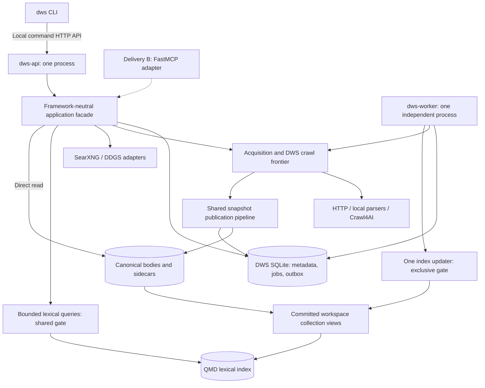
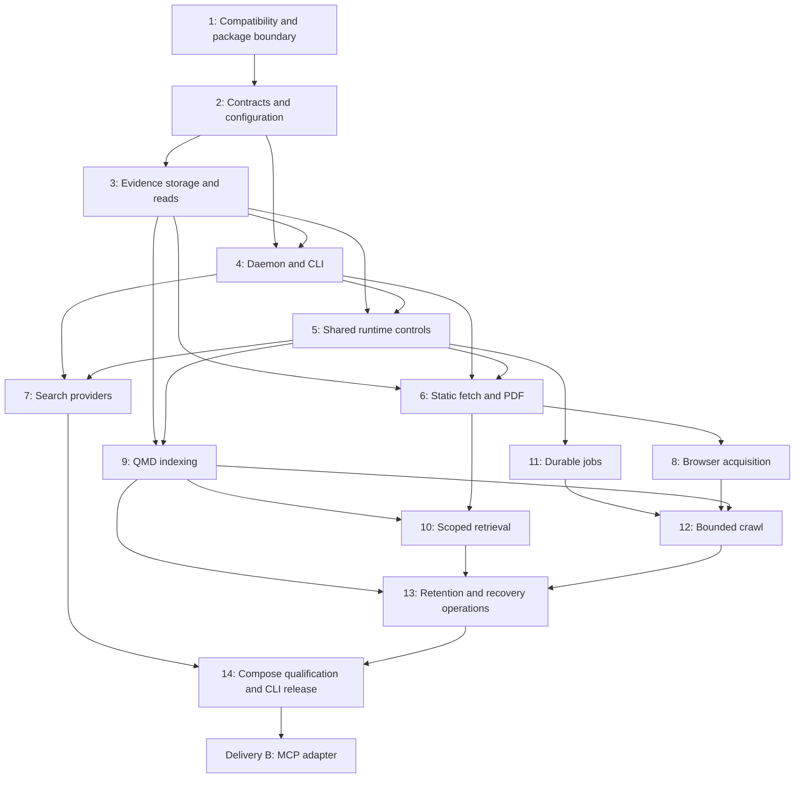

# DWS CLI and Core Engine Implementation Plan

*Names (2026-09): phase bridge → contractor, supervisor → inspector, runner → crew; citations below use the old names.*

**Date:** 2026-09-10

**Status:** Proposed implementation plan; planning only, no product code or validation results implied.

**Origin:** Owner instruction to build the complete DWS engine/CLI first and add an MCP wrapper afterward; [canonical PRD](../../brainstorms/dws/DWS_PRD.md) v1.0 and [technical design](../../brainstorms/dws/DWS_Design.md) v1.0.

**Goal:** Deliver a self-contained, local DWS engine that exposes discovery, acquisition, durable crawling, evidence retrieval, and maintenance through a usable CLI before implementing MCP.

**Planning record:** `cr-s63`. This records production of this plan, not implementation progress.

**Out of scope:**

- Product implementation during this planning task.
- MCP/FastMCP implementation, MCP resources, protocol Tasks, and host MCP installation in Delivery A.
- Internal research planning, synthesis, reports, model inference, vectors, and default OCR.
- Mandatory Firecrawl, TinyFish, Spider, remote exposure, authenticated scraping, or a new database engine.
- Changes to the existing workflow interpreter or reference submodules.

**Constraints — verbatim from the technical design:**

- “No default reasoning-model dependency”
- “A retained snapshot ID never changes its content”
- “Every returned passage maps to its retained snapshot”
- “Acknowledged durable jobs exist before their ID is returned”
- “Successful acquisition does not require immediate indexing”
- “QMD rebuild cannot delete DWS jobs or canonical evidence”
- “Workspace scope is enforced before a result leaves DWS”
- “No transaction spans network, browser, parser, or QMD work”
- “Actual concurrent work and queued work are bounded”
- “Policy denials never trigger bypass through another provider”
- “Normal CLI callers cannot bypass shared-state coordination”
- “Pins and active references protect evidence during cleanup”

## 1. Delivery split and authority

### Delivery A: complete engine and CLI

“CLI” means the usable product entry point for the full engine. It does not mean a collection of independent scripts that open the shared databases on every invocation.

Build the Python application core, local command daemon, independent worker, provider adapters, canonical storage, QMD integration, configuration, diagnostics, retention, and restore tooling. The normal `dws` command is a client of the local daemon. The daemon and worker share the same application package and local persistent volume. Neither depends on MCP.

CLI functionality grows with each vertical slice; it is not postponed until all backend work is finished. Every completed slice must be demonstrable through a real `dws` invocation.

### Delivery B: MCP wrapper

After Delivery A passes its acceptance gates, add FastMCP as an adapter over the existing application facade. Map the seven capability contracts and retained-resource addresses into MCP. Reuse the existing job state, policy, storage, and index ownership. Do not make the CLI invoke MCP or introduce a second engine.

The planned default is mounting the MCP adapter alongside the local command API in the same daemon. A remote bridge or separate MCP process is not assumed. FastMCP dependencies belong in an optional package extra/build target so the engine-only installation remains usable without them.

### How this changes the previous sequence

The owner's latest instruction changes delivery order, not the engine's durability or concurrency requirements. This plan overrides the earlier combined MCP/CLI milestone for sequencing. Before freezing implementation contracts, Task 1 records that sequencing change in the DWS design/PRD without rewriting accepted architectural history. Full original V1 interface parity is achieved only after Delivery B; Delivery A is explicitly the engine/CLI release.

Use `DWS_PRD.md` as the product baseline and `DWS_Design.md` as its proposed implementation companion. `DWS_PRD_and_Architecture_Decision_Record.md` is historical context, not a second active baseline. In particular, do not import its sole-writer API/coordinator topology.

Source identities reviewed for this plan:

| Source | SHA-256 |
|---|---|
| `docs/brainstorms/dws/DWS_PRD.md` | `1de029e91fd455a27673593dbd6aa18cea33effb7c40b35aee1e5d239c8fd610` |
| `docs/brainstorms/dws/DWS_Design.md` | `1eae8cfa93157cfb6afc9483960b0e4dc24c0ce080c93fce7925297573386f19` |

Both documents are design artifacts. Exact third-party interfaces, runtime pins, browser enforcement, filesystem locks, and capacity still require implementation evidence.

## 2. Runtime and code boundaries



API and worker can both write DWS SQLite using short owned transactions and bounded retries. The worker owns QMD collection updates and maintenance. API handles interactive operations and query admission. Shared filesystem slot locks enforce API/worker acquisition capacity. A store-maintenance gate protects files; a separate index lifecycle gate excludes queries during updates. The worker must continue durable crawl work through an API restart.

### Proposed implementation location

Current checkout evidence: the root package is `coding-ritual`, with interpreter-specific tests; DWS currently has design documents, not an established package. Use an isolated nested distribution at `dws/` as the proposed in-checkout implementation boundary. This avoids mixing crawler/native dependencies into the interpreter package and permits moving the distribution to its own repository later. Do not create another Git repository as part of this plan.

The paths below are planned ownership boundaries, not claims that files or exact internal symbols exist. Task 1 confirms this package location before creating product files. Keep all DWS design, plan, qualification, and operator documents in DWS subfolders; repository references in committed files remain relative.

```text
dws/
  pyproject.toml, uv.lock          # independently installable dws distribution
  compose.yaml, Dockerfile        # one DWS Compose entry point and shared image
  config/                         # DWS and provider configuration; no secrets
  src/dws/
    domain/                       # contract models, IDs, outcomes and errors
    services/                     # application facade and capability policies
    ports/                        # provider, evidence and index boundaries
    adapters/
      cli/                        # command parsing, local API client, output
      http/                       # local command API; no MCP in Delivery A
      storage/                    # DWS SQLite repositories and artifact files
      search/                     # SearXNG and DDGS
      acquisition/                # HTTP and Crawl4AI
      extraction/                 # HTML, text and PDF
      retrieval/                  # restricted QMD adapter and passage mapping
    policies/                     # scope, budgets, freshness, retention, URL safety
    runtime/                      # bootstrap, gates, permits, child supervision
    worker/                       # jobs, crawl execution, indexing, recovery
  tests/                          # DWS-only deterministic and integration tests
docs/plans/dws/                    # implementation plan and later MCP plan
docs/brainstorms/dws/              # PRD and technical design
docs/verification/dws/             # measured gates, runtime inventory, release evidence
docs/usage/dws/                    # CLI, configuration, recovery and integration guides
scratchpad/dws/                    # ignored transient logs and experiments
```

Use one Python distribution, ordinary explicit dependencies, Pydantic v2 contracts, uv, Ruff, and strict mypy consistent with repository conventions. Prefer standard-library `argparse` for the initial command surface; add a CLI library only for a present usability need. Python 3.13 is the repository starting point, subject to the DWS compatibility spike. Do not inherit interpreter test collection or unrelated dependencies into DWS accidentally.

## 3. Contracts to freeze before dependent implementation

### Shared application operations

The facade exposes search, fetch, crawl submission, retrieve, read, job status, job cancellation, and explicit owner administration. Inputs and outputs are DWS models, not HTTP, CLI, or MCP objects. Provider models terminate at adapter boundaries.

Every request resolves a request ID, workspace, optional run, policy version, deadline, and response budget. Caller limits can only tighten owner limits. Snapshots retain document identity, normalized body hash, location sidecar, capture time, acquisition observations, source URL/redirect history, and extractor version. Unknown publication dates remain unknown.

Use the design's `schema_version: "1.0"`, `workspace_id`, immutable `snapshot_id`, and `dws://snapshot/{snapshot_id}/...` addresses. A resource address in CLI JSON is a DWS locator; implementing it does not require MCP. Reads use 1-based inclusive normalized line selectors. A full-content URI must not silently mean only its first excerpt.

### CLI and command API surface

| CLI operation | Command API | Required behavior |
|---|---|---|
| `dws search QUERY` | `POST /v1/search` | Compact candidate URLs, snippets, explicit filter/fallback outcomes |
| `dws fetch URL` | `POST /v1/fetch` | Committed snapshot, copied excerpt, source metadata, scoped index state |
| `dws crawl URL` | `POST /v1/crawls` | Durable job/crawl IDs, idempotency support, poll hint |
| `dws retrieve QUERY` | `POST /v1/retrieve` | Scoped passages, exact selectors, coverage/index warnings |
| `dws read SNAPSHOT` | `POST /v1/read` | Bounded retained text independent of index availability |
| `dws jobs status JOB` | `GET /v1/jobs/{job_id}` | Execution state, counters, outcome and result handles |
| `dws jobs cancel JOB` | `POST /v1/jobs/{job_id}/cancel` | Cooperative request and current state, no artifact deletion |
| `dws crawls manifest CRAWL` | Proposed bounded crawl-manifest route | Cursor-based URL outcomes and stop reason |
| `dws workspaces ...`, `dws runs ...` | Proposed owner administration routes | Create/list scopes, defaults, optional run association/closure |
| `dws artifacts pin/unpin/export/expire ...` | `/v1/admin/...` | Explicit evidence protection and controlled export/expiry |
| `dws index status/rebuild`, `dws gc --dry-run` | `/v1/admin/...` | Coordinated maintenance through existing ownership |
| `dws backup`, `dws doctor` | `/v1/admin/...` and diagnostics | Verified backup and actionable capability/runtime status |
| `dws init`, `dws serve`, `dws worker`, `dws restore` | Local process/bootstrap entry points | Explicit startup or exclusive offline work, never implicit shared-store bypass |

The extra CLI administration commands are not extra default model-visible tools. Task 4 owns exact administrative route names and shared DTOs before dependent tasks add implementations.

Normal CLI commands fail clearly if the daemon is unavailable; they do not silently create another daemon or open live storage. Server connection/token and default workspace come from validated local configuration, with explicit overrides. Human output is concise; `--json` emits one schema-valid result on stdout, diagnostics on stderr. Proposed exit classes: 0 for a valid operation result (including disclosed partial/empty/pending results), 2 for invalid usage, 3 for policy denial, 4 for unavailable/capacity/deadline failures, and 1 for other operation/integrity failures. Job status returns its state as data; it does not convert a failed historical job into a failed status transport call.

Submission retries retain an idempotency key. The CLI must not automatically retry an ambiguous crawl submission under a new key. Ctrl-C on a foreground request cleans up that request; leaving a submitted crawl does not cancel it. If a wait convenience is supplied, it polls in ordinary code, preserves the job handle, and requires explicit cancellation to stop durable work.

### State and budget rules

- Jobs: `queued → running → completed | failed`; cancellation uses `cancel_requested → cancelled`, with cancellation from queued also supported. Completion has a separate `outcome` and `stop_reason`.
- Index readiness is per workspace/snapshot mapping: pending, applying, ready, failed, removal pending, removed. Epoch/generation identify verified builds; interrupted QMD mutation leaves a dirty/unready generation until reconciled.
- Query/update exclusion is the initial baseline. Direct reads and independent acquisition can continue while corpus retrieval waits or returns `INDEX_BUSY`.
- Page limits count distinct scheduled URLs, including failed acquisitions. Attempts, elapsed time, bytes, per-domain work and hosted expenditure have separate ceilings.
- Initial configurable limits follow the canonical PRD/design: HTTP 8, rendered pages 2, lexical queries 2, updater 1, active crawl 1, backlog 64; default crawl 100 URLs/depth 2, ordinary hard cap 1,000. These are qualification inputs, not measured capacity.
- Response defaults: search 10/max 20 records; fetch excerpt approximately 800/max 2,000 characters; retrieve 8/max 20 passages; ordinary read/retrieve target 20 KiB and ordinary payload ceiling 64 KiB. Count budgets and serialized-byte budgets both apply.
- Cache freshness, retention, pinning, and index inclusion are independent. Cross-workspace acquisition-cache sharing starts disabled. Equal bytes never erase source or membership history.

## 4. Task graph and execution conventions

This is a standalone implementation plan. Task numbers below are plan references, not fabricated Beads IDs or completion checkboxes. Before authorized implementation, create/reuse Beads work units for the next executable tasks and copy real dependency edges. Beads owns execution status; do not maintain a second status ledger in this document. Record `plan: docs/plans/dws/cli-engine-implementation-plan.md` in issue notes.



Independent tasks may proceed concurrently only with separate path ownership and stable shared contracts. Runtime, storage, and facade edits require one integration owner; do not assign overlapping writes merely because the graph has parallel branches. Small tasks remain local. This plan does not prescribe models or authorize an agent council.

All verification commands below are **planned commands**, run from `dws/` after Task 1 creates that package and tooling. They are not claims that tests exist or pass today. Test files may be split within their named ownership boundary; update the plan references if their entry paths change. Risky state, security, and concurrency behavior is test-first; real binaries and process failure injection are required at integration boundaries. Live provider smoke tests are separate from deterministic fixture tests. Register DWS test markers in its own package; tests requiring QMD, Docker, or browser services check prerequisites explicitly and use isolated fixture volumes. Missing prerequisites remain reported gaps, never quiet passes or tests against owner data.

## 5. Delivery A tasks

### Task 1: Qualify dependencies and establish the DWS package boundary

Goal: The implementer has a buildable engine-only package and evidence that the selected runtime, QMD lifecycle, and browser deployment can meet the design before committing to higher-level implementation.

Files:
- Create: `dws/pyproject.toml`, `dws/uv.lock`, minimal `dws/src/dws/`, `dws/tests/qualification/`, preliminary `dws/Dockerfile` and `dws/compose.yaml`.
- Create: `docs/verification/dws/runtime-qualification.md` and a machine-readable tested runtime manifest under that directory.
- Modify: DWS PRD/design sequencing and release-boundary notes only, to reflect the owner's CLI-first instruction and retain MCP requirements for Delivery B.

Interfaces:
- Consumes: PRD gates G-01 through G-12 and design DD-001 through DD-009.
- Produces: installable `dws` entry point, independent test/lint/type tooling, pinned dependency/image inventory, chosen subprocess and filesystem lifecycle constraints.

Approach: Confirm the proposed nested package location against live checkout state. Keep the root interpreter package unchanged. Pin tested Python, HTTP/parsing, SQLite, QMD JavaScript/native, and browser dependencies using official upstream interfaces and actual binaries. Probe QMD cold initialization, lexical query/update/get, parseable output, per-path verification, model-free execution, concurrent search startup, and interrupted updates. Prototype filesystem slot locks, lock survival with child processes, and browser navigation/subrequest enforcement on the intended Linux volume. Record platform and licensing limitations with evidence. FastMCP installation and protocol compatibility are moved to Delivery B; do not let that deferred gate block the engine package. Use local fixture servers with narrowly isolated test-network policy, never relax production URL safety to accommodate fixtures.

Verification: `uv sync --locked`; `uv run dws --help`; `uv run pytest -q tests/qualification`. Record actual image build/probe commands and outputs in the qualification report. No accepted QMD path downloads models or invokes inference. Failed essential browser/lock/QMD gates prevent release claims and produce an explicit design decision before dependent risky work.

Test seams: actual QMD executable, subprocess supervisor, local volume locks, pinned browser service, fresh image without model caches or credentials.

Dependencies: None.

Risks: Characterization-first. Third-party behavior is unverified until these probes pass; avoid replacing QMD or removing browser scope without a recorded owner decision.

### Task 2: Freeze DWS contracts, configuration, and provider ports

Goal: Every engine operation and adapter shares one bounded schema and policy model that does not import a transport or vendor runtime.

Files:
- Create: `dws/src/dws/domain/`, `ports/`, `policies/` contract/configuration boundaries, `dws/config/dws.example.yaml`.
- Test: `dws/tests/contracts/`, `dws/tests/unit/test_configuration.py`.
- Create: `docs/usage/dws/contracts.md`.

Interfaces:
- Consumes: qualified package/runtime, Section 3 contracts and PRD payload examples.
- Produces: validated requests/results/errors, provider capability descriptors, artifact/index interfaces, effective policy calculation and configuration version identity.

Approach: Use immutable Pydantic models by default, reject unknown closed-schema inputs, and preserve nullable source dates. Define IDs, line selectors, cursor identity, job/outcome distinction, per-mapping index state, and typed capacity/policy/integrity errors. Set safe owner defaults and make requested limits monotonically stricter. Specify output trimming before serialization. Contracts for search, acquisition, extraction and lexical retrieval include limits, filter support, safe provider attempts, and provenance. Test a fake provider through the interface without core imports of its vendor types. Keep internal names flexible behind these contracts.

Verification: `uv run pytest -q tests/contracts tests/unit/test_configuration.py`; invalid selectors, unknown fields, elevated limits, malformed cursors, fabricated dates, and oversized output are rejected or explicitly bounded. Core import tests pass with HTTP/MCP/provider adapters unavailable.

Test seams: serialized request/result schemas, effective policy resolver, fake adapter conformance, import boundaries.

Dependencies: Task 1.

Risks: Test-first for policy and externally visible schemas. Do not duplicate DTOs in CLI, HTTP, and future MCP.

### Task 3: Implement canonical evidence, metadata, and direct reads

Goal: A usable snapshot can be durably published and read with exact locators, source history, and workspace enforcement without a working search index.

Files:
- Create: `dws/src/dws/adapters/storage/`, evidence service and DWS migration files within that boundary.
- Test: `dws/tests/integration/test_evidence_store.py`, `test_publication_recovery.py`.

Interfaces:
- Consumes: evidence/store contracts and shared identifiers.
- Produces: publish/read operations; workspace/run/membership repositories; snapshot/acquisition records; indexing-outbox insertion in the same metadata transaction; bounded manifest lookups.

Approach: Implement DWS SQLite schema/bootstrap and transaction ownership, immutable body and structure sidecars, staged hash validation, collision-safe publication, and metadata-plus-outbox commit. Keep mutable acquisition timestamps out of quoted text. Equal-byte reuse preserves observations and memberships; normalization-version changes remain distinguishable. Direct read validates scope, retention, hash and selector. Distinguish an intentional tombstone from a missing-file integrity failure. Crash points before/after file publication and commit must leave either acknowledged evidence or reconcilable orphans, never a successful missing body. Integrate shared store gates in Task 5 before enabling concurrent service access.

Verification: `uv run pytest -q tests/integration/test_evidence_store.py tests/integration/test_publication_recovery.py`; exact reads survive source changes and metadata restart, cross-workspace reads fail, snapshots are never overwritten, and failed commits never acknowledge captures.

Test seams: real temporary SQLite and filesystem, publication/read facade, deterministic fault points at durable boundaries.

Dependencies: Task 2.

Risks: Test-first for integrity, membership and crash recovery. Do not create DWS FTS tables or use QMD as the evidence archive.

### Task 4: Deliver the local command daemon and working CLI shell

Goal: A real CLI communicates with one command daemon using the shared contracts, with useful startup, scope-management, diagnostics, and bounded error behavior before provider features arrive.

Files:
- Create: `dws/src/dws/adapters/cli/`, `adapters/http/`, facade composition boundary, daemon/bootstrap entry points.
- Test: `dws/tests/integration/test_cli_api.py`, `test_local_access.py`.
- Create: `docs/usage/dws/cli.md`.

Interfaces:
- Consumes: shared models, policy and storage interfaces; receives concrete storage from Task 3 at integration.
- Produces: Section 3 routes and command parsing, configuration discovery, local connection/authentication behavior, human/JSON formatting and admin route contracts.

Approach: Implement FastAPI command transport without FastMCP. Normal CLI calls the daemon and never recursively calls its own process or silently opens shared stores. Register only implemented capabilities; unavailable features produce explicit capability status instead of fake successful responses. Add workspace create/list/default handling and optional run create/close, matching membership rules. Resolve administrative DTOs for manifest, pin/export, index, backup and diagnostic operations before their later implementations. Validate Host/Origin/token policy and keep secrets out of output. Supply explicit foreground init/serve/worker entry points; online maintenance goes through the daemon, exclusive bootstrap/restore is a distinct process mode.

Verification: `uv run pytest -q tests/integration/test_cli_api.py tests/integration/test_local_access.py`; test subprocess stdout/stderr and exit classes, daemon absence, malformed inputs, unknown scopes, denied local access, and schema parity between CLI-decoded results and facade output. `uv run dws --help` and scope/doctor commands work against a temporary daemon.

Test seams: actual CLI subprocess and loopback command server with temporary configuration; fake service boundaries only for capabilities not yet built.

Dependencies: Tasks 2 and 3. CLI transport work may start against contract fixtures earlier; its acceptance exit requires real storage.

Risks: Test-first for local access and output contracts. This is a product shell, not completion of the engine.

### Task 5: Enforce shared resource limits and process ownership

Goal: API and worker obey the same acquisition limits, safe lock ordering, transaction boundaries, and child-process lifetime rules under failures.

Files:
- Create: `dws/src/dws/runtime/` permits, gates, supervision and admission modules.
- Modify: storage transaction/publication integration, daemon lifecycle, worker composition.
- Test: `dws/tests/concurrency/test_runtime_controls.py`, `test_child_ownership.py`.

Interfaces:
- Consumes: qualified lock primitives, budget config, storage and daemon boundaries.
- Produces: global resource-slot acquisition, store-maintenance and index-lifecycle gates, supervised child execution, per-class bounded queues and responsive status/cancel path.

Approach: Coordinate filesystem-backed acquisition slots across processes. Acquire store-maintenance before index lifecycle before any short DB transaction when all are needed. Network/parsing and acquisition-slot waits occur outside DB transactions and maintenance gates. Keep file protection through direct reads/exports. Stop new queries when an exclusive index operation waits; drain bounded existing work. Ensure parent death cannot release a conflicting lock while its QMD child survives. Track provider handles when remote work outlives a timeout and reconcile residual work before assuming capacity is free. Record queue wait and execution time separately; bound waiting objects and preserve interactive fairness versus crawl work.

Verification: `uv run pytest -q tests/concurrency/test_runtime_controls.py tests/concurrency/test_child_ownership.py`; two separate processes never multiply configured slots, parent/child kills preserve ownership, queues saturate with typed backpressure, and status/cancel stays responsive during browser saturation.

Test seams: real processes and OS locks on the target volume, supervised fixture child processes, transaction traces and admission metrics.

Dependencies: Tasks 3 and 4.

Risks: Test-first and crash-injection-first. Unsupported lock semantics require another qualified coordination mechanism before release, not independent in-process semaphores.

### Task 6: Deliver static fetch, text/PDF extraction, and freshness reuse

Goal: `dws fetch` captures suitable public HTML, text and text-bearing PDFs, and `dws read` returns the exact retained content even with indexing disabled.

Files:
- Create: `dws/src/dws/adapters/acquisition/` HTTP adapter, `adapters/extraction/`, acquisition service, URL-safety/freshness policies.
- Modify: CLI/API fetch/read registration and evidence integration.
- Test: `dws/tests/integration/test_fetch_read.py`, `tests/security/test_url_policy.py`, `tests/fixtures/` content corpus.

Interfaces:
- Consumes: acquisition/extractor ports, evidence publication, global permits, request policy and CLI transport.
- Produces: normalized captures with links/location sidecars, quality signals, acquisition attempts, cache/revalidation outcomes and committed fetch responses.

Approach: Stream bounded downloads, inspect media rather than filename suffix, and enforce redirects, DNS/address policy, decompression, bytes and deadlines. Bind validated target handling to the actual network connection so a second DNS resolution cannot silently defeat policy. Extract static content locally; preserve code, headings and simple tables where supported. Retain reliable PDF page mapping and distinguish scanned/unsupported layouts. Add freshness matching, conditional revalidation and policy-sensitive in-flight acquisition claims keyed by workspace. Preserve source observations on reuse. Followers can detach without cancelling shared work still needed by others. A timeout does not silently promote fetch into a durable job with no returned handle.

Verification: `uv run pytest -q tests/integration/test_fetch_read.py tests/security/test_url_policy.py`; static fixtures invoke no browser, excerpts match stored lines, changed sources preserve old snapshots, challenge pages are not indexed as articles, PDF limitations are explicit, and private redirects/DNS changes/oversized inputs are bounded. Exercise `dws fetch --json` followed by `dws read` through the running daemon.

Test seams: actual CLI/API, controlled HTTP/DNS/redirect fixtures, real parsers, persisted acquisition history and retained files.

Dependencies: Tasks 3, 4 and 5.

Risks: Test-first for SSRF, cache/coalescing and fidelity. Qualification fixtures must expose omissions in tables, negations, units and code, not only extracted character counts.

### Task 7: Deliver SearXNG discovery and DDGS fallback

Goal: `dws search` discovers compact candidates with explicit filter support, legitimate empty outcomes, and bounded visible fallback attempts.

Files:
- Create: `dws/src/dws/adapters/search/`, search service/cache integration, `dws/config/searxng/` settings.
- Modify: search CLI/API registration and provider configuration.
- Test: `dws/tests/contracts/test_search_providers.py`, `tests/integration/test_search.py`.

Interfaces:
- Consumes: search adapter contracts, request/deadline policies, metadata history, shared command transport.
- Produces: ranked URL records, search IDs, cache age, filter coverage and provider-attempt history.

Approach: Enable and verify SearXNG's machine-readable interface on the pinned deployment. Normalize results while preserving the requested query; deduplicate safely and expose unknown dates. Add DDGS as an eligible fallback within the same deadline and attempt budget. Distinguish zero results, malformed responses, unsupported filters, transport failures, throttling and total failure. Do not represent shared upstream engines as independent redundancy. Search history stores compact records rather than fetching every returned URL. Hosted fallback remains disabled unless separately implemented and configured.

Verification: `uv run pytest -q tests/contracts/test_search_providers.py tests/integration/test_search.py`; primary timeout falls back once within policy, empty results stay distinct from errors, filters cannot be silently ignored, and CLI JSON remains valid within aggregate bounds. Run separately marked live smoke tests against the configured SearXNG/DDGS paths in Task 14.

Test seams: provider contract fixtures, real daemon/CLI, persisted attempt and search-cache records.

Dependencies: Tasks 3, 4 and 5.

Risks: Test-first for outcome semantics and retry budgets. Upstream search nondeterminism must not make fixture tests flaky.

### Task 8: Deliver browser acquisition through Crawl4AI

Goal: `dws fetch` acquires pages that genuinely need rendering while enforcing the same evidence, policy and budget contracts as static fetch.

Files:
- Create: Crawl4AI adapter under `dws/src/dws/adapters/acquisition/`, browser capability configuration.
- Modify: acquisition routing, `dws/compose.yaml`, browser enforcement configuration.
- Test: `dws/tests/integration/test_rendered_fetch.py`, `tests/security/test_browser_egress.py`.

Interfaces:
- Consumes: qualified browser API/egress mechanism, canonical acquisition pipeline and shared rendered permits.
- Produces: rendered page content/link outcomes in the same acquisition contract, explicit residual-job/timeout information and extraction warnings.

Approach: Route caller-declared rendering or inspectable script-shell/extraction signals to Crawl4AI. A short useful page does not automatically escalate. Apply target policy to navigation, redirects and browser subrequests using the qualified enforcement mechanism. Scope provider connection credentials separately from target URLs. Keep provider services off host-published ports and deny them DWS volumes and host credentials. Track browser work through timeout/cancellation so local slot release does not falsely imply remote work stopped. Feed provider Markdown through DWS identity, retention and validation. Firecrawl/TinyFish extension points remain dormant; no autonomous vendor Agent path is introduced.

Verification: `uv run pytest -q tests/integration/test_rendered_fetch.py tests/security/test_browser_egress.py`; a JS fixture yields captured evidence, a private subresource/navigation is blocked, rendering concurrency holds, policy denials never cause bypass fallback, and timeout reports residual work truthfully. Actual pinned browser tests are required; a mocked egress adapter is insufficient release evidence.

Test seams: real browser service and controlled web fixtures, network observations, CLI fetch output and shared permit accounting.

Dependencies: Tasks 1 and 6.

Risks: Test-first for trust boundaries. If browser egress cannot be enforced, report the blocked capability; do not call the complete browser-enabled CLI baseline ready.

### Task 9: Build the worker-owned lexical indexing pipeline

Goal: Committed snapshots become verified searchable mappings through one recoverable index updater, without model operations or dependence on private QMD tables.

Files:
- Create: `dws/src/dws/adapters/retrieval/` restricted QMD adapter, `worker/` index loop, mapping/outbox repositories and collection-view manager.
- Modify: index diagnostic CLI/API and worker lifecycle.
- Test: `dws/tests/integration/test_index_pipeline.py`, `test_index_recovery.py`.

Interfaces:
- Consumes: committed evidence/outbox, workspace memberships, shared lifecycle gates and supervised child interface.
- Produces: workspace collections, verified mapping readiness, index epoch/generation, bounded retry/dirty-state outcomes and index status.

Approach: Bootstrap QMD through its supported interface. Select outbox batches to a watermark, materialize committed immutable body views using verified links/copies, and serialize registration/update/removal under the exclusive index gate. Later publications remain outside the batch. Verify affected paths and hashes before committing ready mappings; process success alone is insufficient. Interrupted or partial QMD mutation leaves a dirty generation; reconcile or rebuild before serving trusted search results. Support add/remove races by mapping revision so a stale batch cannot re-publish deleted membership. Keep canonical files intact on index failure and never run model commands because QMD reports missing embeddings.

Verification: `uv run pytest -q tests/integration/test_index_pipeline.py tests/integration/test_index_recovery.py`; real pinned QMD indexes committed batches only, detects partial-file failure, honors workspace-specific readiness, survives kills without false ready generations, and rebuilds with network/model downloads blocked. `dws index status` exposes actual pending/failed mappings.

Test seams: real QMD binary, outbox transactions, materialized views, child-process kill points, CLI index status.

Dependencies: Tasks 1, 3, 4 and 5. Index-loop work does not depend on the later crawl job implementation.

Risks: Test-first for state publication and recovery; no direct SQL into QMD. Keep the one worker's indexing loop bounded so later crawl work cannot starve it.

### Task 10: Deliver scoped lexical retrieval and exact passages

Goal: `dws retrieve` returns bounded, verifiable passages within requested workspace/run/crawl/document scope and accurately explains indexing or candidate-coverage gaps.

Files:
- Create: retrieval service, passage builder and cursor handling within `dws/src/dws/services/` and retrieval adapter boundary.
- Modify: CLI/API retrieve/read output and coverage reporting.
- Test: `dws/tests/integration/test_retrieval.py`, `test_retrieval_scope.py`.

Interfaces:
- Consumes: verified index mappings, lexical adapter, canonical read/location maps, scoped memberships and shared gates.
- Produces: exact passage envelopes, bounded continuation, ranking labels, `filter_complete`, pending counts and extraction warnings.

Approach: Query the workspace collection, prefer verified native subset filters, otherwise expand bounded candidate windows and apply authoritative DWS membership. Label a permitted direct lexical scan over a small explicit snapshot set distinctly. Never infer empty scoped evidence from a tiny global top-K. Build snippets from canonical bodies, merge overlapping windows, verify selectors, and indicate title-only matches rather than inventing supporting body text. Hold file protection through response construction; bind cursors to scope/query/generation and reject stale generations. Separate ordinary pending mappings from globally dirty/unavailable index state.

Verification: `uv run pytest -q tests/integration/test_retrieval.py tests/integration/test_retrieval_scope.py`; colliding terms cannot leak across workspaces, relevant subset matches beyond the first candidate window are found or explicitly incomplete, every passage equals its selected normalized text, and an index update yields bounded wait/`INDEX_BUSY` while `read` succeeds.

Test seams: real QMD and canonical artifacts, public CLI/API, deliberately colliding fixture corpora, concurrent removal/retrieval and generation changes.

Dependencies: Tasks 6 and 9.

Risks: Test-first for scope and provenance. Lexical relevance scores never become credibility or completeness scores.

### Task 11: Implement durable jobs, idempotency, leases and cancellation

Goal: Acknowledged execution survives API/client loss and can recover safely from worker loss with fenced ownership and explicit cancellation.

Files:
- Create: job service/repositories and worker lease/recovery logic within `dws/src/dws/services/`, `adapters/storage/`, `worker/`.
- Modify: CLI/API job status/cancel and worker loop coordination with indexing.
- Test: `dws/tests/integration/test_jobs.py`, `tests/concurrency/test_job_recovery.py`.

Interfaces:
- Consumes: metadata transactions, command contracts, runtime process ownership, policy/deadline config.
- Produces: durable submit/claim/checkpoint/complete/cancel semantics, normalized-input idempotency, owner epochs and resumable unit execution for crawl.

Approach: Commit recoverable inputs and idempotency association before acknowledgement. Same key/input returns the existing handle; conflicting input fails explicitly. Claim work atomically and fence checkpoint/terminal writes by owner epoch. Leases indicate suspected ownership loss, not proof a provider stopped. Reconcile live processes/provider handles before replay. Job and index execution share one bounded worker process with explicit fairness; no separate broker or protocol task database. Cancellation stops new scheduling and records cleanup/residual work while retaining useful snapshots. Keep request timeout, job deadline and provider timeout separate.

Verification: `uv run pytest -q tests/integration/test_jobs.py tests/concurrency/test_job_recovery.py`; response-loss retry returns one job, immediate status resolves acknowledged IDs, API restart does not stop worker execution, stale owners cannot overwrite new state, and cancellation before/during execution has correct outcomes.

Test seams: actual API and worker processes, SQLite state transitions, fault-injected unit executor, public job commands.

Dependencies: Tasks 3, 4 and 5. Integrate with Task 9's index loop before the single-worker release.

Risks: Test-first for at-least-once behavior, fencing and cancellation. Do not promise exactly-once external requests or billing.

### Task 12: Deliver bounded, resumable DWS-owned crawling

Goal: `dws crawl` traverses a permitted site section through the shared acquisition pipeline and returns durable progress/manifests with reconcilable limits and outcomes.

Files:
- Create: crawl service/frontier and worker execution under `dws/src/dws/services/`, `worker/`, storage frontier repository.
- Modify: CLI/API crawl submission, manifest pagination and job progress projection.
- Test: `dws/tests/integration/test_crawl.py`, `tests/concurrency/test_crawl_recovery.py`.

Interfaces:
- Consumes: durable jobs, static/rendered acquisition, scope/budget policy, snapshot publication and outbox.
- Produces: persisted frontier and per-URL outcomes, crawl membership, counters, manifest handles and explicit stop reasons.

Approach: Persist seed at depth zero, normalize URL keys without destroying meaningful parameters, and check host/path/depth policy before scheduling and again before acquisition. Explicitly control subdomains and redirects. Count distinct scheduled URLs including eventual failures; retries consume attempt/time budgets rather than adding fresh page allowances. Persist snapshot outcome and link expansion transactionally where possible, otherwise replay link expansion from retained snapshots idempotently. Retain the counter partition: scheduled equals queued plus in-flight plus succeeded plus failed plus skipped-after-scheduling. Stop reasons distinguish frontier exhausted, page/time/attempt limit, cancellation, policy, provider and disk/resource failures. Job completion never claims index completion.

Verification: `uv run pytest -q tests/integration/test_crawl.py tests/concurrency/test_crawl_recovery.py`; local cyclic/off-scope/redirecting/failing sites stay within budgets, interrupted link expansion does not refetch completed pages blindly, cancelled/partial crawls retain captures, and CLI status/manifest counters reconcile after restart.

Test seams: real daemon/worker, controlled linked fixture sites, durable frontier/state inspection, CLI submission/status/cancel/manifest commands.

Dependencies: Tasks 8, 9 and 11, including outbox consumption for searchable crawl results.

Risks: Test-first for traversal, counters and recovery. Native provider frontier ownership remains a separately qualified extension.

### Task 13: Deliver retention, pin/export, backup and restore

Goal: Owners can preserve cited evidence, inspect/remove eligible transient artifacts, and restore a coherent engine without losing protected snapshots or confusing expiry with corruption.

Files:
- Create: retention/maintenance and backup/restore modules within `dws/src/dws/services/`, `runtime/`, `adapters/storage/`.
- Modify: CLI/API administration and worker maintenance handling.
- Test: `dws/tests/integration/test_retention.py`, `test_backup_restore.py`, `tests/concurrency/test_maintenance_races.py`.
- Create: `docs/usage/dws/operations.md`.

Interfaces:
- Consumes: pins/memberships, tombstones, file/index gates, outbox removal, job references and runtime manifest.
- Produces: pin/unpin/expire, bounded manifest/export, dry-run and real GC, quiesced backup, exclusive restore/rebuild and capability verification.

Approach: Enforce retention independently of freshness. Recheck pins/references in a transaction before deletion pending; exclude pending deletion from retrieval, remove the workspace view, reconcile QMD and delete canonical bytes only after final reference checks. Explicitly resolve pin/GC races. Stop admitting large work under disk pressure without evicting pins. Export a verified snapshot package with locators, provenance, hashes and selected originals to a controlled server area or the CLI's own destination, never an arbitrary MCP/server host path. Backup pauses state-changing admission/claims, reaches bounded checkpoints, protects the selected file set, copies SQLite through supported behavior, verifies the manifest and releases maintenance. Restore into an empty volume, verify version/hash compatibility, reconcile jobs/handles, rebuild QMD if needed, and validate pinned reads before reopening admission. Upgrade/rollback uses a verified backup and explicit schema compatibility checks.

Verification: `uv run pytest -q tests/integration/test_retention.py tests/integration/test_backup_restore.py tests/concurrency/test_maintenance_races.py`; pins and active readers survive races, dry-run predicts eligible effects, expiry is explicit, disk pressure preserves protected content, and restore without QMD reproduces the original pinned passage and job metadata. Exercise all operations through CLI or explicit exclusive restore mode.

Test seams: actual file/index/SQLite state, concurrent CLI processes, fixture backup volume, process kills during maintenance and restore validation.

Dependencies: Tasks 10 and 12, including the indexing/removal and durable job integrations.

Risks: Test-first for destructive and recovery semantics. Implement and test cleanup on disposable fixture volumes; do not use owner evidence as a test corpus.

### Task 14: Qualify and document the complete engine/CLI release

Goal: A fresh machine/container installation runs the full baseline with one Compose entry point and no MCP/model/hosted credentials, with measured limits and a demonstrated recovery workflow.

Files:
- Finalize: `dws/compose.yaml`, `dws/Dockerfile`, `dws/config/`, package/lock/build configuration.
- Create: `dws/tests/acceptance/`, `tests/live/`, `docs/usage/dws/getting-started.md`, `docs/usage/dws/host-cli-workflow.md`, `docs/verification/dws/cli-release-qualification.md`.
- Modify: capability diagnostics, sanitized structured logging and CLI documentation at their owning modules.

Interfaces:
- Consumes: complete capabilities from Tasks 1–13, pinned runtime manifest, acceptance matrix below.
- Produces: tested engine-only installation, actual command examples, release evidence, known limitations and MCP handoff package.

Approach: Finalize one API and one worker from the shared image, provider-only internal networking, persistent volumes, explicit one-shot bootstrap, health/readiness and graceful restart. Capability readiness must allow stored reads when discovery/indexing is unavailable. Keep model/hosted secrets absent and FastMCP absent from the engine-only build. Exercise search→selected fetch→retrieve→read and crawl→status→cancel/manifest through actual CLI subprocesses; verify pin/export/restore. Add a portable host CLI workflow template that leaves query formulation and synthesis to the host, satisfying the engine-stage integration requirement without MCP. Run mixed load at 1/5/10/20/50 callers, report queue/SQL/QMD/browser costs separately, verify resource ceilings, and document the supported reference profile without promising arbitrary agent capacity. Run small separately opted-in public provider probes with configured privacy/budget policy; fixture success does not prove live provider connectivity.

Verification: `uv sync --locked`; build/start the fresh qualification environment with `docker compose up -d --build` using the fixture configuration and isolated volume; inspect health and loopback-only publication. Run `uv run pytest -q -m 'not live'` once, including `tests/acceptance`, then `uv run ruff check src tests`, `uv run ruff format --check src tests`, and `uv run mypy --strict src/dws`. Execute the separately gated `tests/live` suite only against permitted providers. Record actual commands, runtime identities, results, skips and measurements; an unavailable required check is unverified, not passed.

Test seams: fresh default image/volume, actual CLI/API/worker/QMD/browser, exact source passage comparison, restart/restore and network observations.

Dependencies: Tasks 7 and 13, with all prior graph dependencies integrated.

Risks: Acceptance is based on observed behavior, not file presence or service liveness. No commit, publication, deployment to an owner environment, or external messaging is implied by this plan.

## 6. Delivery A acceptance and requirement coverage

### Demonstrable milestones

| Milestone | Included tasks | Demonstration and exit |
|---|---|---|
| A0: qualified foundation | 1–5 | Engine-only package, real CLI/daemon, persistent scope/evidence primitives and tested cross-process ownership |
| A1: useful acquisition | 6–8 | Search public sources, capture static/PDF/rendered pages, and read exact saved snapshots through CLI |
| A2: searchable evidence | 9–10 | Asynchronous indexing, scoped bounded passages, readable pending captures and recoverable index failure |
| A3: durable site acquisition | 11–12 | A bounded crawl survives API restart, recovers worker loss and exposes cancellation/partial manifests |
| A4: complete CLI release | 13–14 | Pin/export/cleanup, fresh Compose startup, offline retained retrieval, measured concurrency and verified restore |

Milestones group outcomes; actual scheduling follows task dependencies. Task 11 can be developed alongside retrieval once its inputs are available. The first ready implementation unit is Task 1, not MCP scaffolding.

### Functional requirement mapping

| Canonical requirement | Delivery A ownership | Later boundary |
|---|---|---|
| FR-001 | Tasks 2, 4, 6, 7, 10, 11, 12: all seven capabilities through core/CLI | Delivery B maps the same operations to MCP |
| FR-002, FR-003, FR-004, FR-005 | Tasks 2 and 7: bounded discovery, unchanged queries, filters and typed fallbacks | None |
| FR-006, FR-007, FR-008 | Tasks 3, 6 and 8: safe acquisition, immutable capture and rendering escalation | MCP rendering of resource links only |
| FR-009, FR-010 | Task 6: explicit PDF extraction path and honest unsupported output | Default OCR remains excluded |
| FR-011, FR-012, FR-013, FR-014 | Tasks 11 and 12: frontier, persistence, manifests and restart | None |
| FR-015 | Tasks 1, 9 and 14: actual lexical-only QMD qualification | No semantic mode implied |
| FR-016, FR-017, FR-018 | Tasks 3 and 10: scoped passages and direct reads | MCP resource/read projection only |
| FR-019, FR-020 | Tasks 9 and 10: outbox, verified mappings and partial index/filter reporting | None |
| FR-021, FR-022 | Tasks 3, 9 and 13: separate ownership and preserved provenance | None |
| FR-023 | Tasks 6 and 13: freshness independent of retention | None |
| FR-024 | Task 13: pin/unpin/export/expiry, dry-run GC and pressure control | No new default MCP admin tools |
| FR-025, FR-026 | Tasks 1, 3, 5, 9 and 14: bounded work, transactions and bootstrap | MCP uses these same controls |
| FR-027, FR-028 | Tasks 6, 11 and 12: coalescing, idempotency and cancellation | MCP uses the same job state |
| FR-029 | Tasks 1, 4 and 14: one DWS Compose entry point and persistent state | Add MCP to qualified runtime later |
| FR-030 | Tasks 4, 5, 6, 8, 13 and 14: local access, egress, secrets and safe maintenance | MCP transport-specific tests in Delivery B |
| FR-031, FR-032 | Tasks 2, 4 and 14: shared bounded schemas, engine-only model-free build | MCP wire envelopes in Delivery B |
| FR-033 | Tasks 5–14 at their owning boundaries; Task 14 integrates diagnostics | None |
| FR-034 | Task 14: portable CLI-based host workflow with explicit pin/export | MCP installation guidance in Delivery B |
| FR-035 | Adapter seams/conformance in Tasks 2, 6, 7 and 8 | Optional Firecrawl/Spider implementation requires measured benefit; outside required releases |
| FR-036 | DWS JobService in Task 11 is the future integration boundary | Native MCP Tasks/notifications remain optional after ordinary MCP tools |

### Non-functional requirement mapping

| Requirement | Ownership and proof |
|---|---|
| NFR-001 | Tasks 1, 9, 14: no-model fresh-image qualification |
| NFR-002 | Tasks 2, 5–12, 14: byte/queue/deadline/crawl limits and measured load |
| NFR-003 | Tasks 3, 9, 11–13: acknowledged state, crash recovery and restore |
| NFR-004 | Tasks 3, 6, 8, 10: exact snapshot text, provenance and selectors |
| NFR-005 | Tasks 2, 6–12: empty, failed, pending, partial and unsupported outcomes |
| NFR-006 | Tasks 1, 4, 14: one Compose installation and real local CLI access |
| NFR-007 | Tasks 2, 6–10: replaceable ports and conformance without core vendor imports |
| NFR-008 | Tasks 3, 9, 13: independent QMD lifecycle and evidence authority |
| NFR-009 | Tasks 2, 4: CLI/API/facade parity; full MCP parity is Delivery B |
| NFR-010 | Tasks 5–14: sanitized diagnostics and independently attributed timing |
| NFR-011 | Tasks 4–8, 13, 14: exposure, URL/browser policy and maintenance safety |
| NFR-012 | Tasks 1, 13, 14: exact runtimes, pins, migrations and upgrade/restore evidence |

### Canonical acceptance-test disposition

| PRD test | Planned ownership / release treatment |
|---|---|
| AT-001 | Task 14, fresh default Compose without hosted/model/MCP credentials |
| AT-002 | Tasks 2/4 prove CLI/API/facade schema parity; MCP-vs-CLI portion belongs to Delivery B |
| AT-003, AT-004 | Task 7, search fallback and distinct empty/malformed/filter failures |
| AT-005, AT-006 | Tasks 6/8, static/browser routing and PDF limitations |
| AT-007, AT-008, AT-009 | Tasks 3/6, exact excerpts, reuse, source/version history |
| AT-010 | Task 12, scoped cyclic/failing crawl and counter reconciliation |
| AT-011 | Task 11, durable acknowledgement and submission idempotency |
| AT-012, AT-013, AT-014 | Tasks 11/12, API/worker restart and cooperative cancellation |
| AT-015 | Tasks 1/9/14, real QMD with inference/download paths blocked |
| AT-016, AT-017 | Task 10, workspace/subset coverage and exact bounded passages |
| AT-018 | Tasks 3/9/10, successful read with unavailable/pending index |
| AT-019 | Tasks 9/13, QMD-only rebuild preserving metadata and evidence |
| AT-020, AT-021, AT-022 | Tasks 5/9/14, real multi-process controls, transaction traces and multi-CLI load |
| AT-023, AT-024, AT-025 | Task 13, retention races, disk pressure and verified backup/restore |
| AT-026, AT-027, AT-028 | Tasks 4/5/6/8/14, unsafe targets, secret/command/path injection and oversized input |
| AT-029 | Tasks 2/4/7/10/12/14, bounded valid responses and cursor semantics |
| AT-030 | Task 14, host CLI workflow with pin/export and external synthesis; repeat for MCP in Delivery B |
| AT-031 | Tasks 1/5/9/13/14, startup/update/maintenance and release restart qualification |
| AT-032 | Optional provider expansion, outside the required CLI or MCP baseline; do not mark passed by dormant adapter seams |
| AT-033 | Optional native MCP Tasks integration after ordinary Delivery B capabilities |
| AT-034 | Task 2 and provider contract suites, fake-provider substitution without core vendor coupling |
| AT-035 | Task 14 for command/CLI connectivity and private provider ports; MCP client connectivity in Delivery B |
| AT-036 | Tasks 1/14 for engine/QMD/SQLite/image identity; FastMCP identity qualification in Delivery B |

### Release evidence must answer

1. Can a new installation search, fetch static/PDF/rendered content, retrieve and read evidence, crawl and inspect/cancel jobs using only `dws` commands?
2. Does every acknowledged snapshot remain readable after the relevant process restart, and can every returned passage be verified against its retained normalized body?
3. Does the worker survive API loss, and do worker/index/parent-child crash tests produce explicit recovery rather than duplicate or falsely ready state?
4. Do workspace scope, policy denials, byte/page/time budgets and cross-process limits hold under mixed load?
5. Do pin/export/GC races and restore without QMD preserve protected evidence and provenance?
6. Is the default engine usable with FastMCP uninstalled, model downloads blocked and hosted credentials absent?
7. Are skipped checks, unsupported formats, live-provider failures and measured hardware limits recorded honestly?

Only engine-applicable P0 requirements are claimed for Delivery A. MCP-specific portions stay explicitly open until Delivery B; optional provider/protocol tests stay optional. No gate is satisfied by a diagram, a mock-only test or a healthy container alone.

## 7. Implementation risks and decision gates

| Gate / decision | Resolve in | Continue or stop rule |
|---|---|---|
| Package/build location in existing non-DWS repository | Task 1 | Use isolated `dws/` distribution if checkout remains as inspected; record a different location before creating files and update all owned paths |
| FastMCP/host protocol gate G-01 | Delivery B | Engine API/runtime portion proceeds in A; defer FastMCP pins and real MCP host compatibility without deleting the requirement |
| QMD lexical behavior and package/native footprint G-02 | Tasks 1/9 | No-model failure blocks retrieval baseline; investigate pinned behavior before changing technology |
| QMD lifecycle/subprocess ownership G-03 | Tasks 1/5/9 | Reduce query concurrency to one if qualified; persistent wrapper requires a recorded evidence-based adjustment |
| Scope and per-path verification G-04 | Tasks 1/9/10 | Candidate expansion/direct scan may provide bounded fallback with explicit coverage; no false complete result or unchecked indexed-file readiness |
| Image/volume/privilege and browser egress G-05/G-09 | Tasks 1/8/14 | Required browser path cannot ship as generally safe on unverified egress; gate that capability or resolve design explicitly |
| Extraction fidelity G-06 | Tasks 6/8 | Warn/reject unsupported formats; text-bearing PDF and basic HTML fidelity remain required |
| Fallback and optional-provider benefit G-07/G-08 | Tasks 7/8/14 | DDGS baseline conformance is required; do not add hosted/self-hosted alternatives solely to enlarge the provider list |
| Capacity/quotas/retention G-10 | Tasks 5/13/14 | Begin with documented configurable limits, measure, and report supported workload; hard deployment limits never come from callers |
| Crash/GC/restore correctness G-11 | Tasks 3/5/9/11/12/13 | Failing safety/durability tests block release of affected behavior rather than weakening acknowledgements silently |
| Licenses and runtime distributions G-12 | Tasks 1/14 | Document exact dependencies and relevant constraints before any distribution/publishing action |

Design DD-001 through DD-009 are proposed implementation refinements, not independent product requirements. This plan uses them as the working baseline: two processes, DWS frontier, FastAPI command API, collection views, exclusive updates, filesystem permits, mapping generations, one-shot bootstrap, and quiesced backup. A gate failure can justify the smallest equivalent implementation change, with evidence recorded under `docs/verification/dws/` and the affected design updated. Changes to product scope, technology choices or durability promises require the relevant owner decision.

## 8. Delivery B handoff: a thin MCP adapter

Delivery B is an explicit subsequent implementation stage. Its detailed file-level plan should be written against the completed engine under `docs/plans/dws/mcp-wrapper-implementation-plan.md`; do not invent current engine symbols before they exist.

Inputs from Delivery A:

- Frozen application request/result/error schemas and facade operation contracts.
- Daemon composition/lifespan interface, local access policy and capability diagnostics.
- Canonical snapshot/resource resolver and bounded read/manifest services.
- Durable job status/cancel behavior and shared admission/maintenance controls.
- Reusable CLI acceptance fixtures, exact-evidence corpus and baseline runtime report.

Bounded implementation sequence:

1. Qualify the chosen standalone FastMCP build and actual intended MCP host. Keep exact pins in an optional dependency/build configuration.
2. Add `dws/src/dws/adapters/mcp/` around the existing facade and compose its lifespan with the existing daemon. MCP handlers neither spawn a second crawl worker nor open an unmanaged QMD index.
3. Expose search, fetch, crawl, retrieve, read, job status and job cancellation with truthful capability descriptions and negotiated structured result/resource types.
4. Map snapshot and bounded manifest resources through the same membership, retention, size and integrity checks. Preserve the direct `read` compatibility path.
5. Translate DWS errors/busy hints and request deadlines without changing durable job lifetimes; client disconnection does not cancel a crawl by implication.
6. Prove CLI/MCP payload parity, bounded output, mixed CLI/MCP concurrency, local access protection, restart behavior and real host reachability. Re-run the engine-only installation to prove MCP remains optional.
7. Add tested host MCP installation and research-template guidance under `docs/usage/dws/`. Native MCP Tasks/notifications are a separate optional extension over the same DWS jobs, with no second queue.

Exit: the same evidence operation succeeds through CLI and MCP with the same DWS semantics, and the engine release continues working when MCP is disabled. AT-002, AT-030, AT-035, AT-036 and NFR-009 receive their MCP-specific evidence here. AT-033 is required only if optional native Tasks are implemented.

## 9. Execution handoff and change discipline

Implementation is not authorized by creation of this plan alone. When the owner starts execution, recover current Beads state and the current design, inspect the live Git status and intended code base, then create/claim the bounded Task 1 work item. Reuse this plan and its source pointers; do not restart architectural brainstorming unless new evidence creates a material conflict.

Use the repository execution workflow for tracked multi-step implementation and test-driven development for the risky tasks identified above. Record actual commands and results in Beads/task evidence and DWS verification documents. Preserve unrelated edits; stage explicit paths only if committing is authorized. Do not create a sprawling set of future task records merely to mirror every paragraph of this plan.

Keep future DWS plans, evidence, and usage documents under their respective `dws/` documentation subfolders. Temporary prototypes and raw logs go in ignored `scratchpad/dws/`. No implementation tasks, package installs, live provider experiments, code changes, commits, or publication were performed while writing this plan.
