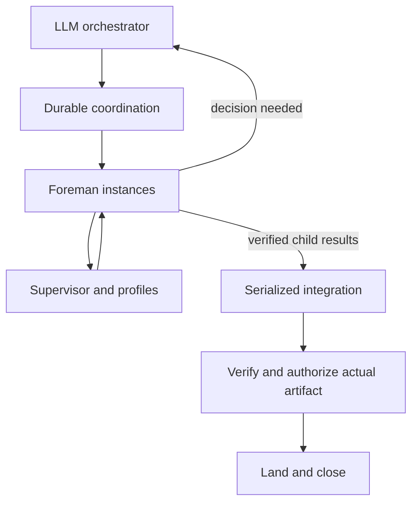

# Bounded workflow coordination

Status: approved
Approved by: repository owner, 2026-09-11, approving the six-phase plan in conversation and instructing execution with Fable 5.1 high reviews at substantial milestones.

## Problem Statement

The interpreter executes local coding loops, but normal phase execution cannot yet complete verified landing and closure. Human-only decisions and absent child-run coordination require the orchestrator to mediate work that should advance automatically. Large handoffs are not bounded at composition.

## Solution

Complete the existing bridge, then expose durable operations for starting, observing, deciding, cancelling, and collecting independent workflow runs. The LLM chooses or constructs workflows and assigns runtime/model roles. Python follows declared outcomes and calls for model judgment only at explicit decision boundaries. Independent work executes concurrently; integration is serialized and verified against its actual resulting tree.

## User Stories

1. As the owner, I want ordinary execution to use the interpreter so stage state and recovery have one authority.
2. As an orchestrator, I want bounded decisions and child results so routine routing does not accumulate in my context.
3. As a graph author, I want configurable implementer, reviewer, and tester runtimes/models so independent perspectives can participate.
4. As an operator, I want restart, cancellation, and failed child runs to have durable outcomes so work is neither duplicated nor silently lost.

## Implementation Decisions

- Keep Foreman deterministic and each instance single-head. Reuse Supervisor execution, profile adapters, canonical pins, process evidence, and Beads.
- Complete the sequential bridge before generalizing coordination. The bridge explicitly accepts the declared APPROVE outcome of its immutable ship gate; arbitrary approval outcomes elsewhere confer no landing authority. Trust existing authenticated gate-closure marks after validating correspondence; do not introduce redundant cryptographic verification with weaker semantics.
- Verification policy is pinned at admission and carried through landing intent and receipt. Empty, missing, duplicate, failed, timed-out, changed-policy, or wrong-artifact check results cannot authorize landing. Verification must leave the candidate source tree unchanged.
- Model decisions are untrusted structured data bound to request identity, run state, artifact identity, and permitted actions. Dispatch decisions through existing task execution rather than a second model execution lifecycle. Ordinary acceptance/rework invokes no decision model.
- An emitted doubt or impossible-plan signal reaches its declared decision boundary without exhausting retries. This does not guarantee detection of doubt a model never emits. Model handling is attributable and cannot impersonate human authorization; explicit human gates remain meaningful.
- Parent/child identities and collected results are durable in the existing Beads coordination store. Each child is an independent pinned instance. The orchestrator starts independent runs, collects compact verified results and decides subsequent work; the runtime does not schedule a child dependency DAG or automatically bind downstream inputs. Code-producing stages close only after their required results are integrated. One durable owner admits each child and consumes each decision.
- Cancellation proves the execution stopped; late results from cancelled or replaced attempts cannot advance their parent. Restart resumes the same admitted identities.
- Maintain a finite overall allowance across child admissions, decisions, retries and replacements. Exhausting decision capacity requires human attention; it never recursively requests another model decision.
- Bound handoff composition, record omitted optional sources, and retain full artifacts by reference. Essential content that cannot fit produces an explicit refusal/decision request rather than silent truncation. Report the counting method; do not claim a vendor-token bound from a character heuristic.
- Serialize integration and landing. Same-base siblings require a bounded fresh integration attempt against the current target, with lineage, review and verification bound to the combined artifact. Existing approval of a child is not approval of a changed combined tree.
- Dynamic construction occurs before a run is pinned. Substantial replanning creates a replacement run with lineage rather than mutating active topology.
- Preserve existing human ship approval by default; graphs may explicitly permit attributable model decisions where supported. No silent relaxation of existing pins.

## Success Criteria

- Two sequential stages execute, verify, land, and close from the normal entry point with recoverable evidence.
- First-pass acceptance invokes no decision model; explicit doubt and allowance exhaustion reach bounded judgment; malformed, duplicate, stale and unauthorized decisions are refused.
- Two independent children overlap in isolated workspaces; duplicate admission, restart and cancellation races cannot create duplicate authoritative work or consume late results.
- Failed children return explicit status to the orchestrator. Required failed or missing contributions prevent integration completion. Same-base child results both contribute through fresh integration and verification.
- No empty or incomplete check set, modified check policy, wrong artifact, or stale approval authorizes landing or closure.
- Oversized optional inputs are recorded when omitted; essential oversized context has an explicit outcome.
- A small basic workflow and a design/spec workflow coexist with feature and build loops; all use the normal execution surface.
- Final evidence includes real coding-agent execution through two available runtimes, in addition to deterministic integration tests. Unavailable providers are reported honestly, never represented as verified by fixtures.

## Testing Decisions

Use existing public Foreman, bridge command, profile/process, and Beads seams. Characterize paused behavior before changes; write regression tests before fixes. Inject crashes at durable boundaries, observe actual Git/Beads state, and substitute agent processes only in deterministic tests. Run real runtime proofs in disposable repositories, preserving development main. Use full repository checks at milestones and focused checks during implementation.

## Out of Scope

- Arbitrary mutation of executing graph topology: deferred; use replacement lineage.
- Concurrent target-branch landing: deferred; serialize integration.
- Standing manager-agent hierarchy: rejected; decisions are on demand.
- New third-party runtimes or copied reference-tool frameworks: deferred; use current adapters.
- Merge or push of the development branch: outside this execution authorization.

## Open Questions

None blocking the approved direction. File-level interfaces are elaborated per phase; material changes to behavior return to the owner.

## Further Notes

ADR 0004 deterministic routing is retained. The prior sequential bridge plan remains the basis for its local safety mechanisms; this specification extends its scope to model decisions and child coordination. Old read-only reference reports provide patterns, not implementation authority. Fable 5.1 high reviews substantial milestones rather than every task.

Owner clarification, 2026-09-11: simplify parallel children to start/status/collect/cancel/restart recovery with isolated writers and finite concurrency. Reuse existing persistence where convenient; a second database requires a concrete advantage. Terra High handles bounded work; Astra is reserved for substantial complexity. Fable milestone cadence is unchanged.
