# Workflow Interpreter in Diagrams

A diagram-first map of the workflow interpreter: what runs, what it stores, and how one
task travels from a bd stage to a landed, exported commit.

- **Code version described:** branch `wf/run-ledger` at `c4e0b10`, which is `main` plus the
  run-ledger epic (the SQLite run ledger beside bd). Anything marked *run ledger* exists only on
  that branch until it merges.
- **Source of truth:** the code. Where the design spec
  ([workflow-interpreter.md](workflow-interpreter.md)) disagrees, section 16 lists the drift.
- **Citations:** `path:line` is relative to `workflow_interpreter/` unless it starts with
  `docs/`, `workflows/`, `scripts/` or `config/`.
- **Rendering:** Mermaid blocks render in GitHub and in VS Code with a Mermaid preview extension.

## Contents

1. [Vocabulary](#1-vocabulary)
2. [The big picture](#2-the-big-picture)
3. [Data model](#3-data-model)
4. [Workflow graphs](#4-workflow-graphs)
5. [The contractor: from a bd stage to a root](#5-the-contractor-from-a-bd-stage-to-a-root)
6. [The foreman: run loop and tick](#6-the-foreman-run-loop-and-tick)
7. [Activation lifecycle](#7-activation-lifecycle)
8. [The inspector wrapper](#8-the-inspector-wrapper)
9. [Grading: claim is not proof](#9-grading-claim-is-not-proof)
10. [Human gates](#10-human-gates)
11. [Landing](#11-landing)
12. [The store: bd and the run ledger](#12-the-store-bd-and-the-run-ledger)
13. [Files, directories and git refs](#13-files-directories-and-git-refs)
14. [Terminal settlement, cleanup and archive](#14-terminal-settlement-cleanup-and-archive)
15. [End to end: one feature task](#15-end-to-end-one-feature-task)
16. [Spec drift and suspected defects](#16-spec-drift-and-suspected-defects)

---

## 1. Vocabulary

| Term | Meaning in code |
|---|---|
| **Epic** | A bd issue whose direct children are stages. |
| **Stage** (task) | One bd task bead, child of an epic. The contractor's `stage_id` is the task id. |
| **Phase-contractor record** | Metadata key `contractor` on the stage bead: attempt, state, base commit, backend pin, landing and export facts (`contractor/models.py:59`). Always stored in bd. |
| **Attempt** | One try at a stage. Each attempt gets its own root. `--retry` creates attempt n+1. |
| **Root** (instance) | One run of a workflow graph. It pins the graph body, its hash, the resolved config and the base commit (`bdio/wire.py:325`). |
| **Instance key** | `contract:<epic>:<stage>:attempt:<n>` for contractor roots (`contractor/models.py:15-22`). Roots are idempotent by this key. |
| **Node** | A graph vertex: `task`, `gate` or `terminal` (`schema/models.py:51`). |
| **Activation** | One execution of one task node in one round. It moves through a lifecycle (`bdio/carriers.py:78`). |
| **Gate** | A decision record that waits for a signed human payload. Opened by the foreman, closed only by a verified signature. |
| **Event** | A derived, append-only transition record: from, outcome, to (`bdio/wire.py:536`). |
| **Outcome** | The closed set `done, no_diff, accept, reject, fail_code, fail_plan, doubt, approve, rebudget, abandon` plus system outcomes `error_crew, error_transport, steered, superseded` (`schema/models.py:93-122`). |
| **Region** | A named set of nodes. `bounded-cycle` regions cap re-entries with `max_entries` (`schema/models.py:231`). |
| **Foreman** | Deterministic code that ticks one root. It has no LLM client (ADR 0004 D4). |
| **Inspector wrapper** | A detached process per activation, `foreman inspector`. It prepares the workspace, launches the crew, watches it and records the exit. |
| **Crew** | The vendor agent CLI: `claude`, `codex exec` or `codex app-server`. |
| **Store** | `WorkflowStore` (`bdio/api.py:125`), the only write API. It sits over a backend: bd or the run ledger. |
| **Run ledger** | The SQLite file `<repo>/.wf/ledger.db` (ADR 0005). Not the harness curation ledger in `CONTEXT.md`. |
| **Wrapper root** | `<wrapper_home>/<sha256(realpath repo_root)[:16]>/`, outside the repo (`foreman/config.py:93-98`). |
| **Band** | A non-blocking `flock` that serialises ticks. Ordinary roots of one wrapper root share `<wrapper_root>/repo-band.lock`. That is normally one per repository, but two wrapper homes over one repo do not exclude each other (`inspector/paths.py:236-247`). |

### 1.1 Who does what

Five actors. Each answers exactly one question, and none answers another's.

| Actor | Package | Its one question | Lives as |
|---|---|---|---|
| **Contractor** | `contractor/` | May this stage start, and where do its commits land? | A command that runs once and returns |
| **Foreman** | `foreman/` | Given what is recorded, what happens next? | A process taking one decision per tick |
| **Inspector wrapper** | `inspector/` | Make one activation happen, and prove what happened. | A detached process per activation |
| **Crew** | vendor CLI | Do the task. | A child process inside bwrap |
| **Store** | `bdio/`, `ledger/` | What is true so far? | A library over bd or SQLite |

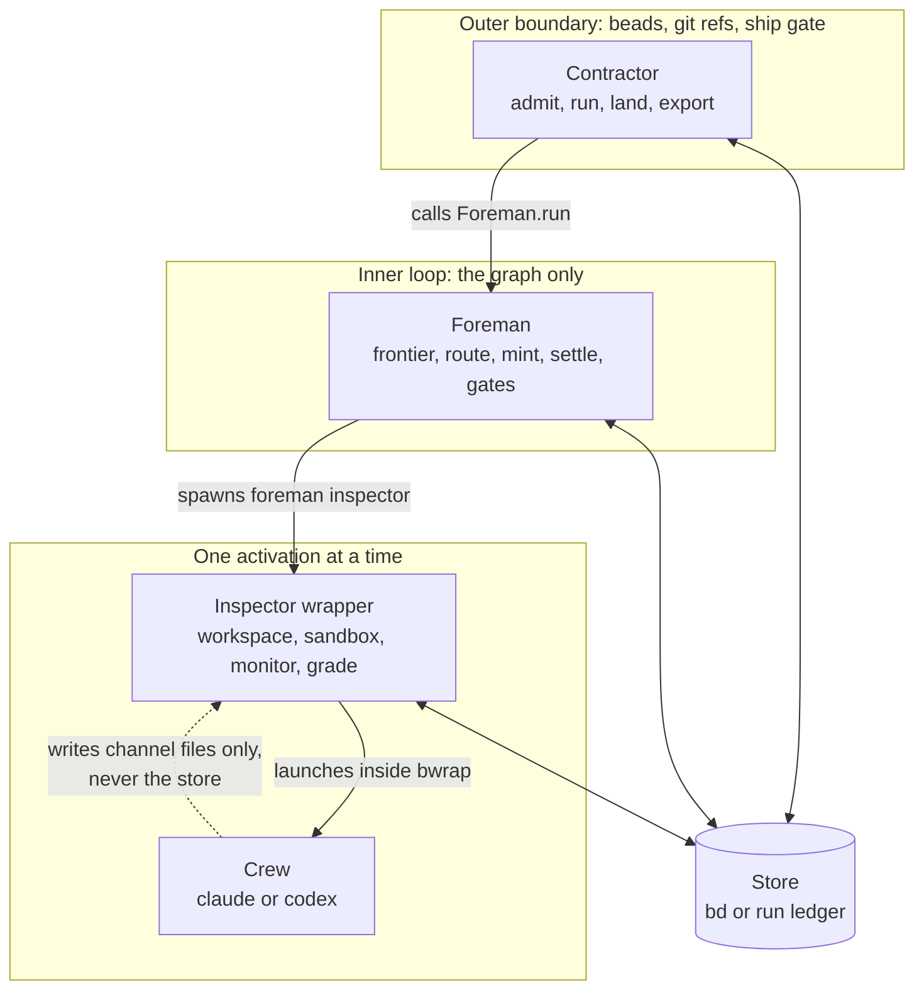
```mermaid
flowchart TB
  subgraph OUT["Outer boundary: beads, git refs, ship gate"]
    B["Contractor<br/>admit, run, land, export"]
  end
  subgraph MID["Inner loop: the graph only"]
    F["Foreman<br/>frontier, route, mint, settle, gates"]
  end
  subgraph EXEC["One activation at a time"]
    W["Inspector wrapper<br/>workspace, sandbox, monitor, grade"]
    R["Crew<br/>claude or codex"]
  end
  S[("Store<br/>bd or run ledger")]

  B -->|"calls Foreman.run"| F
  F -->|"spawns foreman inspector"| W
  W -->|"launches inside bwrap"| R
  B <--> S
  F <--> S
  W <--> S
  R -.->|"writes channel files only,<br/>never the store"| W
```

Four distinctions the rest of this document assumes:

1. **Inspector and wrapper are one thing under two names.** `inspector/` is the code;
   the *wrapper* is a running instance of it plus its directory
   `wrapper_root/<root>/<activation>/`, its `wrapper.lock` and its `wrapper.json`. The lock
   admits one live wrapper per activation. Its entry point is `foreman/inspector.py:75-83`,
   which then drives the `inspector/` machinery (section 8).
2. **The foreman decides and the wrapper does.** The foreman never launches an agent and never
   writes a worktree. The wrapper never chooses the next node. They are separate OS processes,
   and `foreman tick` and `foreman inspector` are the two verbs of one binary (section 2.2).
3. **The wrapper is the jailer, the crew the prisoner.** The crew writes only its channels,
   its uv cache and the git paths the wrapper bound writable (section 8.4). Its claim of success
   is evidence, never proof — the foreman grades it (section 9).
4. **The contractor owns the outside, the foreman the inside.** Epics, dependencies, branches and the
   ship gate are the contractor's. Nodes, edges, rounds and bounds are the foreman's. The contractor calls
   the foreman; the foreman knows nothing about epics (sections 5 and 6).

---

## 2. The big picture

### 2.1 Actors and who holds judgment

The foreman and inspector are deterministic. Judgment lives in three places: the orchestrating
LLM session picks stages, crew agents produce verdicts, and a human signs gates.

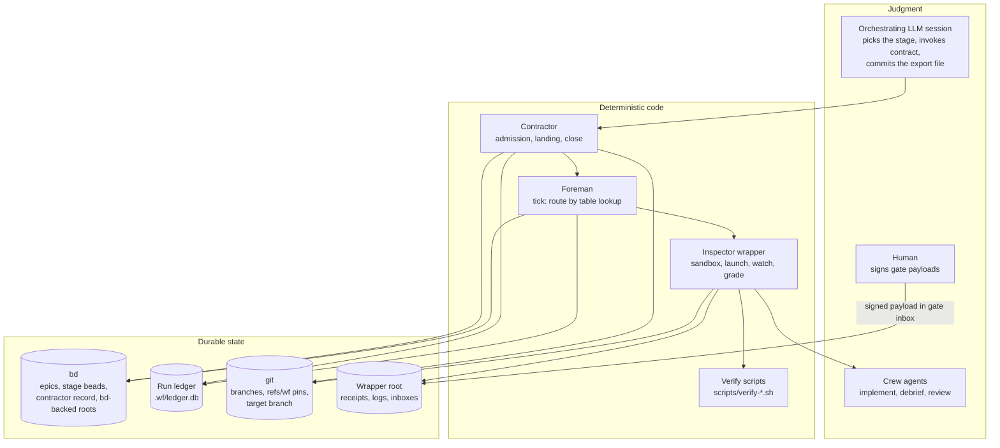
```mermaid
flowchart TB
  subgraph JUDGMENT["Judgment"]
    HUMAN["Human<br/>signs gate payloads"]
    LLM["Orchestrating LLM session<br/>picks the stage, invokes contract,<br/>commits the export file"]
    CREWS["Crew agents<br/>implement, debrief, review"]
  end
  subgraph DETERMINISTIC["Deterministic code"]
    CONTRACTOR["Contractor<br/>admission, landing, close"]
    FOREMAN["Foreman<br/>tick: route by table lookup"]
    SUPER["Inspector wrapper<br/>sandbox, launch, watch, grade"]
    VERIFY["Verify scripts<br/>scripts/verify-*.sh"]
  end
  subgraph STATE["Durable state"]
    BD[("bd<br/>epics, stage beads,<br/>contractor record, bd-backed roots")]
    LEDGER[("Run ledger<br/>.wf/ledger.db")]
    GIT[("git<br/>branches, refs/wf pins,<br/>target branch")]
    WRAP[("Wrapper root<br/>receipts, logs, inboxes")]
  end
  LLM --> CONTRACTOR
  CONTRACTOR --> FOREMAN
  FOREMAN --> SUPER
  SUPER --> CREWS
  SUPER --> VERIFY
  HUMAN -->|"signed payload in gate inbox"| WRAP
  FOREMAN --> BD
  FOREMAN --> LEDGER
  SUPER --> GIT
  SUPER --> WRAP
  CONTRACTOR --> BD
  CONTRACTOR --> GIT
  CONTRACTOR --> LEDGER
```

Sources: ADR 0004 D4; `docs/usage/contractor.md:9`; `contractor/landing.py:525-527`.

### 2.2 Operating-system processes

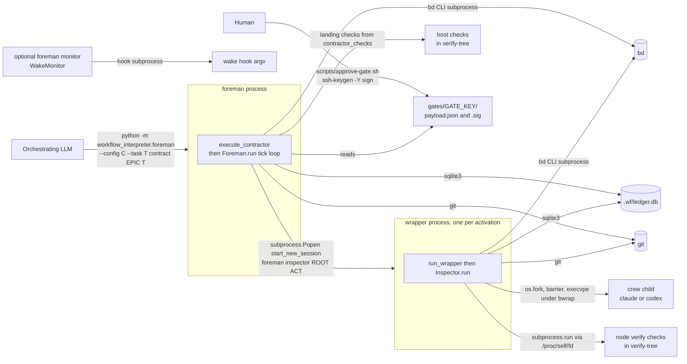
```mermaid
flowchart LR
  LLM["Orchestrating LLM"] -->|"python -m workflow_interpreter.foreman<br/>--config C --task T contract EPIC T"| FP
  subgraph FP["foreman process"]
    RUN["execute_contractor<br/>then Foreman.run tick loop"]
  end
  RUN -->|"subprocess.Popen start_new_session<br/>foreman inspector ROOT ACT"| WP
  subgraph WP["wrapper process, one per activation"]
    RW["run_wrapper then Inspector.run"]
  end
  RW -->|"os.fork, barrier, execvpe under bwrap"| RC["crew child<br/>claude or codex"]
  RW -->|"subprocess.run via /proc/self/fd"| NC["node verify checks<br/>in verify-tree"]
  RUN -->|"landing checks from contractor_checks"| LC["host checks<br/>in verify-tree"]
  RUN -->|"bd CLI subprocess"| BD[("bd")]
  RW -->|"bd CLI subprocess"| BD
  RUN -->|"sqlite3"| DB[(".wf/ledger.db")]
  RW -->|"sqlite3"| DB
  RUN -->|"git"| GIT[("git")]
  RW -->|"git"| GIT
  MON["optional foreman monitor<br/>WakeMonitor"] -->|"hook subprocess"| HOOK["wake hook argv"]
  HUMAN["Human"] -->|"scripts/approve-gate.sh<br/>ssh-keygen -Y sign"| INBOX["gates/GATE_KEY/<br/>payload.json and .sig"]
  RUN -->|"reads"| INBOX
```

Sources: `foreman/compose.py:107-147`; `inspector/fork_launcher.py:131-522`;
`inspector/verify.py:459-493`; `contractor/verification.py:141-203`; `foreman/monitor.py:136`;
`foreman/wake.py:101-130`; `scripts/approve-gate.sh`.

There are no installed console scripts. Every CLI runs as a module
(`pyproject.toml`): `workflow_interpreter.foreman`, `workflow_interpreter.ledger`,
`workflow_interpreter.costs`.

### 2.3 Package architecture

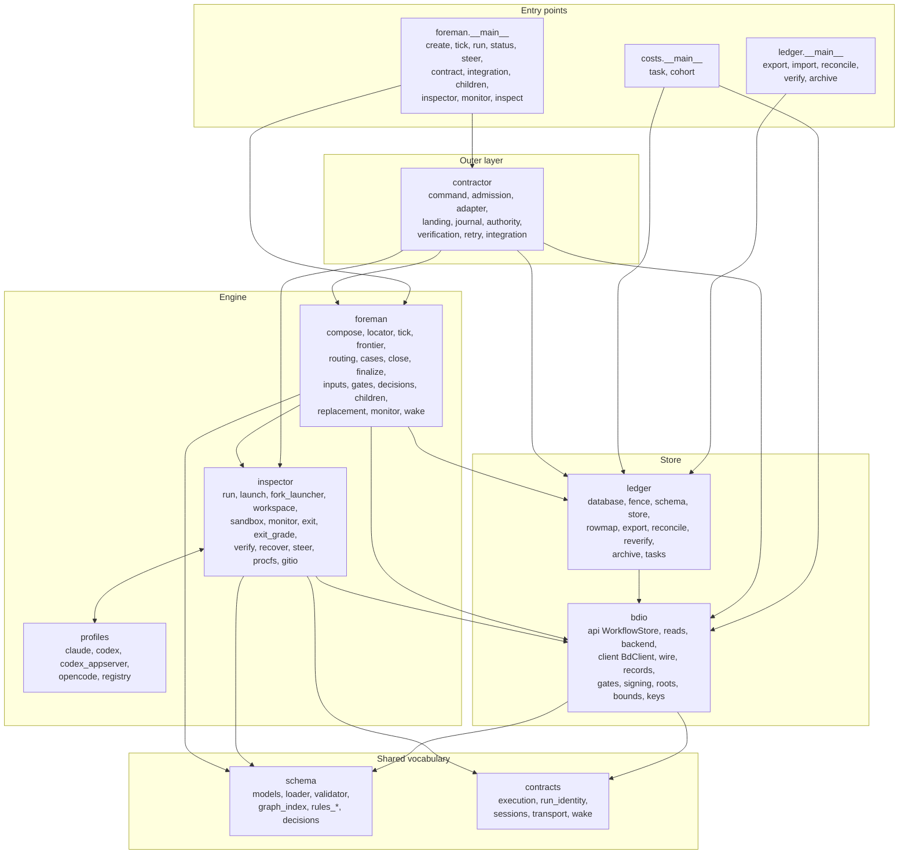
```mermaid
flowchart TB
  subgraph ENTRY["Entry points"]
    FMAIN["foreman.__main__<br/>create, tick, run, status, steer,<br/>contract, integration, children,<br/>inspector, monitor, inspect"]
    LMAIN["ledger.__main__<br/>export, import, reconcile,<br/>verify, archive"]
    CMAIN["costs.__main__<br/>task, cohort"]
  end
  subgraph OUTER["Outer layer"]
    CONTRACTOR["contractor<br/>command, admission, adapter,<br/>landing, journal, authority,<br/>verification, retry, integration"]
  end
  subgraph ENGINE["Engine"]
    FOREMAN["foreman<br/>compose, locator, tick, frontier,<br/>routing, cases, close, finalize,<br/>inputs, gates, decisions, children,<br/>replacement, monitor, wake"]
    INSPECTOR["inspector<br/>run, launch, fork_launcher, workspace,<br/>sandbox, monitor, exit, exit_grade,<br/>verify, recover, steer, procfs, gitio"]
    PROFILES["profiles<br/>claude, codex, codex_appserver,<br/>opencode, registry"]
  end
  subgraph STORE["Store"]
    BDIO["bdio<br/>api WorkflowStore, reads, backend,<br/>client BdClient, wire, records,<br/>gates, signing, roots, bounds, keys"]
    LEDGER["ledger<br/>database, fence, schema, store,<br/>rowmap, export, reconcile, reverify,<br/>archive, tasks"]
  end
  subgraph SHARED["Shared vocabulary"]
    SCHEMA["schema<br/>models, loader, validator,<br/>graph_index, rules_*, decisions"]
    CONTRACTS["contracts<br/>execution, run_identity,<br/>sessions, transport, wake"]
  end
  FMAIN --> CONTRACTOR
  FMAIN --> FOREMAN
  LMAIN --> LEDGER
  CMAIN --> BDIO
  CMAIN --> LEDGER
  CONTRACTOR --> FOREMAN
  CONTRACTOR --> BDIO
  CONTRACTOR --> LEDGER
  CONTRACTOR --> INSPECTOR
  FOREMAN --> INSPECTOR
  FOREMAN --> BDIO
  FOREMAN --> LEDGER
  INSPECTOR <--> PROFILES
  INSPECTOR --> BDIO
  LEDGER --> BDIO
  BDIO --> SCHEMA
  BDIO --> CONTRACTS
  INSPECTOR --> SCHEMA
  INSPECTOR --> CONTRACTS
  FOREMAN --> SCHEMA
```

The arrows are import directions, simplified. Three back-edges exist and are worth knowing:
`inspector` and `profiles` import each other; `bdio.coordination` imports foreman children
functions lazily; `ledger.paths` uses `inspector.sandbox.fence_dir`, and `bdio.api` uses
`inspector.band.BandLock`.

### 2.4 Composition: how one invocation is wired

Every CLI invocation builds one process-wide `Composition`. Each root it touches gets an
`InstanceWiring` with a store bound to that root's backend.

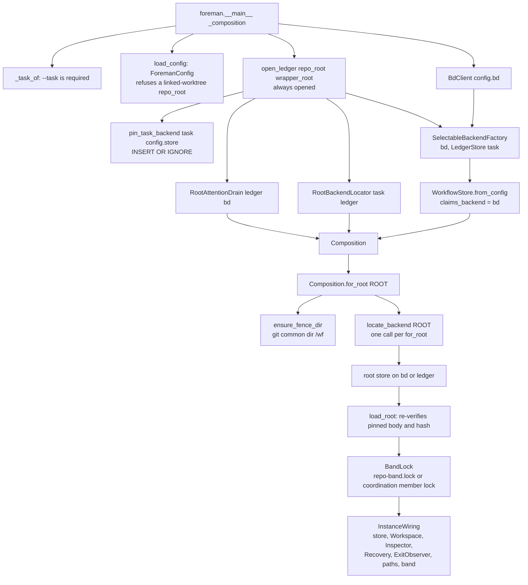
```mermaid
flowchart TB
  MAIN["foreman.__main__ _composition"] --> TASK["_task_of: --task is required"]
  MAIN --> CFG["load_config: ForemanConfig<br/>refuses a linked-worktree repo_root"]
  MAIN --> BDC["BdClient config.bd"]
  MAIN --> OPEN["open_ledger repo_root wrapper_root<br/>always opened"]
  OPEN --> PIN["pin_task_backend task config.store<br/>INSERT OR IGNORE"]
  BDC --> FACT["SelectableBackendFactory<br/>bd, LedgerStore task"]
  OPEN --> FACT
  FACT --> WS["WorkflowStore.from_config<br/>claims_backend = bd"]
  OPEN --> LOC["RootBackendLocator task ledger"]
  OPEN --> DRAIN["RootAttentionDrain ledger bd"]
  WS --> COMP["Composition"]
  LOC --> COMP
  DRAIN --> COMP
  COMP --> FOR["Composition.for_root ROOT"]
  FOR --> FENCE["ensure_fence_dir<br/>git common dir /wf"]
  FOR --> WHICH["locate_backend ROOT<br/>one call per for_root"]
  WHICH --> RS["root store on bd or ledger"]
  RS --> LOAD["load_root: re-verifies pinned body and hash"]
  LOAD --> BAND["BandLock<br/>repo-band.lock or coordination member lock"]
  BAND --> WIRING["InstanceWiring<br/>store, Workspace, Inspector,<br/>Recovery, ExitObserver, paths, band"]
```

Sources: `foreman/__main__.py:127-176`; `foreman/config.py:63-143`; `foreman/compose.py:178-361`;
`foreman/locator.py:47-128`.

The backend locator answers in a fixed order and never substitutes:

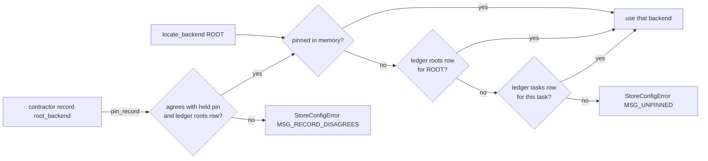
```mermaid
flowchart LR
  Q["locate_backend ROOT"] --> M{"pinned in memory?"}
  M -->|"yes"| USE["use that backend"]
  M -->|"no"| R{"ledger roots row<br/>for ROOT?"}
  R -->|"yes"| USE
  R -->|"no"| T{"ledger tasks row<br/>for this task?"}
  T -->|"yes"| USE
  T -->|"no"| REF["StoreConfigError MSG_UNPINNED"]
  REC["contractor record root_backend"] -->|"pin_record"| CHK{"agrees with held pin<br/>and ledger roots row?"}
  CHK -->|"yes"| M
  CHK -->|"no"| REF2["StoreConfigError MSG_RECORD_DISAGREES"]
```

Sources: `foreman/locator.py:66-128`; `contractor/command.py:690-700`.

---

## 3. Data model

### 3.1 Hierarchy

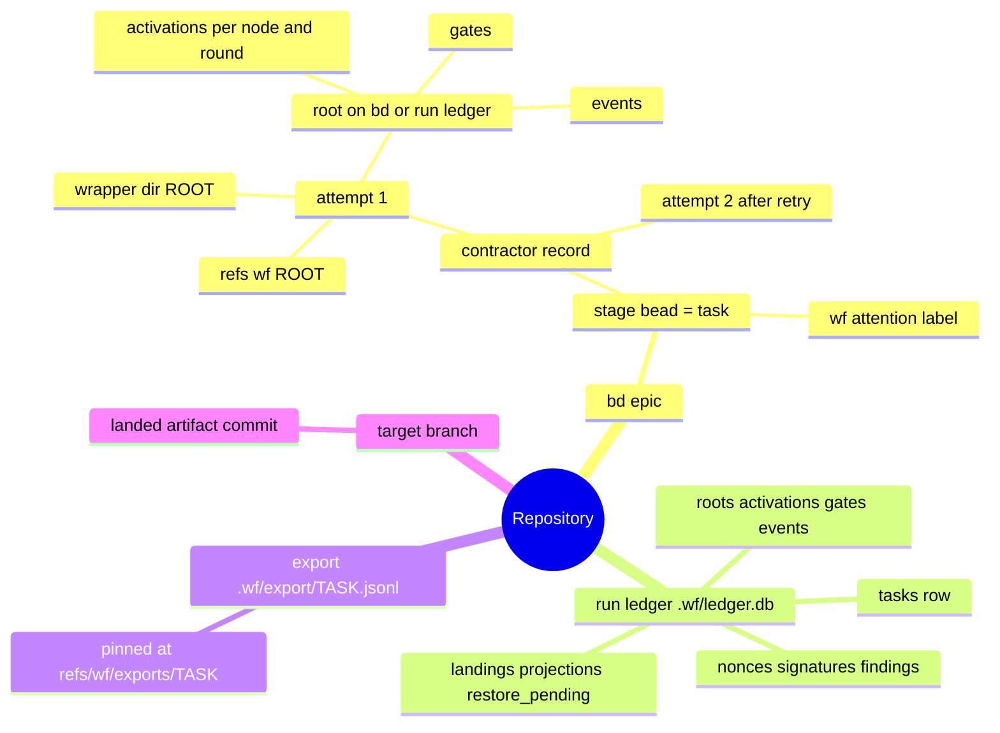
```mermaid
mindmap
  root((Repository))
    bd epic
      stage bead = task
        contractor record
          attempt 1
            root on bd or run ledger
              activations per node and round
              gates
              events
            wrapper dir ROOT
            refs wf ROOT
          attempt 2 after retry
        wf attention label
    run ledger .wf/ledger.db
      tasks row
      roots activations gates events
      nonces signatures findings
      landings projections restore_pending
    export .wf/export/TASK.jsonl
      pinned at refs/wf/exports/TASK
    target branch
      landed artifact commit
```

On the run ledger, ids follow the hierarchy: root `<task>-a<attempt>`, activation
`<root>.<node>.r<round>.<seq>`, gate `<root>.g<seq>`, event `<root>.e<seq>`
(`ledger/rowmap.py:94-125`). On bd, bd mints the ids.

### 3.2 Graph definition model

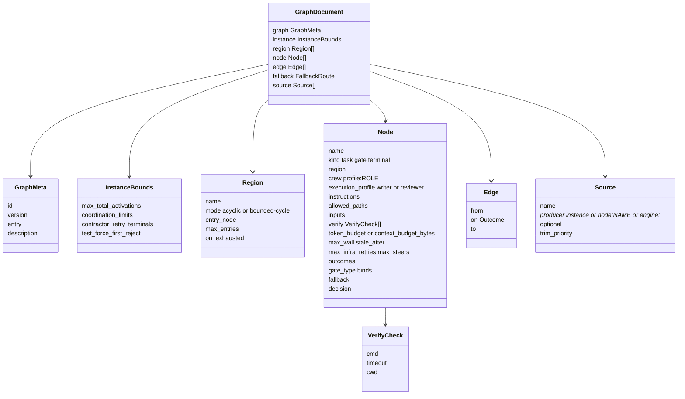
```mermaid
classDiagram
  class GraphDocument {
    graph GraphMeta
    instance InstanceBounds
    region Region[]
    node Node[]
    edge Edge[]
    fallback FallbackRoute
    source Source[]
  }
  class GraphMeta {
    id
    version
    entry
    description
  }
  class InstanceBounds {
    max_total_activations
    coordination_limits
    contractor_retry_terminals
    test_force_first_reject
  }
  class Region {
    name
    mode acyclic or bounded-cycle
    entry_node
    max_entries
    on_exhausted
  }
  class Node {
    name
    kind task gate terminal
    region
    crew profile:ROLE
    execution_profile writer or reviewer
    instructions
    allowed_paths
    inputs
    verify VerifyCheck[]
    token_budget or context_budget_bytes
    max_wall stale_after
    max_infra_retries max_steers
    outcomes
    gate_type binds
    fallback
    decision
  }
  class Edge {
    from
    on Outcome
    to
  }
  class Source {
    name
    producer instance or node:NAME or engine:*
    optional
    trim_priority
  }
  class VerifyCheck {
    cmd
    timeout
    cwd
  }
  GraphDocument --> GraphMeta
  GraphDocument --> InstanceBounds
  GraphDocument --> Region
  GraphDocument --> Node
  GraphDocument --> Edge
  GraphDocument --> Source
  Node --> VerifyCheck
```

Sources: `schema/models.py:199-411`. Engine producers are `engine:verify_failure` and
`engine:ledger_render` (`schema/models.py:364-373`).

### 3.3 Record carriers

Every record's metadata is a frozen pydantic carrier with `extra="forbid"`. An unknown key is
treated as tampering, and writes can never clear a key (`bdio/carriers.py:29`,
`bdio/wire.py:183`).

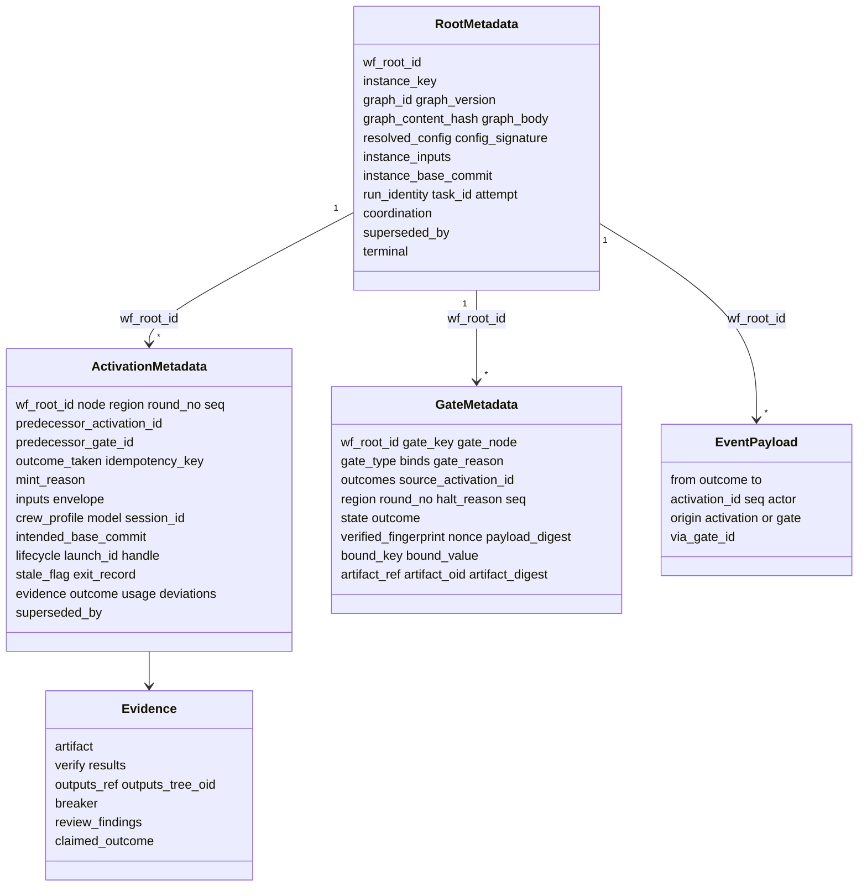
```mermaid
classDiagram
  class RootMetadata {
    wf_root_id
    instance_key
    graph_id graph_version
    graph_content_hash graph_body
    resolved_config config_signature
    instance_inputs
    instance_base_commit
    run_identity task_id attempt
    coordination
    superseded_by
    terminal
  }
  class ActivationMetadata {
    wf_root_id node region round_no seq
    predecessor_activation_id
    predecessor_gate_id
    outcome_taken idempotency_key
    mint_reason
    inputs envelope
    crew_profile model session_id
    intended_base_commit
    lifecycle launch_id handle
    stale_flag exit_record
    evidence outcome usage deviations
    superseded_by
  }
  class GateMetadata {
    wf_root_id gate_key gate_node
    gate_type binds gate_reason
    outcomes source_activation_id
    region round_no halt_reason seq
    state outcome
    verified_fingerprint nonce payload_digest
    bound_key bound_value
    artifact_ref artifact_oid artifact_digest
  }
  class EventPayload {
    from outcome to
    activation_id seq actor
    origin activation or gate
    via_gate_id
  }
  class Evidence {
    artifact
    verify results
    outputs_ref outputs_tree_oid
    breaker
    review_findings
    claimed_outcome
  }
  RootMetadata "1" --> "*" ActivationMetadata : wf_root_id
  RootMetadata "1" --> "*" GateMetadata : wf_root_id
  RootMetadata "1" --> "*" EventPayload : wf_root_id
  ActivationMetadata --> Evidence
```

Sources: `bdio/wire.py:325-556`; `bdio/carriers.py:380`; `inspector/exit.py:456-504`.

### 3.4 Natural keys: why writes are idempotent

Every create looks up a deterministic sha256 key first. A crash and retry finds the same row.

| Record | Key parts | Source |
|---|---|---|
| Root | `instance_key` | `bdio/roots.py:399` |
| Entry activation | root, `"entry"` | `bdio/keys.py:49` |
| Edge activation | root, predecessor activation or gate, outcome taken, target node | `bdio/keys.py:54` |
| Gate | root, gate node, source activation, outcome | `bdio/keys.py:70` |
| Exhaustion gate | root, region, round | `bdio/keys.py:77` |
| Halt gate | root, halt ordinal | `bdio/keys.py:82` |
| Event | root, activation, from, outcome, to | `bdio/keys.py:100` |

Mint order is key lookup, then bounds, then create, then re-lookup. Race losers are superseded,
never deleted (`bdio/api.py:340-355`, `bdio/api.py:587`).

### 3.5 Run ledger schema

Schema version 2. Version 1 created 15 tables. Version 2 added `findings.kind`
(`ledger/schema.py:226-261`).

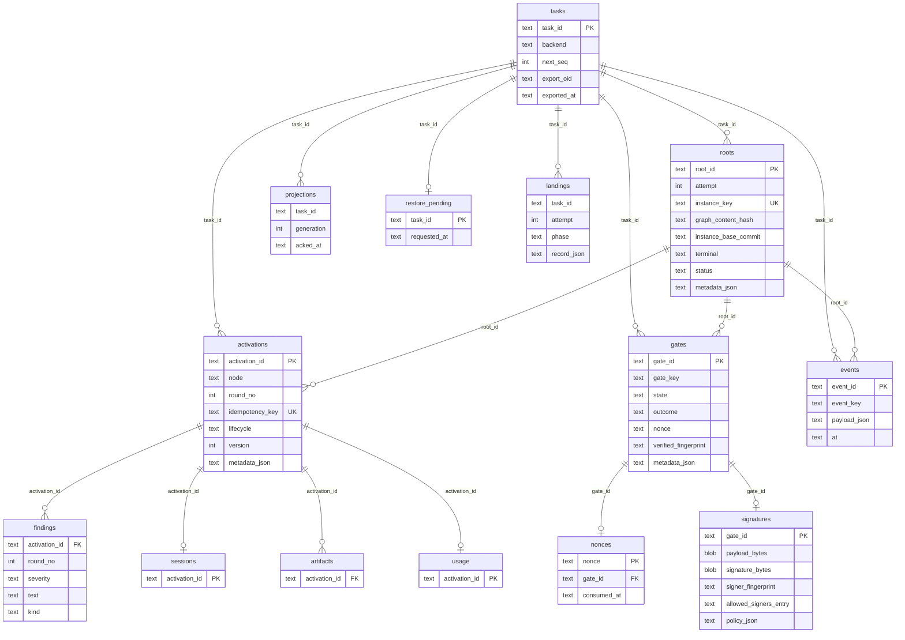
```mermaid
erDiagram
  tasks ||--o{ roots : task_id
  tasks ||--o{ activations : task_id
  tasks ||--o{ gates : task_id
  tasks ||--o{ events : task_id
  tasks ||--o{ projections : task_id
  tasks ||--o| restore_pending : task_id
  tasks ||--o{ landings : task_id
  roots ||--o{ activations : root_id
  roots ||--o{ gates : root_id
  roots ||--o{ events : root_id
  gates ||--o| nonces : gate_id
  gates ||--o| signatures : gate_id
  activations ||--o{ findings : activation_id
  activations ||--o| sessions : activation_id
  activations ||--o{ artifacts : activation_id
  activations ||--o| usage : activation_id
  tasks {
    text task_id PK
    text backend
    int next_seq
    text export_oid
    text exported_at
  }
  roots {
    text root_id PK
    int attempt
    text instance_key UK
    text graph_content_hash
    text instance_base_commit
    text terminal
    text status
    text metadata_json
  }
  activations {
    text activation_id PK
    text node
    int round_no
    text idempotency_key UK
    text lifecycle
    int version
    text metadata_json
  }
  gates {
    text gate_id PK
    text gate_key
    text state
    text outcome
    text nonce
    text verified_fingerprint
    text metadata_json
  }
  events {
    text event_id PK
    text event_key
    text payload_json
    text at
  }
  nonces {
    text nonce PK
    text gate_id FK
    text consumed_at
  }
  signatures {
    text gate_id PK
    blob payload_bytes
    blob signature_bytes
    text signer_fingerprint
    text allowed_signers_entry
    text policy_json
  }
  findings {
    text activation_id FK
    int round_no
    text severity
    text text
    text kind
  }
  landings {
    text task_id
    int attempt
    text phase
    text record_json
  }
  projections {
    text task_id
    int generation
    text acked_at
  }
  restore_pending {
    text task_id PK
    text requested_at
  }
  sessions {
    text activation_id PK
  }
  artifacts {
    text activation_id FK
  }
  usage {
    text activation_id PK
  }
```

Also a `meta` table holds `schema_version`, `repo_hash`, `wrapper_root` and `created_at`.
`sessions`, `artifacts` and `usage` exist but nothing writes them yet (`ledger/export.py:489-490`).
Every row's `seq` and the id suffix come from `tasks.next_seq`, allocated inside
`BEGIN IMMEDIATE`. Projection generations use the same counter, so row seqs have gaps
(`ledger/store.py:642,727-733`).

### 3.6 Which store holds which fact

| Fact | bd-backed root | Ledger-backed root |
|---|---|---|
| Root, activation, gate, event records | bd beads | ledger tables |
| Epic and stage beads | bd | bd |
| `contractor` record, incl. `root_backend` and `export_oid` | bd stage bead | bd stage bead |
| Integration-target claims | bd | bd (ledger refuses claims, D20) |
| Gate nonce | only on the gate carrier | `nonces` table plus carrier |
| Signature bytes and historical signer entry | not stored | `signatures` table |
| Review findings | derivable from evidence | `findings` table, written at close |
| `wf:attention` label on the stage bead | not written | projected by the reconciler |
| Landing journal | ledger `landings` | ledger `landings` |
| Export and `export_oid` | ledger export | ledger export |

Sources: `bdio/backend.py:178`; `contractor/adapter.py:24,165-248`; `bdio/api.py:271-282`;
`ledger/store.py:334-346,376-406,598-630`; `bdio/client.py:633-641`; `ledger/reconcile.py:225-259`;
`contractor/journal.py:72-159`.

The `store = bd|ledger` config key only affects **new** attempt roots. It is recorded as
`root_backend` on the contractor record at prepare and as `tasks.backend` once
(`foreman/config.py:71-76`, `contractor/command.py:377`, `ledger/tasks.py:36-61`).

---

## 4. Workflow graphs

### 4.1 `feature-delivery` 1.1.0, the contractor graph

`[instance] max_total_activations = 26`, `contractor_retry_terminals = ["shipped", "abandoned"]`.
Global fallback is `triage` (`workflows/feature-delivery.toml`).

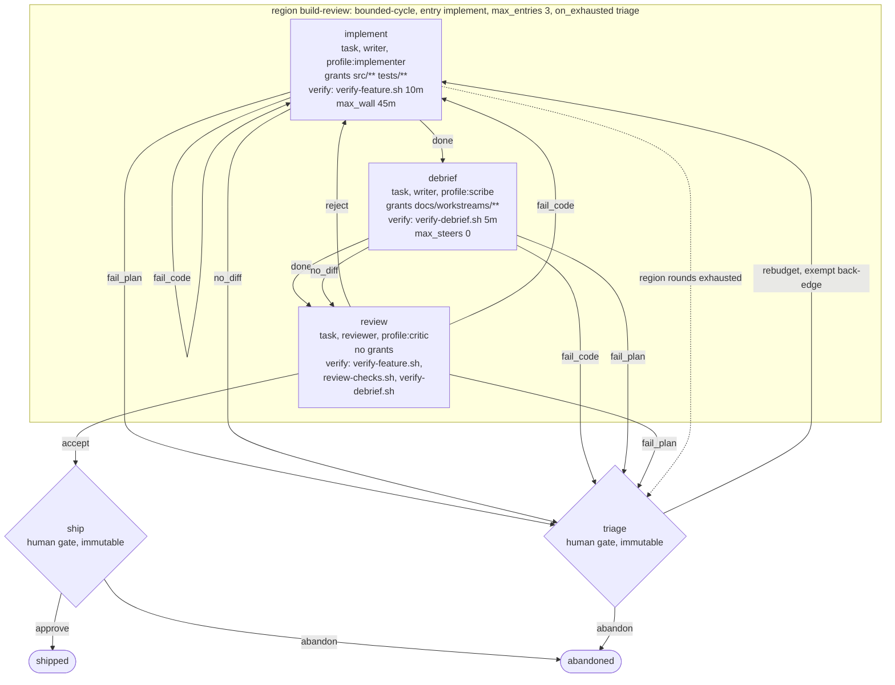
```mermaid
flowchart TD
  subgraph BR["region build-review: bounded-cycle, entry implement, max_entries 3, on_exhausted triage"]
    implement["implement<br/>task, writer, profile:implementer<br/>grants src/** tests/**<br/>verify: verify-feature.sh 10m<br/>max_wall 45m"]
    debrief["debrief<br/>task, writer, profile:scribe<br/>grants docs/workstreams/**<br/>verify: verify-debrief.sh 5m<br/>max_steers 0"]
    review["review<br/>task, reviewer, profile:critic<br/>no grants<br/>verify: verify-feature.sh,<br/>review-checks.sh, verify-debrief.sh"]
  end
  ship{"ship<br/>human gate, immutable"}
  triage{"triage<br/>human gate, immutable"}
  shipped(["shipped"])
  abandoned(["abandoned"])
  implement -->|"done"| debrief
  implement -->|"fail_code"| implement
  implement -->|"fail_plan"| triage
  implement -->|"no_diff"| triage
  debrief -->|"done"| review
  debrief -->|"no_diff"| review
  debrief -->|"fail_code"| triage
  debrief -->|"fail_plan"| triage
  review -->|"accept"| ship
  review -->|"reject"| implement
  review -->|"fail_code"| implement
  review -->|"fail_plan"| triage
  ship -->|"approve"| shipped
  ship -->|"abandon"| abandoned
  triage -->|"rebudget, exempt back-edge"| implement
  triage -->|"abandon"| abandoned
  implement -.->|"region rounds exhausted"| triage
```

Node inputs:

| Node | Inputs | Where they come from |
|---|---|---|
| implement | `task_brief`, `review_findings`, `verify_failure` | instance input; review's outputs tree; engine producer |
| debrief | `task_brief`, `ledger_render` | instance input; engine producer |
| review | `task_brief`, `diff_artifact`, `review_findings` | instance input; implement's artifact; review's outputs tree |

Only `task_brief` and `diff_artifact` are required sources. The rest are optional
(`workflows/feature-delivery.toml:292-325`).

Other graphs in `workflows/`: `basic` (one writer), `build-loop` (tests then build, two regions),
`design-spec` (draft, review, ship), `dws-package-pilot`, `engine-bootstrap` and
`pointer-handoff` (feature-delivery shape without debrief), and `integration`
(integrate, review, ship; loaded from a fixed path by `integration prepare`).

### 4.2 The effective graph the validator and router use

Declared edges are not the whole routing table. Tasks also route through fallback, and
bounded-cycle regions add an exhaustion route.

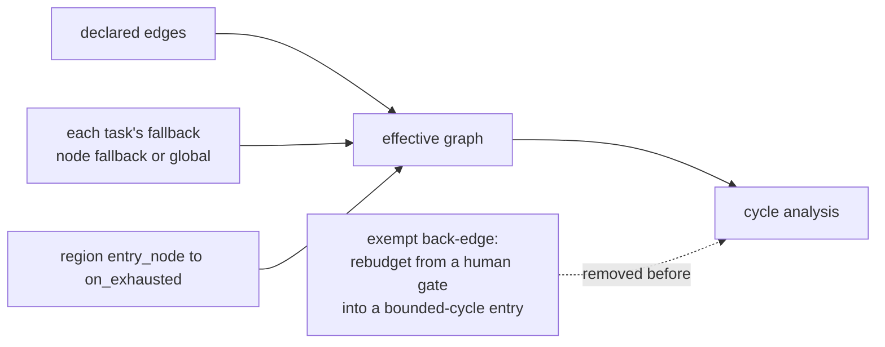
```mermaid
flowchart LR
  DECL["declared edges"] --> EFF["effective graph"]
  FB["each task's fallback<br/>node fallback or global"] --> EFF
  EXH["region entry_node to on_exhausted"] --> EFF
  EFF --> CYC["cycle analysis"]
  EXEMPT["exempt back-edge:<br/>rebudget from a human gate<br/>into a bounded-cycle entry"] -.->|"removed before"| CYC
```

Sources: `schema/graph_index.py:156-229`.

### 4.3 Loading and validating a graph

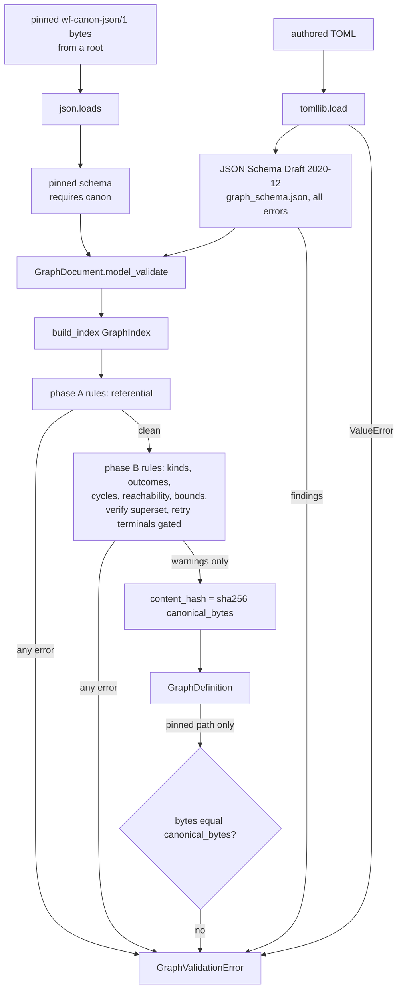
```mermaid
flowchart TD
  TOML["authored TOML"] --> PARSE["tomllib.load"]
  PINNED["pinned wf-canon-json/1 bytes<br/>from a root"] --> JPARSE["json.loads"]
  PARSE --> JS["JSON Schema Draft 2020-12<br/>graph_schema.json, all errors"]
  JPARSE --> PJS["pinned schema<br/>requires canon"]
  JS --> PYD["GraphDocument.model_validate"]
  PJS --> PYD
  PYD --> IDX["build_index GraphIndex"]
  IDX --> A["phase A rules: referential"]
  A -->|"any error"| REJ["GraphValidationError"]
  A -->|"clean"| B["phase B rules: kinds, outcomes,<br/>cycles, reachability, bounds,<br/>verify superset, retry terminals gated"]
  B -->|"any error"| REJ
  B -->|"warnings only"| HASH["content_hash = sha256 canonical_bytes"]
  HASH --> DEF["GraphDefinition"]
  DEF -->|"pinned path only"| CANON{"bytes equal canonical_bytes?"}
  CANON -->|"no"| REJ
  PARSE -->|"ValueError"| REJ
  JS -->|"findings"| REJ
```

Sources: `schema/loader.py:121-324`; `schema/validator.py:51-99`; `schema/rules_*.py`.

---

## 5. The contractor: from a bd stage to a root

### 5.1 What `contract EPIC STAGE` decides

One invocation resumes whatever state the stage is in. The command is safe to re-run.

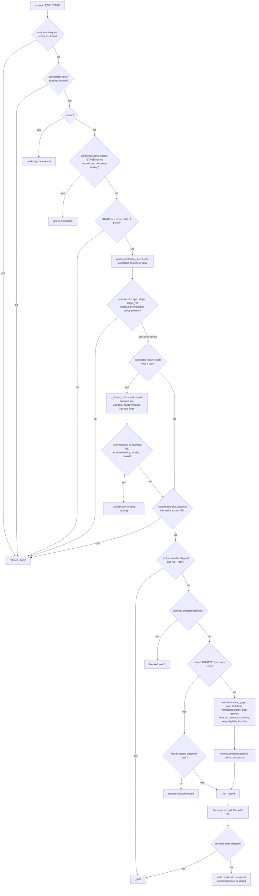
```mermaid
flowchart TD
  S["contract EPIC STAGE"] --> ARGS{"--retry-landing with<br/>--retry or --trace?"}
  ARGS -->|"yes"| REF["refused, exit 2"]
  ARGS -->|"no"| ATT{"coordinator on an<br/>attached branch?"}
  ATT -->|"no"| REF
  ATT -->|"yes"| TR{"--trace?"}
  TR -->|"yes"| TRACE["read-only trace report"]
  TR -->|"no"| EX{"all direct stages closed, STAGE has no<br/>record, and no --retry-landing?"}
  EX -->|"yes"| PX["phase-exhausted"]
  EX -->|"no"| OWN{"STAGE is a direct child of EPIC?"}
  OWN -->|"no"| REF
  OWN -->|"yes"| REPAIR["repair_contractor_successor,<br/>integration resume or retry"]
  REPAIR --> OWNR{"prior record: epic, stage, target_ref<br/>match and verification policy present?"}
  OWNR -->|"no"| REF
  OWNR -->|"yes or no record"| PRIOR{"contractor record exists<br/>with a root?"}
  PRIOR -->|"yes"| PINR["_pinned_root: install record backend pin,<br/>load root, check instance key and base"]
  PINR --> LAND1{"--retry-landing, or an intent file,<br/>or state landing, landed, closed?"}
  LAND1 -->|"yes"| LANDREC["_land recover or retry-landing"]
  LAND1 -->|"no"| DIRT
  PRIOR -->|"no"| DIRT{"coordinator dirty, ignoring<br/>this task's export file?"}
  DIRT -->|"yes"| REF
  DIRT -->|"no"| SHIPPED{"root terminal is shipped<br/>and not --retry?"}
  SHIPPED -->|"yes"| LAND2["_land"]
  SHIPPED -->|"no"| BLK{"blocking bd dependencies?"}
  BLK -->|"yes"| BLOCKED["blocked, exit 0"]
  BLK -->|"no"| ADM{"record ADMITTED and not --retry?"}
  ADM -->|"yes"| HEAD{"HEAD equals expected base?"}
  HEAD -->|"no"| MOVED["refused: branch moved"]
  HEAD -->|"yes"| RUNR["_run_record"]
  ADM -->|"no"| NEW["load contractor_graph, read task brief,<br/>verification policy: prior record's,<br/>else pin contractor_checks,<br/>retry eligibility if --retry"]
  NEW --> ADMIT["PhaseAdmission admit or admit_successor"]
  ADMIT --> RUNR
  RUNR --> FR["Foreman.run poll 30s, wall 8h"]
  FR --> TERM{"terminal node shipped?"}
  TERM -->|"yes"| LAND2
  TERM -->|"no"| RESULT["state result with run report<br/>exit 2 if attention or stalled"]
```

Sources: `contractor/command.py:109-430`; `foreman/constants.py:149-150`.

### 5.2 Admission

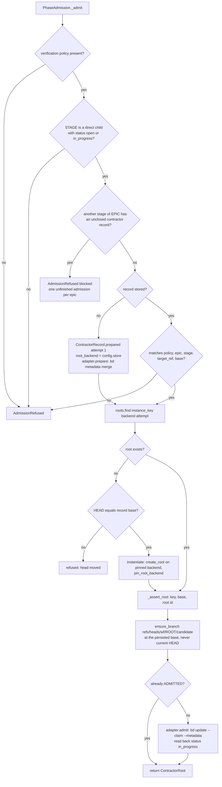
```mermaid
flowchart TD
  A["PhaseAdmission._admit"] --> P{"verification policy present?"}
  P -->|"no"| R1["AdmissionRefused"]
  P -->|"yes"| SEL{"STAGE is a direct child<br/>with status open or in_progress?"}
  SEL -->|"no"| R1
  SEL -->|"yes"| OTHER{"another stage of EPIC has<br/>an unclosed contractor record?"}
  OTHER -->|"yes"| R2["AdmissionRefused blocked<br/>one unfinished admission per epic"]
  OTHER -->|"no"| REC{"record stored?"}
  REC -->|"no"| PREP["ContractorRecord.prepared attempt 1<br/>root_backend = config.store<br/>adapter.prepare: bd metadata merge"]
  REC -->|"yes"| MATCH{"matches policy, epic, stage,<br/>target_ref, base?"}
  MATCH -->|"no"| R1
  MATCH -->|"yes"| FIND
  PREP --> FIND["roots.find instance_key backend attempt"]
  FIND --> HAS{"root exists?"}
  HAS -->|"no"| HM{"HEAD equals record base?"}
  HM -->|"no"| R3["refused: head moved"]
  HM -->|"yes"| CREATE["instantiate: create_root on pinned backend,<br/>pin_root_backend"]
  HAS -->|"yes"| ASSERT
  CREATE --> ASSERT["_assert_root: key, base, root id"]
  ASSERT --> BR["ensure_branch refs/heads/wf/ROOT/candidate<br/>at the persisted base, never current HEAD"]
  BR --> ADMQ{"already ADMITTED?"}
  ADMQ -->|"yes"| DONE["return ContractorRoot"]
  ADMQ -->|"no"| CLAIM["adapter.admit: bd update --claim --metadata<br/>read back status in_progress"]
  CLAIM --> DONE
```

Sources: `contractor/admission.py:175-324`; `contractor/adapter.py:165-203`; `bdio/client.py:587-610`;
`foreman/resolve.py:362-429`.

### 5.3 Phase-contractor record states

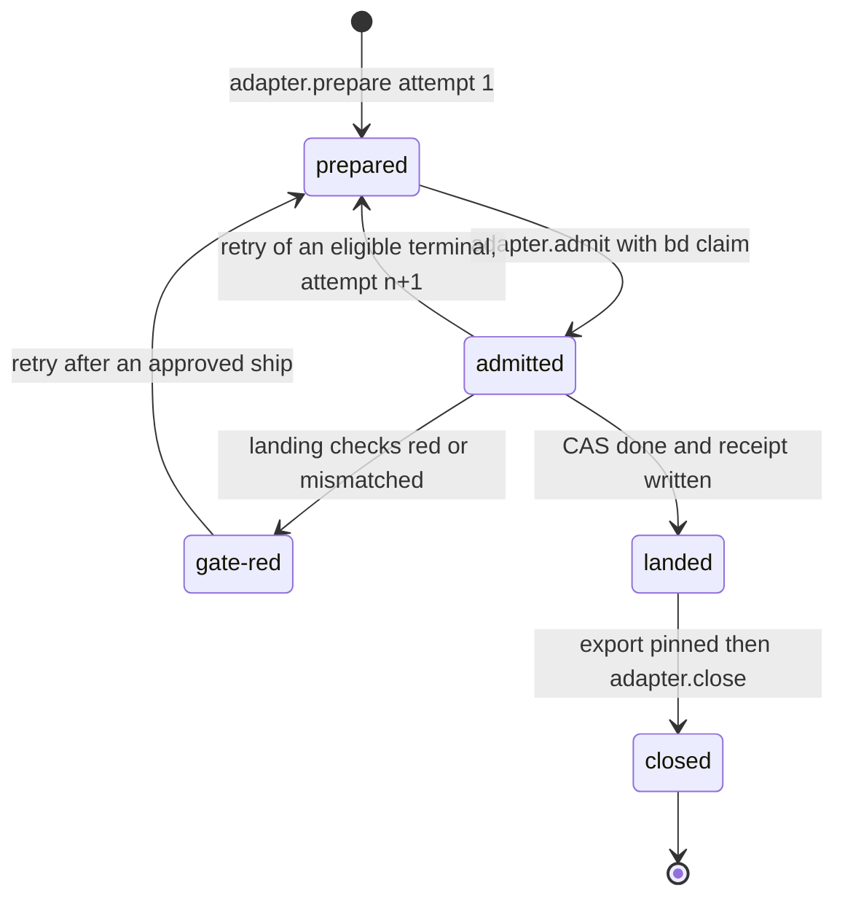
```mermaid
stateDiagram-v2
  state "prepared" as PREPARED
  state "admitted" as ADMITTED
  state "gate-red" as GATE_RED
  state "landed" as LANDED
  state "closed" as CLOSED
  [*] --> PREPARED: adapter.prepare attempt 1
  PREPARED --> ADMITTED: adapter.admit with bd claim
  ADMITTED --> GATE_RED: landing checks red or mismatched
  ADMITTED --> LANDED: CAS done and receipt written
  LANDED --> CLOSED: export pinned then adapter.close
  ADMITTED --> PREPARED: retry of an eligible terminal, attempt n+1
  GATE_RED --> PREPARED: retry after an approved ship
  CLOSED --> [*]
```

A `landing` state exists for reading old records only. No code writes it
(`contractor/models.py:46-56`). A retry never goes over `closed` (`contractor/adapter.py:304-326`).

### 5.4 Retry eligibility

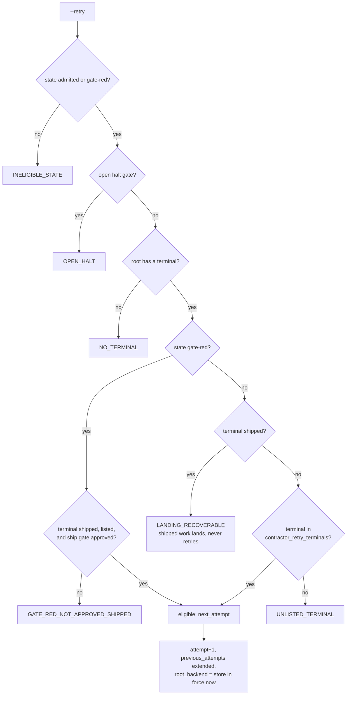
```mermaid
flowchart TD
  R["--retry"] --> S{"state admitted or gate-red?"}
  S -->|"no"| X1["INELIGIBLE_STATE"]
  S -->|"yes"| H{"open halt gate?"}
  H -->|"yes"| X2["OPEN_HALT"]
  H -->|"no"| T{"root has a terminal?"}
  T -->|"no"| X3["NO_TERMINAL"]
  T -->|"yes"| G{"state gate-red?"}
  G -->|"yes"| GR{"terminal shipped, listed,<br/>and ship gate approved?"}
  GR -->|"no"| X4["GATE_RED_NOT_APPROVED_SHIPPED"]
  GR -->|"yes"| OK["eligible: next_attempt"]
  G -->|"no"| SH{"terminal shipped?"}
  SH -->|"yes"| X5["LANDING_RECOVERABLE<br/>shipped work lands, never retries"]
  SH -->|"no"| L{"terminal in<br/>contractor_retry_terminals?"}
  L -->|"no"| X6["UNLISTED_TERMINAL"]
  L -->|"yes"| OK
  OK --> NA["attempt+1, previous_attempts extended,<br/>root_backend = store in force now"]
```

Sources: `contractor/retry.py:27-59`; `contractor/models.py:157-180`; `contractor/command.py:555-579`.

---

## 6. The foreman: run loop and tick

### 6.1 The run loop

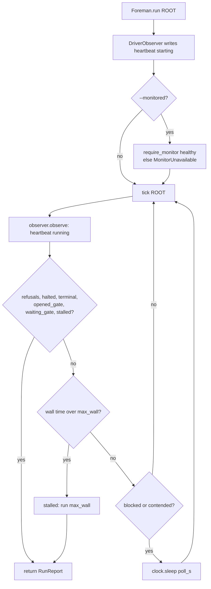
```mermaid
flowchart TD
  START["Foreman.run ROOT"] --> OBS["DriverObserver writes heartbeat starting"]
  OBS --> MON{"--monitored?"}
  MON -->|"yes"| REQ["require_monitor healthy<br/>else MonitorUnavailable"]
  MON -->|"no"| TICK
  REQ --> TICK["tick ROOT"]
  TICK --> REC["observer.observe: heartbeat running"]
  REC --> STOP{"refusals, halted, terminal,<br/>opened_gate, waiting_gate, stalled?"}
  STOP -->|"yes"| OUT["return RunReport"]
  STOP -->|"no"| WALL{"wall time over max_wall?"}
  WALL -->|"yes"| STALL["stalled: run max_wall"]
  STALL --> OUT
  WALL -->|"no"| SLEEP{"blocked or contended?"}
  SLEEP -->|"yes"| WAIT["clock.sleep poll_s"]
  SLEEP -->|"no"| TICK
  WAIT --> TICK
```

Sources: `foreman/tick.py:631-682`; `foreman/heartbeat.py:140-169`.

`tick` has two wrapper layers. `advance_decision` handles coordinated roots first
(`foreman/decisions.py:427`). `_tick_local` runs the tick, then retakes the band to reconcile
in-place steer controls. Any uncertain control becomes a refusal, which stops `run`
(`foreman/tick.py:401-421`; `foreman/rpc_control.py:65-130`).

### 6.2 One tick

A tick takes **at most one branch** below, which is one decision, and returns. A branch may still
make several durable writes, for example mint plus dispatch, or evidence plus close.

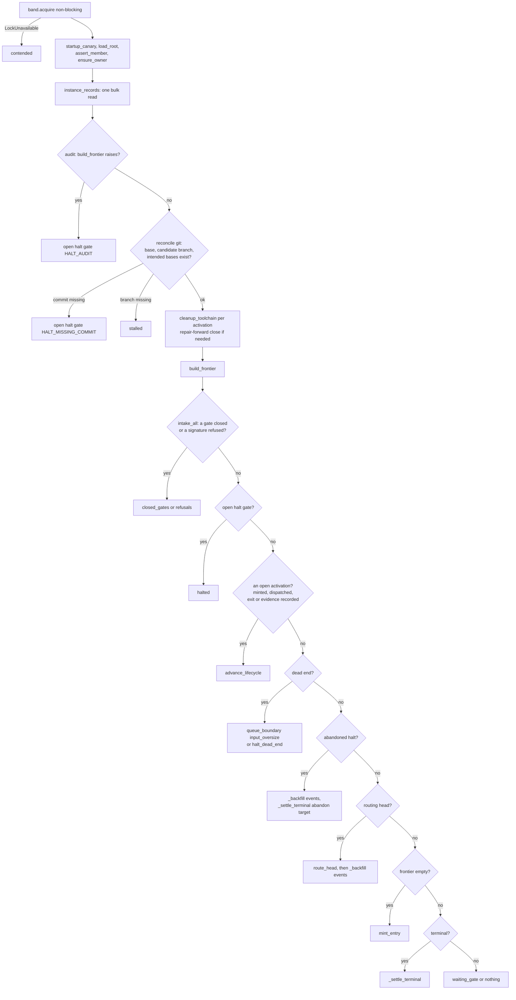
```mermaid
flowchart TD
  A["band.acquire non-blocking"] -->|"LockUnavailable"| Z1["contended"]
  A --> B["startup_canary, load_root,<br/>assert_member, ensure_owner"]
  B --> C["instance_records: one bulk read"]
  C --> D{"audit: build_frontier raises?"}
  D -->|"yes"| H1["open halt gate HALT_AUDIT"]
  D -->|"no"| E{"reconcile git:<br/>base, candidate branch,<br/>intended bases exist?"}
  E -->|"commit missing"| H2["open halt gate HALT_MISSING_COMMIT"]
  E -->|"branch missing"| Z2["stalled"]
  E -->|"ok"| F["cleanup_toolchain per activation<br/>repair-forward close if needed"]
  F --> G["build_frontier"]
  G --> I{"intake_all: a gate closed<br/>or a signature refused?"}
  I -->|"yes"| Z3["closed_gates or refusals"]
  I -->|"no"| J{"open halt gate?"}
  J -->|"yes"| Z4["halted"]
  J -->|"no"| K{"an open activation?<br/>minted, dispatched,<br/>exit or evidence recorded"}
  K -->|"yes"| L["advance_lifecycle"]
  K -->|"no"| M{"dead end?"}
  M -->|"yes"| N["queue_boundary input_oversize<br/>or halt_dead_end"]
  M -->|"no"| O{"abandoned halt?"}
  O -->|"yes"| P["_backfill events,<br/>_settle_terminal abandon target"]
  O -->|"no"| Q{"routing head?"}
  Q -->|"yes"| R["route_head, then _backfill events"]
  Q -->|"no"| S{"frontier empty?"}
  S -->|"yes"| T["mint_entry"]
  S -->|"no"| U{"terminal?"}
  U -->|"yes"| P2["_settle_terminal"]
  U -->|"no"| V["waiting_gate or nothing"]
```

Sources: `foreman/tick.py:423-591`.

Exceptions become reports, not crashes:

| Exception | Tick result |
|---|---|
| `LockUnavailable` | `contended` |
| `TerminationFailed` | halt gate `HALT_INDETERMINATE` |
| `InputsUnavailable` | halt gate `HALT_INPUTS` |
| `BoundExceededError`, `CanaryFailedError`, `ContinuationRefused`, `GateVerificationError`, `PinnedGraphMismatchError`, `InstanceBranchMissing`, `GitCommandError`, `SnapshotFailed` | `stalled` with the message |

Source: `foreman/tick.py:592-627`.

### 6.3 Building the frontier

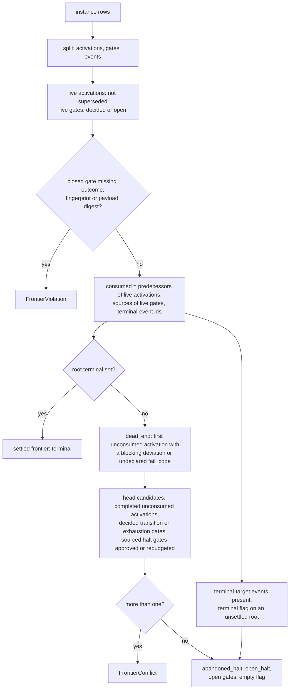
```mermaid
flowchart TD
  ROWS["instance rows"] --> SPLIT["split: activations, gates, events"]
  SPLIT --> LIVE["live activations: not superseded<br/>live gates: decided or open"]
  LIVE --> VIOL{"closed gate missing outcome,<br/>fingerprint or payload digest?"}
  VIOL -->|"yes"| FV["FrontierViolation"]
  VIOL -->|"no"| CONS["consumed = predecessors of live activations,<br/>sources of live gates, terminal-event ids"]
  CONS --> SETTLED{"root.terminal set?"}
  SETTLED -->|"yes"| TF["settled frontier: terminal"]
  SETTLED -->|"no"| DE["dead_end: first unconsumed activation with<br/>a blocking deviation or undeclared fail_code"]
  CONS --> TE2["terminal-target events present:<br/>terminal flag on an unsettled root"]
  TE2 --> REST
  DE --> HEADS["head candidates: completed unconsumed activations,<br/>decided transition or exhaustion gates,<br/>sourced halt gates approved or rebudgeted"]
  HEADS --> MANY{"more than one?"}
  MANY -->|"yes"| FC["FrontierConflict"]
  MANY -->|"no"| REST["abandoned_halt, open_halt,<br/>open gates, empty flag"]
```

Dead-end deviation kinds, in order: `instance_branch_diverged`, `precondition_refused`,
`inputs_unavailable`, `sandbox_unavailable`, `unusable_resolution`, `bound_violated`
(`foreman/frontier.py:116-140`). Source: `foreman/frontier.py:143-290`.

### 6.4 Routing a completed head (ADR 0004)

Routing is a table lookup over the pinned graph. No model is consulted.

```mermaid
flowchart TD
  H["head activation with outcome"] --> Q1{"fail_plan or doubt,<br/>and node decision policy lists it?"}
  Q1 -->|"yes"| B1["queue_boundary, blocked"]
  Q1 -->|"no"| Q2{"retry_kind"}
  Q2 -->|"steered"| R1["Recovery.resolve:<br/>mint steer continuation"]
  Q2 -->|"error_crew or error_transport"| R2["mint INFRA_RETRY,<br/>same inputs, dispatch"]
  Q2 -->|"none"| RT["route node outcome"]
  RT --> K{"RouteKind"}
  K -->|"TASK"| M1["_mint_successor: bind inputs, mint,<br/>dispatch. Round +1 if the target<br/>is the region entry_node"]
  K -->|"GATE"| G1["open transition_gate"]
  K -->|"NO_PROGRESS"| G2["open no_progress_gate to fallback"]
  K -->|"FALLBACK to gate"| G1
  K -->|"FALLBACK to task"| M1
  K -->|"FALLBACK to terminal"| TE
  K -->|"TERMINAL"| TE["terminal: settle root"]
  K -->|"DEAD_END"| HB["halt gate HALT_FAIL_CODE"]
  K -->|"FAIL_CLOSED or other FALLBACK"| HA["halt gate HALT_FAIL_CLOSED"]
  M1 -->|"BoundExceededError"| RC["_refusal_case"]
  R1 -->|"BoundExceededError"| RC
  R2 -->|"BoundExceededError"| RC
  RC --> QB{"decision policy queues<br/>allowance_exhausted?"}
  QB -->|"yes"| BL["blocked"]
  QB -->|"no"| K2{"refusal kind"}
  K2 -->|"REGION_ROUNDS"| G3["open exhaustion_gate at region<br/>on_exhausted, else fallback"]
  K2 -->|"INFRA_RETRIES or STEERS"| FB{"fallback node kind"}
  FB -->|"terminal"| TE
  FB -->|"gate"| G1
  FB -->|"task"| HC
  K2 -->|"INSTANCE_CEILING"| HC["halt gate HALT_CEILING"]
```

`route` checks, in order: no-progress breaker, undeclared `fail_code`, the first matching edge,
then fallback. It fails closed on gate-to-gate routes and on a mutable gate without a bound
artifact. Sources: `foreman/cases.py:243-328,418-615`; `foreman/routing.py:43-98`;
`foreman/bounds.py:32-39`.

Two details surprise readers. A bound refusal whose fallback is a task never mints that task. It
opens a `HALT_CEILING` halt instead. And the store, not the router, derives the round: any edge
mint that lands on a region's `entry_node` opens the next round and counts against
`max_entries` (`bdio/mint.py:286-334`).

A decided gate is also a head. A transition or exhaustion gate routes by its outcome on the gate
node. A sourced halt gate approved or rebudgeted re-mints the node that dead-ended. A gate head
whose route is not a task or terminal stalls (`foreman/cases.py:425-457`).

### 6.5 Input binding and engine producers

```mermaid
flowchart TD
  MINT["mint request for target node"] --> SB["select_bindings per declared input"]
  SB --> ENG{"engine producer source?"}
  ENG -->|"yes"| SKIP["skip here, bound by routing seam"]
  ENG -->|"no"| INST{"instance source?"}
  INST -->|"yes"| IB["wf-instance://NAME, sha256 of pinned input"]
  INST -->|"no"| PROD["latest completed producer activation,<br/>same round preferred"]
  PROD --> WR{"producer writes?"}
  WR -->|"yes"| AR["artifact ref and tree oid"]
  WR -->|"no"| OR["outputs ref and outputs tree oid"]
  MINT --> EDGE{"EDGE mint?"}
  EDGE -->|"yes"| VF["bind_feedback: if target wants verify_failure,<br/>pin bounded failure payload blob at<br/>refs/wf/ROOT/verify-failure/SOURCE/DIGEST"]
  VF --> LR["bind_render: if target wants ledger_render,<br/>commit findings.md and evidence.json,<br/>ref refs/wf/render/TASK-aN"]
  LR --> STORE["store.mint_activation: bindings become durable"]
  IB --> STORE
  AR --> STORE
  OR --> STORE
  STORE --> DISP["at dispatch: materialize re-verifies every<br/>binding, then compose_envelope within<br/>context_budget_bytes, default 262144"]
```

Sources: `foreman/inputs.py:72-474`; `foreman/verify_feedback.py:182-286`;
`foreman/ledger_render.py:307-384`; `foreman/envelope.py:64-115`.

Retries and entry mints do not re-run the engine producers. Retries reuse the head's bindings
(`foreman/cases.py:231-235,514-522`).

### 6.6 Settlement: turning an exit into a close

```mermaid
flowchart TD
  S["settle activation"] --> LC{"lifecycle"}
  LC -->|"not exit or evidence recorded"| AW["awaiting"]
  LC -->|"exit-recorded"| ER["exit record from store or exit.json"]
  ER -->|"missing"| C1["close error_transport"]
  ER --> REP["ExitObserver.replay:<br/>reuse completion.json or regrade"]
  REP --> BRANCH{"artifact pinned but<br/>branch advance missing?"}
  BRANCH -->|"yes"| ADV["advance_instance_branch again"]
  BRANCH -->|"no"| DEC
  ADV --> DEC["finalize.decide"]
  DEC --> BLK{"undeclared effects?"}
  BLK -->|"yes"| EVG["record_evidence, open effects gate"]
  BLK -->|"no"| EV["record_evidence"]
  EV --> CLOSE["close_activation outcome evidence usage deviations"]
  LC -->|"evidence-recorded"| EG{"effects gate?"}
  EG -->|"open"| AW
  EG -->|"abandon"| DISC["close fail_code, effects discarded"]
  EG -->|"approve"| ACC["close with opening outcome, effects accepted"]
  EG -->|"none"| CLOSE2["close with completion outcome"]
```

Sources: `foreman/close.py:59-346`; `foreman/finalize.py:51`.

An effects gate opened here is not surfaced. `advance_lifecycle` drops the opened gate id, so the
tick report is empty, no inbox directory is created, and `run` re-ticks without sleeping until
`max_wall`. See suspected defect 1 in section 16.2 (`foreman/cases.py:367-414`).

---

## 7. Activation lifecycle

### 7.1 States and their writers

```mermaid
stateDiagram-v2
  state "minted" as MINTED
  state "dispatched" as DISPATCHED
  state "exit-recorded" as EXIT
  state "evidence-recorded" as EVID
  state "closed" as CLOSED
  state "superseded" as SUPER
  [*] --> MINTED: foreman mint_activation
  MINTED --> MINTED: wrapper record_precondition
  MINTED --> DISPATCHED: wrapper record_dispatch after barrier
  MINTED --> CLOSED: wrapper _close_error mapped failure
  DISPATCHED --> DISPATCHED: stale flag, session registration
  DISPATCHED --> EXIT: wrapper record_exit, or foreman after recovery finds exit.json
  DISPATCHED --> CLOSED: recovery dead without exit, or steer
  EXIT --> EVID: foreman record_evidence
  EXIT --> CLOSED: foreman settle
  EVID --> CLOSED: foreman settle
  MINTED --> SUPER: mint race loser
  DISPATCHED --> SUPER: mint race loser
  CLOSED --> [*]
  SUPER --> [*]
```

A recorded outcome is terminal whatever the lifecycle says. A crash between the metadata write
and the row close is repaired forward (`bdio/wire.py:440`, `bdio/transitions.py:341`,
`bdio/finalize.py:63`). Sources: `bdio/activation_writes.py:194-552`;
`inspector/launch.py:314,465,627`; `inspector/exit.py:421`; `foreman/close.py`;
`inspector/recover.py:528-556`; `inspector/steer.py:281`.

### 7.2 Two-phase activation: mint, then dispatch

```mermaid
sequenceDiagram
  participant T as Foreman tick
  participant C as cases._mint_successor
  participant S as WorkflowStore
  participant FS as activation dir
  participant SP as DetachedSpawner
  participant W as wrapper process
  participant SU as Inspector.run
  T->>C: route_head returned TASK
  C->>C: select_bindings, bind_feedback, bind_render
  C->>S: mint_activation
  S-->>C: MINTED, or BoundExceededError
  C->>FS: dispatch_minted: write dispatch-request.json
  C->>SP: launch WrapperLaunch, same tick
  SP->>W: Popen foreman inspector ROOT ACT
  SP->>FS: write wrapper.json pid start_time boot_id
  W->>FS: take wrapper.lock, else exit LOCKED
  W->>S: load activation, must still be minted
  W->>SU: run with task builder
  SU->>S: record_precondition, record_envelope, record_dispatch
  SU->>S: record_exit as final act
  T->>T: later tick settles and closes
```

Every mint (entry, edge successor, infra retry) is followed by `dispatch_minted` in the same tick.
A later tick re-dispatches a still-`minted` activation only when no wrapper holds
`wrapper.lock`, which is the crash or lost-spawn case (`foreman/cases.py:152-177,212-240,331-363,533`;
`foreman/inspector.py:75-83,234-427`).

### 7.3 How wrapper failures close an activation

| Exception inside `run_wrapper` | Close outcome | Deviation |
|---|---|---|
| `ForkBarrierAbortError` | `error_transport` | `fork_barrier_abort` |
| `UnusableResolutionError` | `error_transport` | `unusable_resolution` |
| `ForkBarrierError`, `ExecLedgerError`, `TaskRefused`, `UnsupportedOptionError`, `UnregisteredCrewError` | `error_crew` | none |
| `ContinuationRefused` | `error_transport` | `continuation_refused` |
| `InputsUnavailable` | `error_transport` | `inputs_unavailable` |
| `SandboxUnavailable` | `error_transport` | `sandbox_unavailable` |
| `BandNotHeld` | `error_transport` | none |
| `PreconditionRefused` | `error_transport` | `precondition_refused` |
| `LifecycleConflictError`, `LossyWriteError` | no close: `CLOSED_BY_TICK` or `FAILED` | none |
| `InterruptedWorkPreservationFailed` | no close: `FAILED` | none |
| other `InspectorError` or `OSError` | `error_transport` | none |

Deviations like `sandbox_unavailable` make the activation a dead end, so the frontier opens a
halt gate instead of retrying. Source: `foreman/inspector.py:303-428`.

---

## 8. The inspector wrapper

### 8.1 Components

```mermaid
flowchart TB
  RW["run_wrapper"] --> SUP["Inspector.run"]
  SUP --> DISP["Dispatcher.dispatch"]
  SUP --> MON["Monitor.watch"]
  SUP --> RPC["RpcSession.watch<br/>codex app-server only"]
  SUP --> OBS["ExitObserver.observe"]
  DISP --> WS["Workspace.prepare"]
  DISP --> SBX["sandbox plan_for and wrap"]
  DISP --> SEED["ToolchainSeeder.prepare"]
  DISP --> PROF["Profile: claude, codex,<br/>codex-appserver"]
  PROF --> FORK["ForkBarrierLauncher"]
  FORK --> CHILD(["crew child under bwrap"])
  WS --> ART["ArtifactManager"]
  WS --> ATTR["AttributionManager"]
  MON --> PROC["procfs prove_liveness, terminate"]
  RPC --> MON
  OBS --> GRADE["EvidenceGrader"]
  GRADE --> VER["run_checks in VerifyTree"]
  OBS --> WS
  REC["Recovery.resolve"] --> PROC
  REC --> STEER["Steerer"]
  REC --> WS
  DISP --> STORE[("WorkflowStore")]
  OBS --> STORE
  STEER --> STORE
  WS --> GIT[("git via Git.run<br/>closed subcommand set")]
```

Sources: `inspector/run.py:111-420`; `inspector/launch.py:250-723`; `inspector/exit.py:154-647`;
`inspector/recover.py:195-561`. The git wrapper has no `push`, `fetch`, `commit`, `merge` or
`rebase` (`inspector/gitcmd.py:101-141`).

### 8.2 One activation: dispatch to exit-recorded

```mermaid
sequenceDiagram
  participant RW as Inspector._inspect
  participant D as Dispatcher
  participant W as Workspace
  participant St as WorkflowStore
  participant P as Profile
  participant L as ForkBarrierLauncher
  participant C as crew child
  participant M as Monitor
  participant O as ExitObserver
  RW->>D: dispatch request node profile
  D->>St: mint_activation, idempotent
  D->>D: _reattach: receipt and exec.ledger check
  D->>W: prepare: HEAD at intended base, tree clean
  D->>St: record_precondition before any exec
  D->>St: record_envelope: task builder materializes inputs
  D->>D: _sandbox: probe bwrap, plan_for
  D->>D: ToolchainSeeder.prepare offline uv cache
  D->>P: prepare session, build_command
  D->>L: profile.launch through launcher
  L->>C: fork, barrier, execvpe
  L-->>D: ProcessHandle
  D->>D: _assert_barrier_held: receipt, handle, ledger +1
  D->>St: record_dispatch handle launch_id
  RW->>M: watch
  M->>St: record_stale_flag once when silent
  M-->>RW: terminal verdict: exited, max_wall, stale breach
  alt steer-intent.json present
    RW->>RW: return without observing, the steerer closes
  else no steer intent
    RW->>O: observe exit_code reason
    O->>O: write exit.json first
    O->>W: preserve_interrupted
    O->>W: record_attribution, pin_artifact, pin_outputs
  end
  O->>O: grade, write completion.json
  O->>St: record_exit, the wrapper's final act
```

Sources: `inspector/run.py:133-298`; `inspector/launch.py:272-648`; `inspector/exit.py:174-429`.

### 8.3 Workspace precondition

```mermaid
flowchart TD
  P["Workspace.prepare"] --> IR{"in-repo without band?"}
  IR -->|"yes"| X1["BandNotHeld"]
  IR -->|"no"| CE{"intended commit exists?"}
  CE -->|"no"| X2["PreconditionRefused"]
  CE -->|"yes"| MODE{"isolation"}
  MODE -->|"worktree"| WT["worktree/.git missing?<br/>git worktree add --force -B<br/>wf/ROOT/candidate at intended"]
  MODE -->|"in-repo"| SNAP["snapshot dirty paths and stash"]
  WT --> PLAN
  SNAP --> PLAN["_plan: what may be reset"]
  PLAN --> REFD{"protected paths or<br/>protected HEAD?"}
  REFD -->|"yes"| X3["DirtyTreeRefused"]
  REFD -->|"no"| APPLY{"anything to reset?"}
  APPLY -->|"yes"| PRE["pin pre-reset snapshot at<br/>refs/wf/ROOT/prereset/ACT,<br/>then reset --hard and clean"]
  APPLY -->|"no"| CLEAN
  PRE --> CLEAN{"HEAD equals intended and clean?"}
  CLEAN -->|"no"| X2
  CLEAN -->|"yes"| REC["write workspace.json,<br/>return PreconditionResult"]
```

In worktree mode every dirty path is resettable. In-repo, only paths with positive crew
attribution are resettable (`inspector/workspace.py:214-645`; `inspector/attribution.py:85-136`).

### 8.4 The sandbox mount plan

Bind order matters. Later binds override earlier ones, and read-only pins come last.

```mermaid
flowchart LR
  BASE["bwrap --die-with-parent<br/>--dev-bind / /"] --> RO["ro-bind: repo_root,<br/>wrapper_root, checkout"]
  RO --> GITRW["bind git write roots, writers only.<br/>Worktree shape: objects, refs/heads/wf/ROOT,<br/>logs/refs/heads/wf/ROOT, worktree gitdir.<br/>In-repo shape: all of .git"]
  GITRW --> GR["bind: grant dirs from<br/>allowed_paths, writers only"]
  GR --> CH["bind: ACT/channels"]
  CH --> TC["bind: ACT/toolchain/uv-cache"]
  TC --> VS["bind: vendor state,<br/>app-server only"]
  VS --> PINS["ro-bind pins, last. Always: git common dir /wf fence,<br/>seed roots. Worktree shape: commondir, gitdir,<br/>config.worktree, info. In-repo shape: config,<br/>config.worktree, hooks, info, modules config,<br/>refs/wf, worktrees"]
```

Sources: `inspector/sandbox.py:593-703`; `inspector/execution.py:34-94`. Crews see these
environment channels: `WF_OUTCOME_FILE`, `WF_ARTIFACT_DIR`, `WF_EFFECTS_FILE`, `WF_SCRATCH_DIR`,
and a committer email `crew+ACT@workflow-interpreter.invalid` (`inspector/profile.py:102-131`).
Pushes are blocked by a `pushInsteadOf` rewrite (`profiles/_base.py:168`).

### 8.5 The fork barrier

The barrier guarantees that an exec never happens without a durable receipt, and that the
exec ledger counts real execs, not intents.

```mermaid
sequenceDiagram
  participant LP as launcher parent
  participant FS as activation dir
  participant CH as forked child
  LP->>CH: os.fork
  CH->>CH: setsid
  CH->>LP: write R
  alt no R within barrier timeout
    LP->>CH: abandon: kill group, reap
  end
  LP->>LP: read child start time and boot id
  LP->>FS: write launch-receipt.json durably
  LP->>CH: GO with ExecLedgerEntry line
  CH->>FS: stat receipt, else exit 122
  CH->>FS: append exec.ledger with fsync
  CH->>LP: write A
  alt no A within barrier timeout
    LP->>FS: receipt ABORTED or ABORT_PENDING
  end
  CH->>CH: redirect fds, chdir
  CH->>CH: execvpe crew, else exit 127
```

Source: `inspector/fork_launcher.py:173-522`.

### 8.6 Monitor cycle

```mermaid
flowchart TD
  O["Monitor.observe"] --> LOG{"log grew?"}
  LOG -->|"yes"| ACT["last activity = now"]
  LOG -->|"no"| EXITQ
  ACT --> EXITQ{"child reaped or dead?"}
  EXITQ -->|"reaped"| EXITED["EXITED, or pending breach verdict"]
  EXITQ -->|"liveness indeterminate"| HOLD["INDETERMINATE: hold, no action"]
  EXITQ -->|"alive"| WALL{"elapsed over max_wall?"}
  WALL -->|"yes"| KILL["terminate group"]
  KILL -->|"death confirmed"| MWB["MAX_WALL_BREACH"]
  KILL -->|"not confirmed"| HOLD
  WALL -->|"no"| STALE{"silent over stale_after?"}
  STALE -->|"yes"| FLAG["write stale.flag once"]
  FLAG --> STALE2{"silent over 2x stale_after?"}
  STALE2 -->|"yes"| KILL2["terminate group"]
  KILL2 -->|"confirmed"| SB["STALE_BREACH"]
  STALE2 -->|"no"| RUN["RUNNING"]
  STALE -->|"no"| RUN
```

Liveness needs three facts: pid present, boot id matches, and process start time matches.
Only ENOENT, ESRCH or ENOTDIR mean gone. Any other read error is indeterminate
(`inspector/procfs.py:134-321`; `inspector/monitor.py:146-396`).

### 8.7 Recovery after a crash

```mermaid
stateDiagram-v2
  [*] --> classify
  classify --> ABORT_PENDING: receipt abort-pending
  classify --> NOT_LAUNCHED: lifecycle minted
  classify --> STEER_PENDING: steer-intent.json present
  classify --> EXIT_RECORDED: exit record in store or exit.json
  classify --> INDETERMINATE: proc unreadable
  classify --> RUNNING: identity proven alive
  classify --> DEAD_WITHOUT_EXIT: otherwise
  RUNNING --> DEAD_WITHOUT_EXIT: app-server owner dead
  ABORT_PENDING --> Aborted: terminate confirmed
  STEER_PENDING --> Resumed: Steerer.resume
  INDETERMINATE --> Halted: halt, no action
  EXIT_RECORDED --> Settle: foreman settles
  RUNNING --> Watch: wrapper still owns it
  DEAD_WITHOUT_EXIT --> Terminated: terminate, must confirm
  Terminated --> Preserved: exit.json, preserve interrupted work
  Preserved --> Pinned: pin orphan artifact, quarantined
  Pinned --> Halted: pin refused
  Pinned --> Closed: close error_transport exit_unobserved
  Closed --> [*]
```

The next tick then retries `error_transport` as an infra retry, subject to
`max_infra_retries` (`inspector/recover.py:195-561`; `foreman/cases.py:498-533`).

### 8.8 Steering a running activation

```mermaid
sequenceDiagram
  participant Op as operator
  participant F as Foreman.steer
  participant S as Steerer
  participant FS as activation dir
  participant P as crew process
  participant St as WorkflowStore
  Op->>F: foreman steer ROOT ACT --reason
  F->>S: steer activation reason instructions
  S->>St: preflight continuation within max_steers
  S->>FS: write steer-intent.json
  S->>FS: request_interrupt if a session exists
  S->>P: terminate, must confirm death
  S->>FS: write exit.json code -15 reason steered
  S->>S: preserve interrupted work
  S->>St: close_activation steered with steer deviation
  S->>St: mint continuation, same session id
```

The codex app-server profile also supports an in-place steer: `--in-place` queues a control file
that the live RPC session delivers as `turn/steer` (`inspector/steer.py:188-308`;
`inspector/rpc_control.py:58-141`; `inspector/rpc_session.py:378-423`).

---

## 9. Grading: claim is not proof

### 9.1 Exit grading

The crew's `outcome.json` is a claim. The wrapper computes the real outcome.

```mermaid
flowchart TD
  START["EvidenceGrader._compute"] --> CHK["run_checks in VerifyTree<br/>at artifact commit or intended base"]
  CHK --> A{"exit code nonzero<br/>and no marker?"}
  A -->|"yes"| ER["error_crew"]
  A -->|"no"| B{"marker missing or invalid?"}
  B -->|"yes"| FM["fail_code + MARKER_INVALID"]
  B -->|"no"| C{"any verifier provenance failure?"}
  C -->|"yes"| FP["fail_code + VERIFIER_PROVENANCE"]
  C -->|"no"| D{"claim is done, accept or no_diff?"}
  D -->|"yes"| G["fail_code if: any check red, effects manifest missing,<br/>judgment on a different commit, no_diff with artifact,<br/>done without artifact on a writer"]
  D -->|"no"| E{"reject with no artifact paths?"}
  E -->|"yes"| FR["fail_code"]
  E -->|"no"| KEEP["keep claimed outcome"]
  G --> FLAGS
  FR --> FLAGS
  KEEP --> FLAGS
  FP --> FLAGS
  FLAGS["add flags: undeclared effect, outside allowed paths,<br/>outputs unsafe, branch diverged"] --> SV
  ER --> SV
  FM --> SV
  SV{"sandbox verdict"} -->|"app-server turn incomplete"| ET["error_transport"]
  SV -->|"receipt sandbox off"| OFF["add SANDBOX_OFF"]
  SV -->|"wrote outside allowed paths on disk"| BV["error_transport + BOUND_VIOLATED"]
  SV -->|"clean"| RF
  OFF --> RF
  ET --> RF
  BV --> RF
  RF["review_findings from review.md<br/>in the outputs tree, reject-capable nodes only"] --> DONE["write completion.json"]
```

Sources: `inspector/exit_grade.py:53-535`; `inspector/exit.py:431-591`.

### 9.2 Two different verification paths

The node's `verify` checks and the landing's `contractor_checks` are separate mechanisms.

```mermaid
flowchart LR
  subgraph NODE["Node verify, per activation"]
    N1["root creation pins sha256 of each<br/>verify program: pin_verifier_digests"] --> N2["VerifyTree: detached checkout<br/>of the graded commit"]
    N2 --> N3["open program, hash the fd,<br/>compare pinned digest"]
    N3 --> N4["run /proc/self/fd/N with wrapper env plus<br/>WF_BASE_COMMIT, WF_EPIC_SEGMENT,<br/>WF_TASK_ID, WF_ATTEMPT,<br/>WF_RENDER_OID, WF_RENDER_DIGEST"]
    N4 --> N5["red once? rerun once"]
  end
  subgraph LAND["Landing checks, per stage"]
    L1["admission pins contractor_checks:<br/>argv, env, timeout, program sha256"] --> L2["VerifyTree at the<br/>approved artifact"]
    L2 --> L3["re-hash program by fd"]
    L3 --> L4["run with PATH=/usr/bin:/bin,<br/>temp HOME and TMPDIR"]
    L4 --> L5["source unchanged after each check"]
  end
```

Sources: `foreman/resolve.py:473`; `inspector/verify.py:165-546`; `contractor/verification.py:18-203`.

### 9.3 The debrief contract

The debrief node writes the round's knowledge into one directory, and `verify-debrief.sh`
proves it stayed there.

```mermaid
flowchart TD
  MINT["mint debrief: bind_render"] --> RENDER["render findings.md and evidence.json<br/>from store rows, commit, pin ref,<br/>binding carries tree oid and digest"]
  RENDER --> RUN["scribe crew writes<br/>docs/workstreams/SEG/runs/TASK/aN/<br/>debrief.md, findings.md, evidence.json"]
  RUN --> V1{"identity vars safe<br/>single path components?"}
  V1 -->|"no"| FAIL["check fails: fail_code, routes to triage"]
  V1 -->|"yes"| V2{"every changed path since<br/>WF_BASE_COMMIT inside the directory?"}
  V2 -->|"no"| FAIL
  V2 -->|"yes"| V3{"the three files exist as<br/>mode 100644 blobs, nothing else odd?"}
  V3 -->|"no"| FAIL
  V3 -->|"yes"| V4{"render bound?"}
  V4 -->|"no, e.g. at review"| V6
  V4 -->|"yes"| V5{"committed findings.md and evidence.json<br/>equal the render at WF_RENDER_OID,<br/>digest matches?"}
  V5 -->|"no"| FAIL
  V5 -->|"yes"| V6{"debrief.md within size bound?"}
  V6 -->|"no"| FAIL
  V6 -->|"yes"| PASS["pass: debrief done routes to review"]
```

Sources: `scripts/verify-debrief.sh`; `foreman/ledger_render.py`; `contracts/run_identity.py:25-55`;
`inspector/verify.py:390-407`.

---

## 10. Human gates

### 10.1 Gate kinds

| Builder | Opened when | Gate node | Outcomes |
|---|---|---|---|
| `transition_gate` | an edge or fallback routes to a gate node | the target gate, e.g. `ship` | the gate node's outcomes |
| `exhaustion_gate` | region rounds refused | region `on_exhausted`, e.g. `triage` | that node's outcomes |
| `no_progress_gate` | evidence carries the no-progress breaker | fallback target | that node's outcomes |
| `halt_gate` | audit, missing commit, inputs, ceiling, fail-closed, dead end, indeterminate | `halt` | `approve`, `rebudget`, `abandon` |
| `effects_gate` | settlement found undeclared effects | `effects` | `approve`, `abandon` |

Sources: `foreman/gates.py:85-198`. Gates bind an artifact: commit, tree and digest for
`immutable`, a ref plus digest for `mutable` (`bdio/wire.py:634-667`).

### 10.2 Approval end to end

```mermaid
sequenceDiagram
  participant T as Foreman tick
  participant S as WorkflowStore
  participant IN as gates/GATE_KEY inbox
  participant CLI as foreman status
  participant H as Human
  participant AG as approve-gate.sh
  T->>S: open_gate, e.g. ship after review accept
  T->>IN: ensure_inbox
  T-->>T: run stops: opened_gate
  H->>CLI: foreman status ROOT
  CLI-->>H: inbox path, payload template with nonce placeholder, diff stat, findings
  H->>AG: template, inbox, private key
  AG->>AG: replace placeholder with a fresh uuid nonce
  AG->>IN: payload.json and payload.json.sig via ssh-keygen -Y sign -n wf-gate
  T->>IN: intake_all finds both files
  T->>S: close_gate_verified payload signature
  alt verification refused
    T->>IN: refusal.json
    T->>T: refusals.jsonl, run stops with attention
  else verified
    S-->>T: gate closed with outcome and fingerprint
    T->>T: next tick routes the decided gate
  end
```

Sources: `foreman/tick.py:274-285,492-503`; `foreman/gates.py:210-329`; `foreman/cases.py:94-128`;
`foreman/__main__.py:466-543`; `scripts/approve-gate.sh`.

The payload is `wf-gate-payload/1` JSON: graph id, root id, gate key, outcome, artifact
commit, tree and sha256, nonce, and a `bound_mutation` present only for `rebudget`
(`bdio/signing.py:196-234`).

### 10.3 What `close_gate_verified` checks

```mermaid
flowchart TD
  IN["payload bytes and signature"] --> CAN{"bytes are canonical JSON?"}
  CAN -->|"no"| X["refused: gate stays open"]
  CAN -->|"yes"| PR["ssh-keygen -Y find-principals"]
  PR -->|"no principal"| X
  PR --> VS["ssh-keygen -Y verify, namespace wf-gate"]
  VS --> FP{"fingerprint on the allow-list<br/>for this namespace?"}
  FP -->|"no"| X
  FP -->|"yes"| CL{"gate already closed?"}
  CL -->|"same payload digest"| REPAIR["repair forward, idempotent"]
  CL -->|"different digest"| CONF["LifecycleConflictError"]
  CL -->|"open"| MATCH{"payload root, graph, gate key match,<br/>outcome allowed, artifact shape matches binds?"}
  MATCH -->|"no"| X
  MATCH -->|"yes"| NON{"nonce unused in this root?"}
  NON -->|"no"| X
  NON -->|"yes"| BOUND{"no bound_mutation, or rebudget<br/>raises a declared bound?"}
  BOUND -->|"no"| X
  BOUND -->|"yes"| FRESH{"mutable gate artifact still fresh?"}
  FRESH -->|"no"| STALE["append stale receipt, refuse"]
  FRESH -->|"yes"| WRITE["one GateClosure write"]
  WRITE --> BDW["bd: merge metadata, close row.<br/>No nonce row, no signature bytes."]
  WRITE --> LDW["run ledger, one transaction:<br/>re-check decidable, nonce unspent globally,<br/>rewrite gate, insert nonces and signatures,<br/>enqueue attention projection"]
```

The allow-list must live outside the bd workspace and is parsed at startup. One bad line refuses
the whole file (`bdio/signing.py:506-696`; `bdio/gates.py:308-724`; `ledger/store.py:406-630`).

---

## 11. Landing

Landing moves the target branch to the exact approved artifact, by compare-and-swap, only as a
fast-forward.

```mermaid
flowchart TD
  L["PhaseLanding.land"] --> J{"journalled intent,<br/>or record landed or closed?"}
  J -->|"yes"| REC["recover: never moves a ref"]
  J -->|"no"| ST{"record admitted?"}
  ST -->|"no"| HA["HUMAN_ATTENTION"]
  ST -->|"yes"| CO{"coordinator attached to target<br/>and clean except the export file?"}
  CO -->|"no"| HA
  CO -->|"yes"| AUTH["BeadGateAuthority.verify:<br/>exactly one ship gate, closed, immutable,<br/>approve, all marks, matches pinned graph"]
  AUTH -->|"fails"| BRF["ContractorRefusal"]
  AUTH --> TGT{"target ref equals expected base?"}
  TGT -->|"no"| BM["BRANCH_MOVED"]
  TGT -->|"yes"| ANC{"artifact descends from base?"}
  ANC -->|"no"| HA
  ANC -->|"yes"| CHECKS["landing checks in VerifyTree"]
  CHECKS -->|"red or mismatch"| RED["record gate-red, HUMAN_ATTENTION"]
  CHECKS -->|"green"| LOCK["take landing locks"]
  LOCK --> INTENT["write intent file, read back,<br/>ledger landings INTENT row"]
  INTENT --> RECHK{"coordinator still attached and clean?"}
  RECHK -->|"no"| HA
  RECHK -->|"yes"| CAS{"git update-ref TARGET ARTIFACT BASE"}
  CAS -->|"fails"| BM
  CAS -->|"ok"| SYNC["sync coordinator checkout:<br/>read-tree -m -u base artifact"]
  SYNC -->|"refused"| HA
  SYNC --> RCPT["write receipt file,<br/>ledger landings RECEIPT row"]
  RCPT --> LANDED["adapter.land: record landed"]
  LANDED --> EXPORT["ExportPin.pin: write .wf/export/TASK.jsonl,<br/>git blob, refs/wf/exports/TASK,<br/>tasks.export_oid"]
  EXPORT --> CLOSE["adapter.close: record closed with export_oid,<br/>bd close reason receipt digest"]
```

Sources: `contractor/landing.py:248-811`; `contractor/authority.py:52-128`; `contractor/journal.py:72-159`;
`contractor/adapter.py:205-248`.

After the landing closes the stage, the orchestrating session commits the export file. That
committed blob is what `python -m workflow_interpreter.ledger verify` anchors to in a fresh clone (`ledger/reverify.py:428-481`).

Default recovery never moves a ref. If the target still sits at the old base, recovery reports
`PENDING` and names `--retry-landing` as the explicit next action (`contractor/landing.py:418-468`).

---

## 12. The store: bd and the run ledger

### 12.1 The store seam

```mermaid
flowchart LR
  CALLERS["foreman, inspector, contractor"] --> COMP["Composition.store_for_root"]
  COMP --> LOC["RootBackendLocator"]
  COMP --> WS["WorkflowStore<br/>write API"]
  WS --> WR["WorkflowReads<br/>no write methods"]
  WS --> FACT["SelectableBackendFactory"]
  FACT --> PROTO["StoreBackend protocol<br/>get_row, find_rows, _create_row,<br/>_merge_metadata, _close_row, _close_gate"]
  PROTO -->|"bd"| BDC["BdClient"]
  PROTO -->|"ledger"| LS["LedgerStore"]
  WS -->|"claims, always bd"| CLAIMS["ClaimStore"]
  CLAIMS --> BDC
  BDC --> BDCLI["bd CLI subprocess<br/>closed command set, 60s timeout"]
  LS --> SQL[(".wf/ledger.db")]
  ADAPTER["contractor PhaseAdapter"] -->|"raw bd writes on the stage bead"| BDC
```

Sources: `bdio/api.py:125-776`; `bdio/reads.py:352-429`; `bdio/backend.py:40-215`;
`bdio/client.py:115-672`; `ledger/store.py:151`.

### 12.2 One lifecycle write on each backend

```mermaid
sequenceDiagram
  participant C as caller
  participant T as transitions.apply
  participant BD as BdClient
  participant LS as LedgerStore
  participant DB as SQLite
  C->>T: e.g. record_exit
  T->>T: fresh load, assert allowed lifecycle
  T->>T: build delta of owned keys only, and a guard
  alt bd backend
    T->>BD: _merge_metadata delta
    BD->>BD: bd update --metadata @tmpfile
    BD->>BD: bd show, assert written keys
    Note over BD: the guard is not evaluated on bd
  else run ledger backend
    T->>LS: _merge_metadata delta guard
    LS->>DB: BEGIN IMMEDIATE
    LS->>DB: locate row, run guard inside the transaction
    LS->>DB: rewrite projected columns, version+1
    LS->>DB: verify row, enqueue projection if needed
    LS->>DB: COMMIT
  end
  opt busy
    T->>T: write refused, not retried. A store_busy_refused deviation note is tried up to 4 times
  end
  T->>T: repair_forward if an outcome exists
```

Sources: `bdio/transitions.py:221-390`; `bdio/client.py:559-583`; `ledger/store.py:312-543`.

### 12.3 Opening the run ledger and draining attention

```mermaid
sequenceDiagram
  participant P as foreman process
  participant LD as LedgerDatabase
  participant F as fence git-common-dir/wf/ledger.lock
  participant DB as SQLite
  participant R as AttentionReconciler
  participant TL as wrapper_root/tasks/TASK.lock
  participant BD as bd
  P->>LD: open_ledger
  LD->>DB: peek schema_version
  opt schema behind
    LD->>F: exclusive, bounded 5s
    LD->>DB: new database: migrate and pin identity. Existing: assert identity, then migrate
  end
  LD->>F: shared, held for the connection's life
  LD->>DB: pragmas WAL, busy_timeout 5000, foreign keys
  LD->>DB: assert identity and schema
  Note over P,DB: later, settle_root enqueues a projection in its own transaction
  P->>R: drain ROOT
  R->>TL: exclusive
  R->>DB: newest unacked generation, restore_pending
  R->>DB: wanted = an open gate on a live root
  R->>BD: bd update TASK --add-label or --remove-label wf:attention
  BD-->>R: read back
  R->>DB: ack generations, delete restore row
```

No subprocess ever runs inside a SQLite transaction (`ledger/database.py:16-19,203-417`;
`ledger/fence.py:95-151`; `ledger/reconcile.py:122-259`).

### 12.4 Export, import, verify, archive

```mermaid
flowchart TD
  subgraph EXP["Export at landing close"]
    E1["export_task under a read transaction:<br/>header, tasks row, rows by seq,<br/>nonces, signatures, projections"] --> E2[".wf/export/TASK.jsonl<br/>canonical JSON lines"]
    E2 --> E3["git blob, refs/wf/exports/TASK,<br/>tasks.export_oid"]
  end
  subgraph IMP["Import: rebuild a ledger"]
    I1["parse every file first:<br/>header identity, table and column allow-list"] --> I2["exclusive fence, one transaction"]
    I2 --> I3["clear exportable and derived tables"]
    I3 --> I4["insert rows, rebuild findings,<br/>record restore_pending"]
  end
  subgraph VER["python -m workflow_interpreter.ledger verify TASK"]
    V1["read signatures from the export"] --> V2["bytes valid: ssh-keygen verify<br/>with the stored historical entry"]
    V1 --> V3["export pinned: blob at HEAD:.wf/export/TASK.jsonl,<br/>else refs/wf/exports/TASK"]
    V1 --> V4["signer trusted: fingerprint and key in<br/>the operator's allowed_signers"]
    V2 --> V5["accepted only if all three"]
    V3 --> V5
    V4 --> V5
  end
  subgraph ARC["ledger archive TASK --bundle PATH"]
    A1["refuse: unknown task, no export_oid,<br/>root not terminal, bundle inside repo"] --> A2["git bundle create refs/wf/ROOT/*"]
    A2 --> A3{"git bundle verify ok?"}
    A3 -->|"no"| A4["refuse, delete nothing"]
    A3 -->|"yes"| A5["delete wrapper_root/ROOT dirs and refs"]
  end
  E2 --> I1
  E2 --> V1
```

Sources: `ledger/export.py:119-499`; `ledger/reverify.py:239-524`; `ledger/archive.py:62-112`;
`ledger/__main__.py:85-304`. The export round-trips byte-identically, which is why owed attention
drains after an import live in the non-exported `restore_pending` table.

---

## 13. Files, directories and git refs

### 13.1 On-disk layout

```text
<repo>/
  .wf/
    .gitignore                 ignores itself, ledger.db, -wal and -shm
    ledger.db                  the run ledger (gitignored)
    export/<task>.jsonl        per-task export, committed after landing
  docs/workstreams/<seg>/runs/<task>/a<n>/
    debrief.md findings.md evidence.json   landed with the code
<git common dir>/wf/
  ledger.lock                  the fence; read-only inside sandboxes
  coordination/                lock root for ledger-backed coordination
<wrapper_home>/<repo hash16>/  = wrapper_root, outside the repo
  owner.json                   repo identity guard
  repo-band.lock               the band for ordinary roots
  repo-workspace.json          in-repo workspace record
  toolchain-seeds/             shared offline uv seeds
  tasks/<task>.lock            attention reconciler lock
  <root_id>/                   = instance_dir
    worktree/                  the candidate checkout
    verify-tree/               throwaway detached checkout for checks
    workspace.json attribution.json prereset.index driver-heartbeat.json
    refusals.jsonl monitor.json wake-state.json
    contract-landing.json contract-landing-receipt.json
    gates/<gate_key>/payload.json payload.json.sig refusal.json
    <activation_id>/
      dispatch-request.json wrapper.json wrapper.lock wrapper.log
      launch-receipt.json exec.ledger run.jsonl
      exit.json completion.json stale.flag steer-intent.json recovery.json
      outputs-snapshot/        transient copy of channels/artifacts
      toolchain/uv-cache/      crew-writable
      channels/                the crew's report channels, crew-writable
        outcome.json effects.json artifacts/ scratch/
```

Sources: `inspector/paths.py:25-332`; `foreman/constants.py:61-133`; `ledger/paths.py:33-100`;
`ledger/reconcile.py:112`; `contractor/landing.py:40-41`.

### 13.2 Who creates and who deletes

```mermaid
flowchart LR
  subgraph CREATE["Creators"]
    WS["Workspace._ensure_tree"]
    VT["VerifyTree enter"]
    LA["fork launcher and child"]
    OB["ExitObserver, Monitor,<br/>Steerer, Recovery"]
  end
  subgraph THINGS["Artifacts"]
    WT["worktree"]
    VTD["verify-tree"]
    RCPT["receipt and exec.ledger"]
    RECS["exit, completion, stale,<br/>steer-intent files"]
    SCR["channels/scratch"]
    TC["toolchain/uv-cache"]
    INST["instance_dir"]
    REFS["refs/wf/ROOT/*"]
  end
  subgraph DELETE["Deleters"]
    CLEAN["tick terminal cleanup"]
    TCL["cleanup_toolchain after close<br/>and proven death"]
    ARCH["ledger archive, manual,<br/>after a verified bundle"]
  end
  WS --> WT
  VT --> VTD
  LA --> RCPT
  OB --> RECS
  OB --> REFS
  CLEAN --> WT
  CLEAN --> VTD
  CLEAN --> SCR
  TCL --> TC
  ARCH --> INST
  ARCH --> REFS
  VT -->|"also removes on exit"| VTD
```

### 13.3 Git refs

| Ref | Written by | Deleted by |
|---|---|---|
| `refs/heads/wf/<root>/candidate` | admission `ensure_branch`; `worktree add -B`; advanced by CAS after each pinned artifact | nothing |
| `refs/wf/<root>/artifact/<act>` | `ArtifactManager.pin_artifact`, the reset authority | `ledger archive` |
| `refs/wf/<root>/orphan/<act>` | recovery quarantine pin | `ledger archive` |
| `refs/wf/<root>/prereset/<act>` | snapshot before a destructive reset | `ledger archive` |
| `refs/wf/<root>/recovery/<act>` | interrupted-work preservation | `ledger archive` |
| `refs/wf/<root>/outputs/<act>` | `pin_outputs`, the non-writer outputs tree | `ledger archive` |
| `refs/wf/<root>/verify-failure/<source>/<digest>` | `bind_feedback` | `ledger archive` |
| `refs/wf/render/<task>-a<n>` | `bind_render`, moved to the current round | nothing |
| `refs/wf/exports/<task>` | `ExportPin.pin` at landing | nothing |
| target branch, e.g. `refs/heads/main` | landing CAS, fast-forward only | nothing |

Sources: `inspector/artifact.py:26-193`; `inspector/workspace.py:409-725`;
`bdio/carriers.py:233,256`; `ledger/constants.py:20`; `ledger/archive.py:32-110`.

---

## 14. Terminal settlement, cleanup and archive

```mermaid
flowchart TD
  T["tick reaches a terminal node"] --> SR["settle_root: set terminal,<br/>close root row, idempotent"]
  SR --> DR["drain attention: refusals logged, not raised"]
  DR --> CU["_cleanup_terminal_state, retried on every<br/>tick that reaches the settled root"]
  CU --> EP{"contractor root and<br/>export_oid not recorded yet?"}
  EP -->|"yes"| WAIT["defer: landing must export first"]
  EP -->|"no"| ART{"every writer activation<br/>has a pinned artifact?"}
  ART -->|"no"| WAIT2["defer: permanent if a writer activation<br/>closed with no artifact, e.g. error_* or no_diff"]
  ART -->|"yes"| DEAD{"death_refusal clear for<br/>every activation?"}
  DEAD -->|"no"| WAIT3["defer: a process may be alive"]
  DEAD -->|"yes"| WTC{"worktree clean?"}
  WTC -->|"no"| WAIT4["defer"]
  WTC -->|"yes"| RM["git worktree remove,<br/>remove verify-tree,<br/>delete channels/scratch per activation"]
  RM --> KEEP["kept: instance dirs, receipts,<br/>logs, refs, ledger rows"]
  KEEP -.->|"manual, later"| ARCH["ledger archive TASK --bundle PATH"]
```

Sources: `foreman/tick.py:708-849`; `inspector/toolchain_cleanup.py:45-141`; `ledger/archive.py:62-112`.

Cleanup runs only inside a tick. On a contractor run, the tick that settles `shipped` still sees the
export as pending, because landing and export happen after `Foreman.run` returns. Nothing ticks
the root again automatically: a re-run of `contract` on a closed stage takes the landing
recovery path, which never ticks. An explicit `foreman tick ROOT` is needed to remove the trees
(`contractor/command.py:282-291,417-418`; `foreman/tick.py:723-764`).

---

## 15. End to end: one feature task

This follows stage `T` of epic `E` through `feature-delivery` on the run ledger, with one review
rejection and one approval. The orchestrating session invokes the contractor twice: once to run
until the ship gate opens, and once after the human signs.

```mermaid
sequenceDiagram
  autonumber
  participant O as Orchestrating LLM
  participant B as contract
  participant F as Foreman ticks
  participant W as wrappers and crews
  participant ST as bd and run ledger
  participant G as git
  participant H as Human
  O->>B: foreman --task T contract E T
  B->>ST: prepare record attempt 1, root_backend ledger
  B->>ST: create root T-a1, pin backend
  B->>G: refs/heads/wf/T-a1/candidate at base
  B->>ST: admit: bd claim, record admitted
  B->>F: Foreman.run
  F->>ST: mint implement round 1
  F->>W: dispatch, crew writes code
  W->>G: pin artifact, advance candidate
  W->>ST: record_exit
  F->>ST: settle: record evidence, close implement done
  F->>ST: mint debrief with render binding
  F->>W: dispatch scribe
  W->>ST: record_exit, graded: verify-debrief green
  F->>ST: settle: close debrief done
  F->>ST: mint review
  F->>W: dispatch critic, writes review.md
  W->>ST: record_exit
  F->>ST: settle: close review reject, findings rows
  F->>ST: mint implement round 2 with review_findings
  Note over F,W: implement, debrief and review run again
  F->>ST: settle: close review accept
  F->>ST: open ship gate bound to the artifact
  F-->>B: run stops: opened_gate
  B-->>O: state result, exit 0
  H->>F: foreman status, sign payload with approve-gate.sh
  O->>B: contract E T again
  B->>F: record admitted, HEAD at base, run
  F->>ST: intake: close_gate_verified approve
  F->>ST: route approve to shipped, settle_root
  F-->>B: terminal shipped
  B->>B: landing checks in verify-tree
  B->>ST: landings INTENT
  B->>G: update-ref target artifact base
  B->>ST: landings RECEIPT, record landed
  B->>G: export blob, refs/wf/exports/T
  B->>ST: record closed with export_oid, bd close T
  B-->>O: completed
  O->>G: commit .wf/export/T.jsonl
  Note over F,G: worktree, verify-tree and scratch stay until someone runs foreman tick ROOT after the export is recorded
```

The rejection and second round follow the edges in section 4.1. Every arrival at `implement`
opens a new round, including its own `fail_code` rework. A fourth arrival is refused by
`max_entries 3` and opens the `triage` gate instead.

Between the two invocations the coordinator branch must not move. The second invocation
requires `HEAD` to equal the recorded base, or it refuses with `branch-moved`
(`contractor/command.py:312-318`).

---

## 16. Spec drift and suspected defects

### 16.1 Where the code differs from the design spec

The code is authoritative. These are places a reader of
[workflow-interpreter.md](workflow-interpreter.md) would be misled.

| Spec says | Code does | Code source |
|---|---|---|
| §1: the foreman is a model | The foreman is deterministic code with no LLM client | ADR 0004 D4 |
| P1: bd is the sole authority | `store = "ledger"` puts new roots in SQLite; stage beads stay in bd | `foreman/config.py:71-76`, ADR 0005 |
| §2: schema at `workflows/schema.json` | `workflow_interpreter/schema/graph_schema.json` | `schema/loader.py:38` |
| §2: graph outcomes list | `doubt` also exists | `schema/models.py:102` |
| §2: only `engine:verify_failure` | `engine:ledger_render` added | `schema/models.py:368` |
| §2: `token_budget` required | `token_budget` or `context_budget_bytes` | `schema/rules_nodes.py:102-117` |
| §4: tick lock is repo flock plus `bd merge-slot` | `<wrapper_root>/repo-band.lock`; no merge-slot | `inspector/paths.py:237-247` |
| §4: ticks are manual | `Foreman.run` and `children drive` loop | `foreman/tick.py:631` |
| §4: tick step order | one durable action per tick; gate intake before lifecycle | `foreman/tick.py:423-591` |
| §5.4: worktree created by the wrapper | `worktree add --force -B` also resets the candidate branch if the worktree's `.git` is gone | `inspector/gitio.py:507-525` |
| §5.6: three recovery cases | seven cases plus an app-server owner override | `inspector/models.py:174-193` |
| §7: evidence computed at exit-recorded | the wrapper grades before `record_exit`; the foreman records evidence and closes | `inspector/exit.py:21-36` |
| §9: nonce unique per root | the run ledger enforces global nonce uniqueness | `ledger/schema.py:109` |
| §10.5: no-progress routes to `on_exhausted` | opens a gate at the node or global fallback | `foreman/cases.py:568-573` |
| §10.6: audit re-runs validator and bounds | audit is only "does `build_frontier` raise" | `foreman/audit.py:23-29` |

### 16.2 Suspected defects found while surveying

These were read from code and **not executed**. Each needs a test before anyone acts on it.

| # | Suspicion | Where |
|---|---|---|
| 1 | An effects gate opened during settlement is dropped by `advance_lifecycle`: the report is empty, no inbox directory is created, and `run` re-ticks without sleeping until `max_wall`. Nobody learns a gate is waiting. | `foreman/cases.py:387-414`, `foreman/tick.py:513-518,666-682` |
| 2 | `blocked` from `route_head` is dropped, so `run` re-ticks immediately instead of sleeping. | `foreman/tick.py:552-567` |
| 3 | `ExitObserver.replay` does not forward `run_identity`, so replayed checks see empty `WF_TASK_ID`, `WF_EPIC_SEGMENT` and `WF_ATTEMPT`. | `inspector/exit.py:221-245` |
| 4 | `RpcSession` failure path updates key `reason` instead of field `exit_reason`, so `TERMINATED` may be lost. | `inspector/rpc_session.py:520-525` |
| 5 | Ledger `gates.bound_value` column is always NULL because an int goes through a text projector. The value survives in `metadata_json`. | `ledger/rowmap.py:109-114,232` |
| 6 | `OwnerConflict` is raised inside the tick but not caught by any except clause. | `foreman/tick.py:435,592-627` |
| 7 | The `EXHAUSTED` branch in `route_head` looks unreachable. | `foreman/cases.py:563-567` |
| 8 | `LedgerStore` natural-key lookups are task-scoped while `instance_key` and `idempotency_key` are globally unique, so a cross-task collision would fail as a transport error. | `ledger/store.py:306-308` |
| 9 | `tree_blobs` raises when the outputs tree has more than 32 entries. The review read then fails, so the node gets an uncomputable `fail_code` instead of a graded verdict. `review.md` is not silently hidden. | `inspector/exit_grade.py:114` |
| 10 | `packed-refs` stays writable in the in-repo sandbox shape. | `inspector/sandbox.py:108-111`, ADR 0001 |
| 11 | Node verify checks run with the wrapper's full environment and outside bwrap. | `inspector/verify.py:492` |
| 12 | Terminal cleanup defers while any writer activation lacks a pinned artifact. A writer that closed with no artifact makes that defer permanent, so the trees are never removed. | `foreman/tick.py:797-808` |
