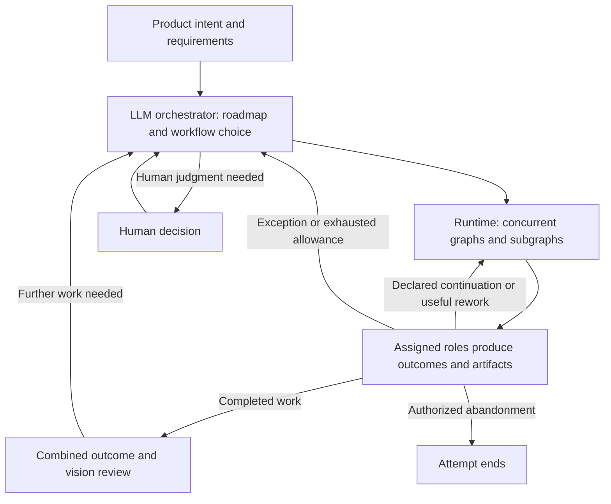

# Workflow Vision

Status: discussion draft, incorporating the user's clarification on 2026-09-11.

This document captures intended behavior for discussion. It is not an
implementation plan or a claim about what the current interpreter supports.
It does not supersede the existing interpreter spec or recorded ADRs.

## Core vision

Build a simple system for dynamically selecting or constructing workflows
and assigning suitable coding runtimes and models to their roles. Keep the
organization as flat as practical. The human-work analogy describes how
different views contribute to a product; it does not prescribe a hierarchy
of product-manager, engineering-manager, and team-lead agents.

Models exercise judgment about goals, decomposition, workflow choice,
assignments, exceptions, and overall quality. Once a workflow is assigned,
the runtime follows its declared transitions in response to role outcomes.
The LLM supervisor is invoked when its judgment is needed; it is not an
intermediary for routine handoffs between roles.

The balance is model intelligence where judgment is needed, deterministic
execution where the next action is already agreed, and human involvement
where the situation requires it.

## From product intent to assigned work

Product direction begins with discussion. Product managers, product
engineers, sales representatives, and other relevant participants decide
what product or features are needed. That discussion can be sequential or
collective and produces a product requirements document (PRD).

Those human responsibilities motivate the contributions needed in the
system, rather than a required agent for each title. An orchestrator can
take a project, establish a roadmap, dispatch design work through its own
graph, and then derive phases and subtasks from the resulting decisions.

Subtasks can themselves be graph instances, dispatched in parallel when
their dependencies permit. The orchestrator makes decisions about work;
the runtime manages progress through the assigned graphs.

## Adaptable workflow shapes

The system can offer a small set of workflow families and allow the
orchestrator to compose or adapt them for the task. Illustrative shapes
include a basic task with little or no separate review, spec-driven
development, and more demanding work with implementation, review, testing,
and broader assurance. Five families was an example, not a fixed count.

Workflow structure and model assignment are distinct choices. The same
workflow can use different models as capabilities, task demands, or costs
change. More complex work can require additional roles or subgraphs without
making that complexity mandatory for simple work.

## Roles, runtimes, and models

Different people in the analogy correspond to distinct agent assignments.
Assignments can differ both in coding runtime and in the model used within
that runtime. The user's term "vendor" includes tools such as Codex,
Claude Code, OpenCode, and Cursor; runtime and model choice are separate
parts of the assignment.

Capability should match responsibility. There is no fixed policy requiring
a cheaper model to implement and an expensive model to review. A stronger
model can implement whenever appropriate. When a workflow includes a
separate review, author and reviewer are separate assignments. A workflow
can require multiple independent reviews, analogous to GitHub approvals.

Cross-runtime and cross-model compatibility is a core requirement.
Cross-family/vendor review is an intended use of that capability: it brings
different perspectives to automated work. Its effectiveness is an empirical
question, separate from supporting the assignment. For example,
a Codex implementer might be reviewed by a Claude Code agent; a Sonnet
tester might be reviewed by Sol; Astra or Fable might assess an epic's
overall outcome. These are illustrative assignments from the discussion,
not fixed defaults or a verified model-capability ranking.

The graph records who performs each role when that workflow is assigned.

## Local workflows and bounded feedback

Each chunk can run a local workflow with its own review and testing loops.
For example:

1. An implementer produces a change.
2. A separate reviewer accepts it or returns findings.
3. Rejection returns the work and findings to the implementer.
4. The pair repeats within the assigned iteration allowance.
5. Testing assesses the result against requirements, with a separate review
   of the testing work where assigned.
6. Failures return to the appropriate review or implementation stage.

In the feature-development example, testing follows implementation and code
review. The intended system can express that process as well as other
authored orders; the existing test-first build loop is one workflow shape.

The supervisor does not receive and retransmit every implementation,
review, correction, and test exchange. Those exchanges stay within the
local workflow while it can make progress under its assigned rules.

For example, a workflow can allow an implementer/reviewer pair three
iterations. Acceptance on the first review proceeds immediately. An
impossible requirement or invalid plan can escalate immediately. Abandonment
can end the attempt when the role and workflow authorize that outcome.
Only useful, permitted rework takes another iteration; the allowance is a
ceiling, never a target.

When a role reports a condition that requires judgment outside the current
workflow, or when the allowance is exhausted, the runtime returns control
to the LLM supervisor. It can revise the approach or assignment, authorize
another bounded allowance, or involve a human. Three is an illustrative
allowance, not a universal limit. Exact outcome names and schemas remain
design choices.

## Graph composition and on-demand supervision

An orchestrator can dispatch several graphs at once. A graph can include
subgraphs with substantial internal work, but nesting execution does not
require a permanent supervisor agent at every level. Runtime coordination
handles routine dependencies and handoffs while the graphs execute.

Role outputs carry the judgment that determines which declared edge to
follow. Deterministic routing means applying that edge mapping; it does not
mean predicting role judgments or forcing every run through the same path.
Exceptions return to an LLM that can reconsider the plan. The orchestrator
also performs the broader outcome and process reviews that the work needs.

The diagram illustrates responsibilities; it is not a fixed graph schema
or a requirement to use exactly these levels for every project.

## Oversight across the whole effort

Local success is not the only measure. Across sprints, at epic boundaries,
and at project completion, the orchestrator or assigned reviewers examine the
combined result: does it work together, satisfy the requirements, and
remain faithful to the product vision?

These reviews also assess the process. If assignments, collaboration, or
workflow choices are not producing the intended outcome, leadership uses
judgment to change the approach. The highest-capability models are intended
for these broad, consequential assessments where appropriate.

## Why this architecture matters

The motivating problem is supervisor context growth. When every local
exchange passes through one model, its context accumulates implementation
details and repeated findings that it does not need for its own decisions.
Repeated mediation spends tokens on already-agreed transitions and makes
it harder for the supervisor to retain the larger picture.

The desired result is local detail staying with the agents doing that work,
while supervisors receive the outcomes and exception context needed to
coordinate and decide. Even compact routing messages become unnecessary
overhead when many graphs run concurrently. The runtime should eliminate
that routine model mediation, not merely summarize it more aggressively.

## Simplicity constraint

Use the least custom machinery that achieves these behaviors. Existing
components, a smaller interpretation of the current system, or a fresh
implementation are all acceptable options. Rebuilding from scratch is an
available option, not a decision made by this document. Graph composition,
cross-runtime support, role outcomes, and exception-driven supervision are
the desired capabilities; implementation complexity must justify itself.

## Questions reserved for the next discussion

The vision establishes the division of responsibility. It leaves these
design choices open:

- What information should a subgraph send upward on success, escalation,
  and broader review, and how can a supervisor retrieve further evidence?
- Who may change an active assignment, graph, or iteration allowance, and
  what changes require human involvement?
- How should dependencies and shared work be coordinated across subgraphs?
- How should runtime/model capability and reviewer independence influence
  assignments, and how will those choices be evaluated?
- How should overall outcome reviews translate into new work or changes
  to the process?

Related context: [workflow graph idea](ideas/workflow-graphs.md),
[current interpreter spec](specs/workflow-interpreter.md), and
[deterministic routing decision](adr/0004-deterministic-routing.md).
